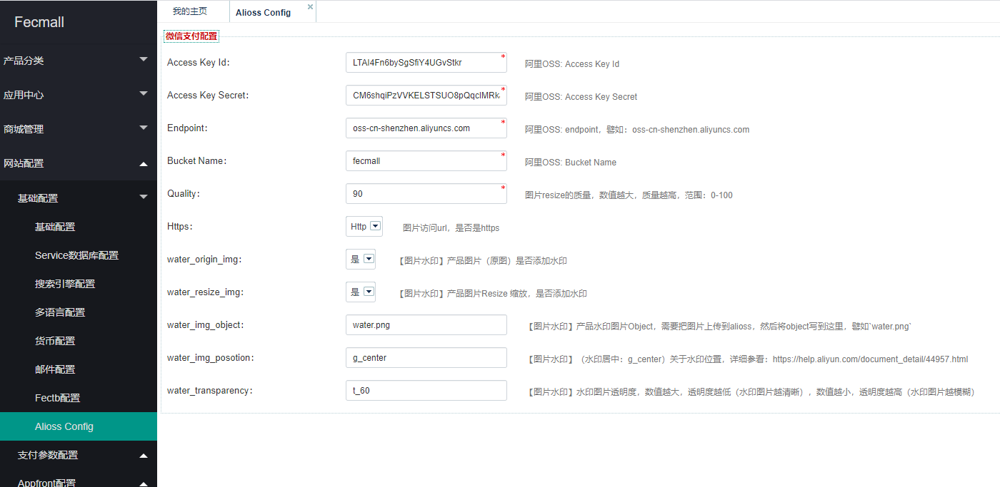

Fecmall-阿里云OSS存储产品图片
=============


> 使用阿里云图片服务，存储fecmall的产品图片的功能扩展应用插件


### Fecmall-阿里云OSS存储产品图片-功能介绍


1.历史`本地产品`图片通过脚本，将`fecmall本地图片`，`同步`到阿里云`OSS`

2.后台产品`新建`，`编辑`等，图片将会同步到阿里云`OSS`，本地不会存储产品图片。

3.图片显示，将使用阿里云`oss`的图片地址，显示图片

4.支持图片`比例缩放`

5.支持`图片水印`

### 阿里云OSS开通，配置


1.阿里云oss购买地址：https://www.aliyun.com/product/oss

2.阿里云OSS配置教程：https://help.aliyun.com/document_detail/31883.html

2.1创建Bucket


2.2创建`AccessKey`: https://help.aliyun.com/document_detail/53045.html

创建用户过程中，勾选：`编程访问启用 AccessKey ID 和 AccessKey Secret，支持通过API或其他开发工具访问`

创建完成后，设置一下权限

2.3`Bucket ACL`文件读写权限设置成`公用可读`

2.4获取`EndPoint`（地域节点），点击创建的Bucket，即可看到


其他的一些参考资料: http://www.fecmall.com/topic/2296


### Fecmall-阿里云`OSS`存储产品图片-应用下载

应用市场地址：http://addons.fecmall.com/27157121

下载安装后，即可使用


### Fecmall-阿里云OSS存储产品图片-后台配置

后台配置：




`Access Key Id`：阿里OSS: Access Key Id 

`Access Key Secret`：阿里OSS: Access Key Secret 

`Endpoint`：阿里OSS 地域节点: endpoint，譬如：oss-cn-shenzhen.aliyuncs.com 

`Bucket Name`：阿里OSS: Bucket Name 

`Quality`：图片resize的质量，数值越大，质量越高，范围：0-100 

`Https`：Http图片访问url，是否是https 

`water_origin_img`：是【图片水印】产品图片（原图）是否添加水印 

`water_resize_img`：是【图片水印】产品图片Resize 缩放，是否添加水印 

`water_img_object`：【图片水印】产品水印图片Object，需要把图片上传到alioss，然后将object写到这里，譬如`water.png` 

`water_img_posotion`：【图片水印】（水印居中：g_center）关于水印位置，详细参看：https://help.aliyun.com/document_detail/44957.html 

`water_transparency`：【图片水印】水印图片透明度，数值越大，透明度越低（水印图片越清晰），数值越小，透明度越高（水印图片越模糊）


### 图片上传到阿里云oss

1.配置完成后，当产品保存，将会自动上传到阿里云oss

2.对于历史产品图片，您可以手动执行脚本，进行上传

```
cd ./addons/fecmall/fecalioos/shell
sh syncProductImageToAlioss.sh
```

### 冲突处理conflict

阿里云扩展，重写了images services，但是有一些扩展也重写了images services，那么就会产生冲突，
譬如：fecyo，fecwbbc，fecbbc，解决如下：

1.将fecalioos扩展的优先级设置最高，如何设置扩展插件优先级，请参看：[Fecmall-应用扩展优先级设置](https://www.fecmall.com/doc/fecshop-guide/addons/cn-2.0/guide-fecmall-addons-score.html)

2.images services更改

打开文件 ./addons/fecmall/fecalioos/services/Image.php

找到21行代码：`class Image extends \fecshop\services\Image`

2.1fecyo将其改为：`class Image extends \fecyo\services\Image`

2.1fecwbbc将其改为：`class Image extends \fecwbbc\services\Image`

2.1fecbbc将其改为：`class Image extends \fecbbc\services\Image`


### 补充


1.如果遇到报错：阿里云oss，上传图片报错：ErrorCode: AccessDenied ErrorMessage: You have no right to access this object because of bucket acl.

参看：http://www.fecmall.com/topic/2297


2.如果设置后不生效，可以刷新一下缓存（如果page cache 开启了）


