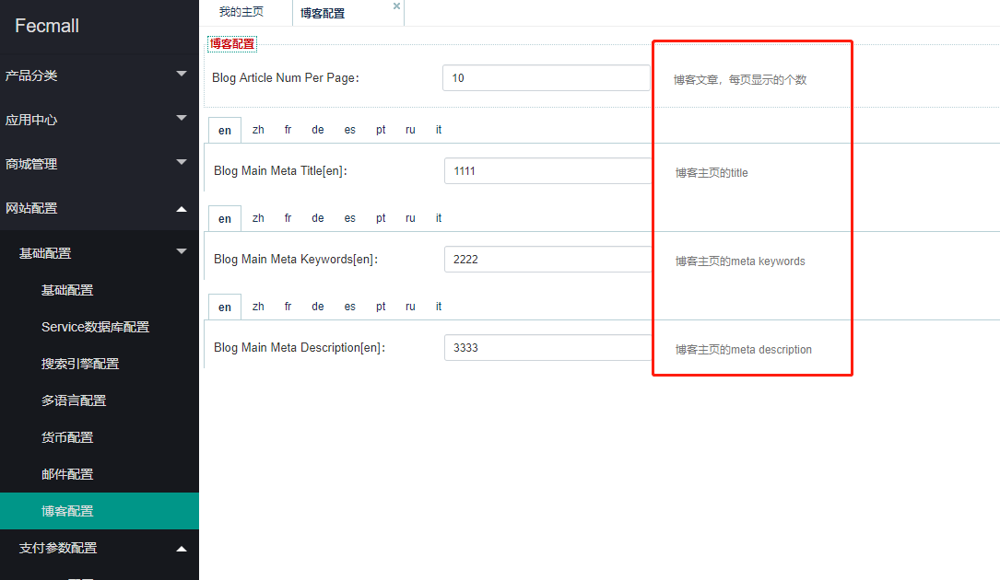
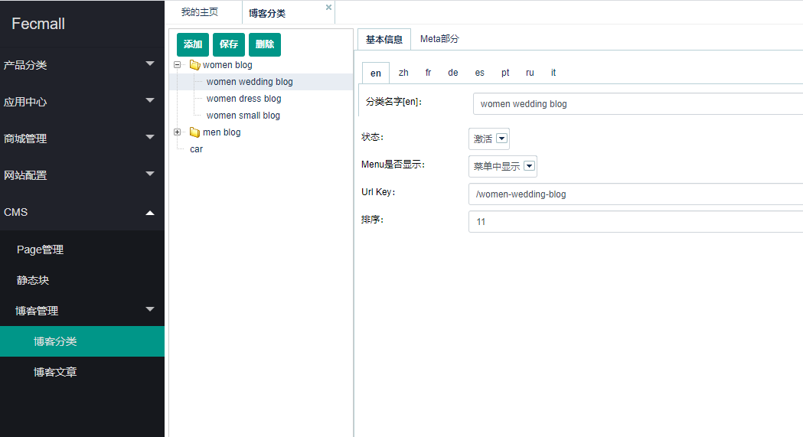
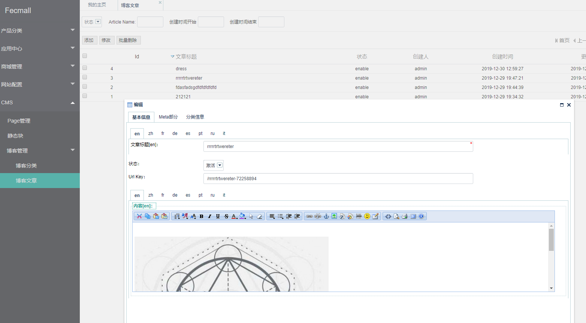
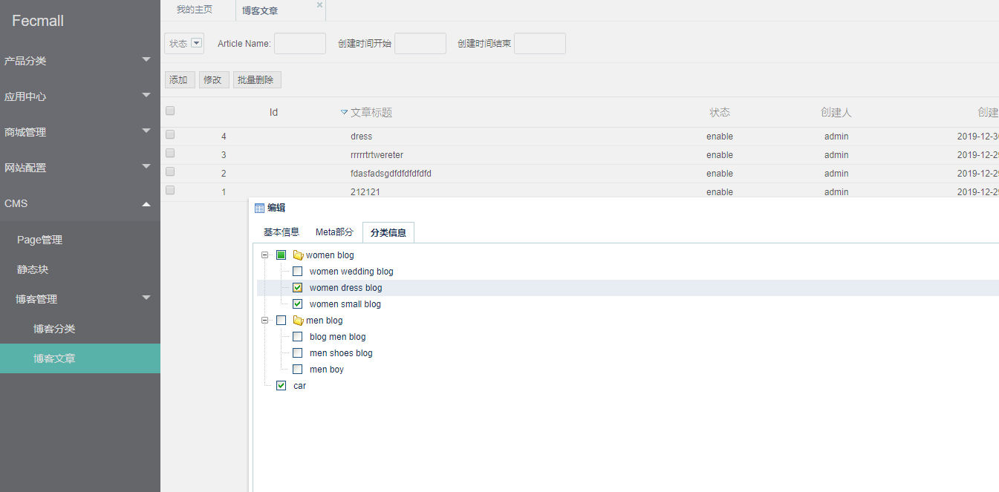
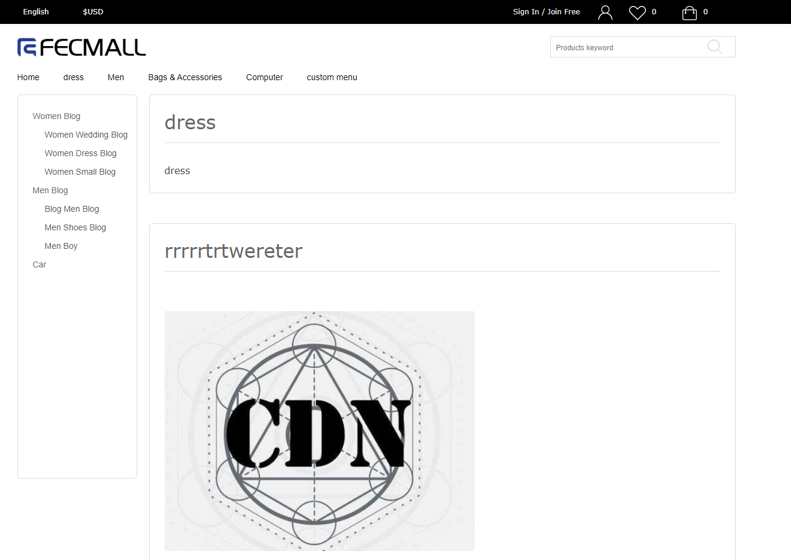

Fecmall扩展-Blog Cms博客扩展
====================

> Fecmall Blog扩展，支持多语言的博客，用于商城的图文

### fecmall blog 简介

1.为满足有大量`软文`，而且需要对文章进行分类的商城

2.支持`多语言文章`切换，`blog分类`和`blog文章`都支持多语言

3.文章支持上传`图片`

4.`blog分类`与`blog文章`，`多对多`关系，一篇文章可以对应多个分类，一个分类可以包含多个文章

### fecmall blog 安装，配置

1.安装

应用市场地址：http://addons.fecmall.com/62165749

`在线`安装，完成后，刷新`缓存`即可

2.配置

### fecmall blog 使用

1.后台添加博客分类

2.后台添加博客文章

为博客文章选择分类

3.前端商城访问

访问： http://www.domain.com/cms/blog/index （将 http://www.domain.com 替换成您自己的域名）

4.显示管理

4.1如果不想让某个文章显示，可以在后台管理博客文章，将其`disable`

4.2如果不想让某个文章分类显示，可以在后台管理博客分类，将其`disable`

