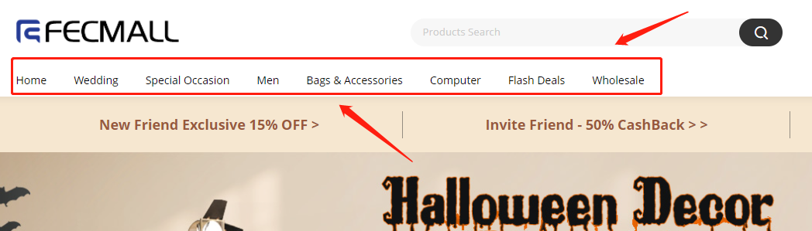
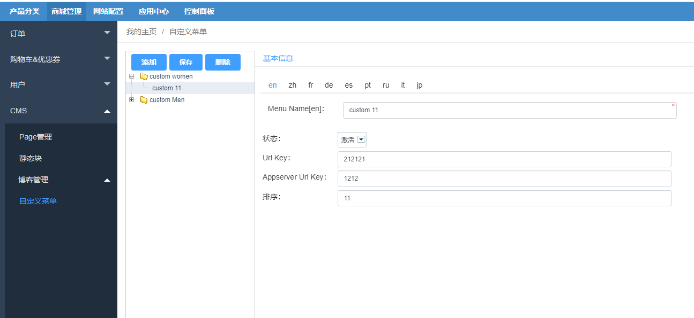
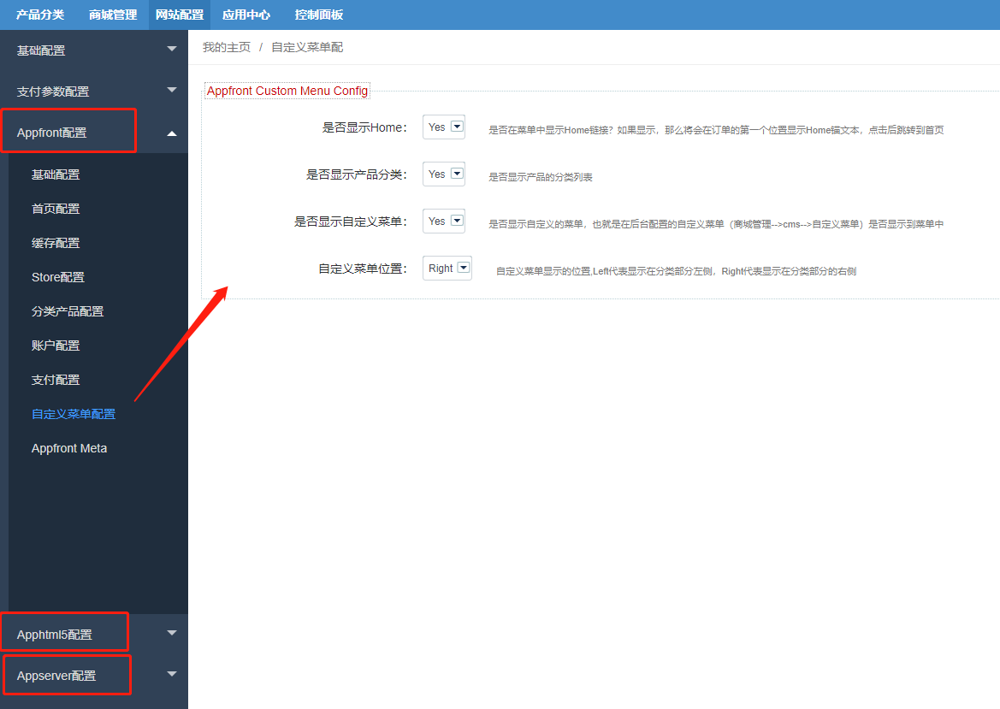

Fecmall扩展-自定义商城顶部菜单的扩展
===================

> 自定义商城菜单的扩展

### 自定义商城顶部菜单

对于pc和h5等商城入口，主体为产品分类菜单，如图:

1.对于菜单，大致分为三部分

1.1`Home`链接，用于点击进入`首页`

1.2产品`分类`部分

1.3`自定义菜单`部分，可以将`文字条款`，`联系我们`，`博客分类`等，加入进去，让其显示在`商城菜单`栏目里面

2.对于fecmall，本身支持`自定义菜单`，不过是在配置文件里面的,详细参看：[Fecmall菜单分类](https://www.fecmall.com/doc/fecshop-guide/instructions/cn-2.0/guide-fecmall_category.html)

在配置文件里面操作不方便用户，本扩展加入了`后台菜单`自定义配置，加入了`配置选项`，方便维护菜单部分。

### 自定义商城菜单扩展 - 安装

1.应用市场地址：http://addons.fecmall.com/62743267

2.如何`应用市场`安装应用，请参看文档：[Fecmall安装应用](https://www.fecmall.com/doc/fecshop-guide/addons/cn-2.0/guide-fecmall-addons-install.html)

安装插件后，请设置支付插件的优先级，`fecbraintree扩展优先级需要高出`其他插件（譬如fecro，fecwbbc等），
如何设置扩展插件优先级，请参看：[Fecmall-应用扩展优先级设置](https://www.fecmall.com/doc/fecshop-guide/addons/cn-2.0/guide-fecmall-addons-score.html)

### 自定义商城菜单扩展 - 配置

安装插件后一定要配置

1.自定义菜单 - 增删改查

自定义菜单的增删改查，和产品分类的类似，大致一样的操作，下面说明一下操作参数

`Menu Name`: 菜单的名称，也就是在前端商城菜单，自定义菜单部分显示出来的菜单名称，这里可以多语言

`状态`: 菜单的状态，如果是关闭状态，则不会显示在前端商城自定义菜单部分。

`Url Key`: 自定义菜单对应的url，您可以填写 `/customer/account` 这种`urlKey`，也可以填写`http`开头的完整url。
该字段针对appfront和apphtml5入口有效

`Appserver Url Key`: 和上面的`Url Key`类似，针对`appserver`入口有效

`排序`: 菜单的排序，数字越大，越在前面

`注意`：对于`url key`的填写，前提是您已经有了这个`urlKey`页面，譬如：您在后台`cms page`里面
新建了一个`about-us`的page页，想让其显示在菜单栏目里面，那么这里的`url key`就填写 `/about-us`, `Name`填写`About Us`
等，新建后就可以了。

2.配置菜单

对于菜单的配置，是按照入口来的，您需要在`appfront`，`apphtml5`，`appserver`里面单独配置,
下面是apfront的配置：

各个配置项，主要用来配置是否在菜单中显示各个菜单部分，在截图右侧的描述里面已经写清楚，这里不再讲解

3.配置完成后，就可以去商城菜单查看您添加的菜单了

这里着重说明，对于您的`自定义菜单`部分，该插件的作用只是在菜单栏目中`添加一个链接`，
对于点击`链接`（url）进入的页面，您需要`自己创建`，您可以通过`cms page`，`blog插件`，或者您自己`开发`的模块等等，
需要保证这个页面存在，否则点击进去后，页面会`404`.

