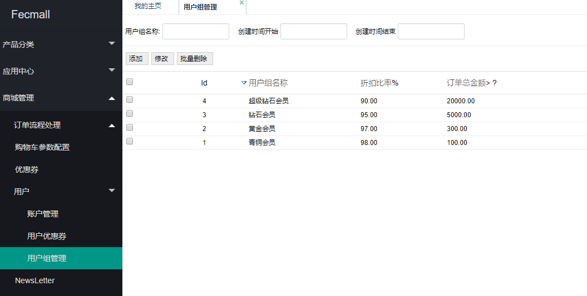
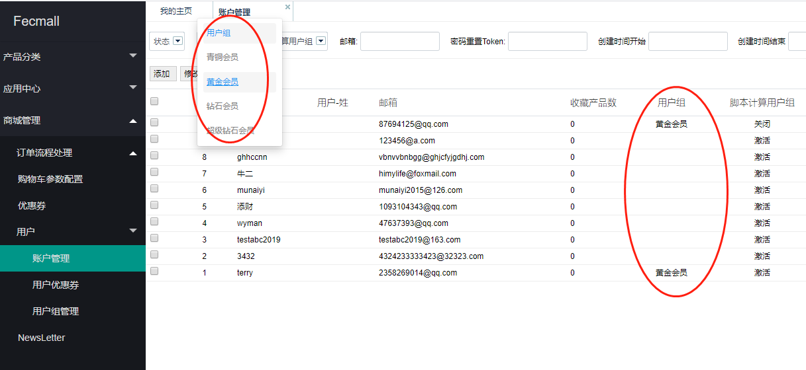
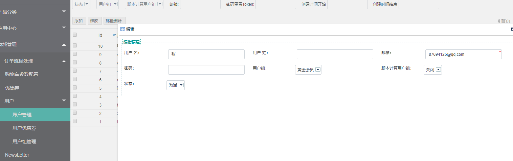

Fecmall 用户组等级，不同等级购买产品有不同的折扣
==============================

> 前端用户，对应的用户组，不同的用户组，对应不同的价格折扣

### 功能介绍

1.后台设置各个`用户组`的名称，`折扣金额`（百分比），用户登陆账户后，直接显示折扣后的`金额`（用户对应的用户组对应的折扣比率计算的价格）

2.分类，产品等处的缓存，`cache_key`加入当前`用户组`，作为数据缓存`key`的一部分.

3.用户加入该`用户组`后，就会享受用户组对应的`折扣价格`

4.管理员可以在后台， 手动将某个`用户`加入某个`用户组`

5.可以设置规则，全部购物订单满`xx`的用户，进行用户组计算，根据订单金额范围 计算出来用户组，然后设置用户的`用户组`

6.如果某个用户不想让`脚本`计算订单金额覆盖，那么可以将用户设置成`不允许脚本覆盖`,对于这个用户的用户组的修改，只能`后台手动`修改。

### 安装

应用市场地址：http://addons.fecmall.com/89781284

购买后，直接后台应用安装即可，安装完成后，刷新一下`缓存`

### 操作

1.后台设置用户组

您可以设置用户组的名称，折扣比率，以及更改用户组的条件。

2.用户管理，查看各个用户的用户组

3.编辑用户对应的用户组

用户的`用户组`默认是由`脚本`计算的，根据用户的`总订单金额`，满足`用户组`条件，将会被加入到相应的`用户组`

您可以在这里手动设置用户的`用户组`，然后将`脚本计算用户组`设置成`关闭`，计算脚本将不在计算该用户的`用户组`。

4.用户添加到`用户组`后，将会看到商城中产品`价格`发生变动。

