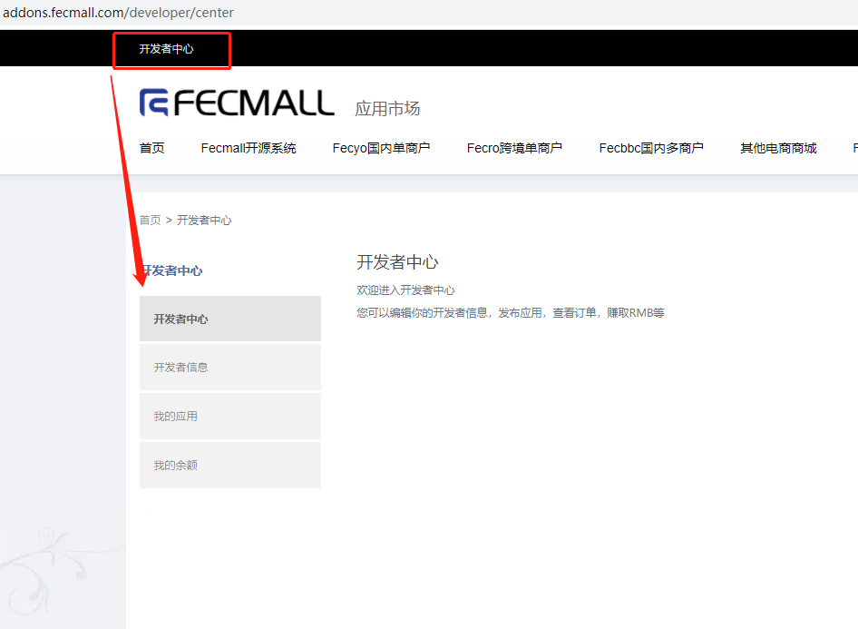
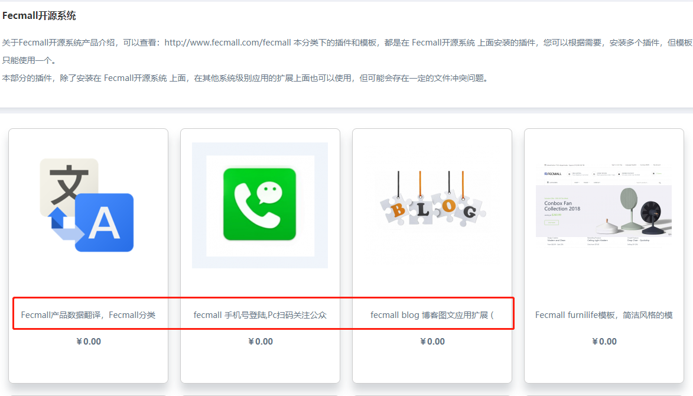

Fecmall-开发应用以及发布
===============

> 了解了fecmall应用的安装原理，加载原理以及如何发布，本部分完整的串一下整个过程

### Fecmall应用市场，申请成为开发者


应用市场，成为开发者，创建应用

申请成为开发者，详细参看： [Fecmall-开发者中心](fecmall-addons-developer-center.md)

成为开发者，成为开发者，才有资质进行开发。


### 创建应用

申请成为开发者，审核通过后，您就可以在fecmall应用市场，点击`开发者中心`，如图：




在这里，您可以点击`我的应用`, 然后点击 `添加应用` 按钮


`应用名称`: 这里的名称，就是应用发布后，在分类页面显示的名字，譬如：




`Namespace`: 您的扩展插件的命名空间名称，这个必须是您在fecmall开发的namespace，必须一致，否则会出问题，
也就是您使用 [Fecmall-应用初始化Gii工具](fecmall-addons-developer-init-tools.md) 创建插件的时候，填写的namespace。

注意：`Namespace`必须唯一，因此您创建的时候，尽量加个前缀，譬如多商户bbc，可以我使用的是fecbbc，您根据自己加上一个简单
的前缀，防止冲突。


### Gii创建应用文件


1. Gii创建应用文件

您可以在fecmall后台，使用gii工具创建初始化扩展文件：[Fecmall-应用初始化Gii工具](fecmall-addons-developer-init-tools.md)

需要注意的是，应用市场添加应用的`namespace`和gii生成填写表单的`namespace`, 必须一致。


2.应用开发辅助工具

后台菜单：`应用中心` --> `应用管理` -->  `应用市场`

您可以看到自己创建的扩展。


您可以看到自己创建的扩展，多出来几个`辅助工具按钮`（应用市场添加了应用，本地创建了应用，`namespace`一致，就会出现这几个开发辅助按钮）


### Fecmall扩展开发

1.查看Gii创建应用后的文件路径

Gii创建应用文件后，就会生成一些文件，您进入文件夹查看文件，进入文件夹：`@addons/package包名/应用插件包名/`,
可以看到文件

`config.php`： 应用配置文件

`README.md`：说明文件

`administer/Install.php`：应用安装文件

`administer/Uninstall.php`：应用卸载文件

`administer/Upgrade.php`：应用升级文件

4.进行应用功能开发

这个部分，如何在config.php进行配置，参考`Fecmall开发者`部分的文档


5.打包上传

进入文件夹：`@addons/package包名/应用插件包名/`

```
zip -r   应用插件包名.zip  ./*
```

注意，一定要进入`应用插件包名`里面进行打包，然后上传

参看：[Fecmall-开发者中心](fecmall-addons-developer-center.md)

6.管理员审核

管理员审核通过后，就可以下载了，如果是其他的账户，需要先进行应用的下单，添加到`我的应用`
中才可以安装


