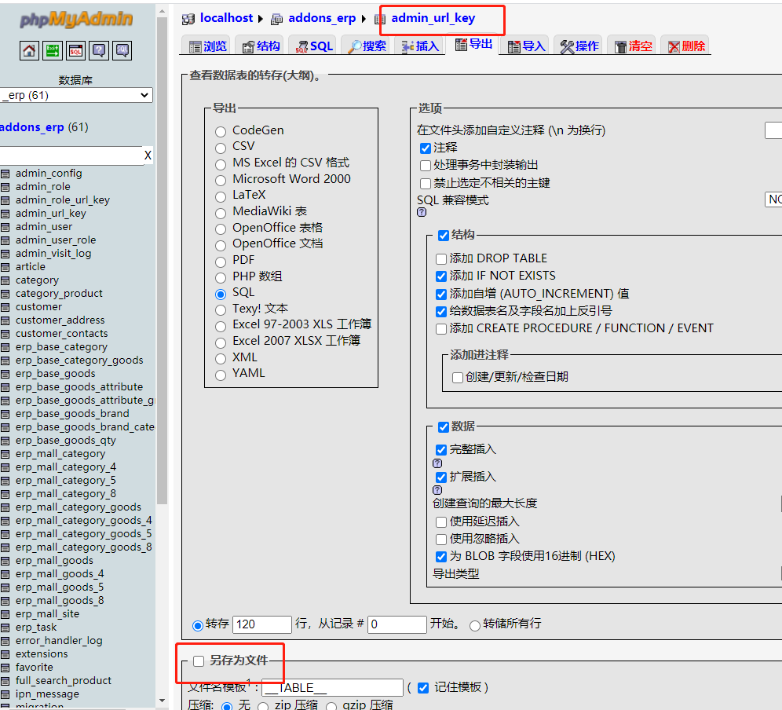
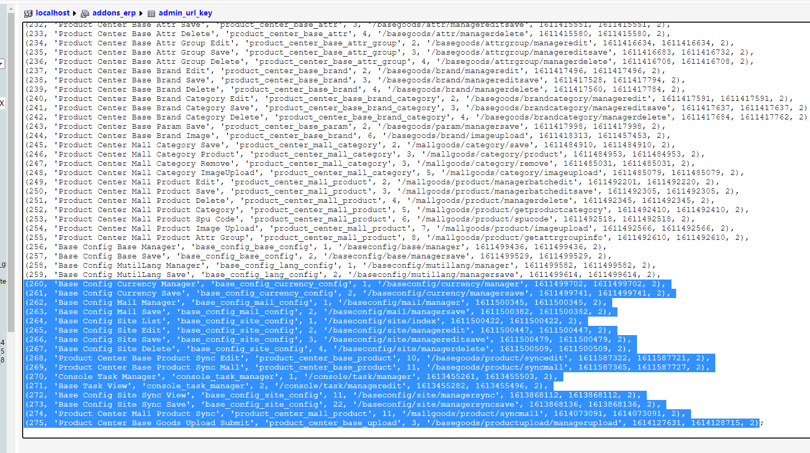
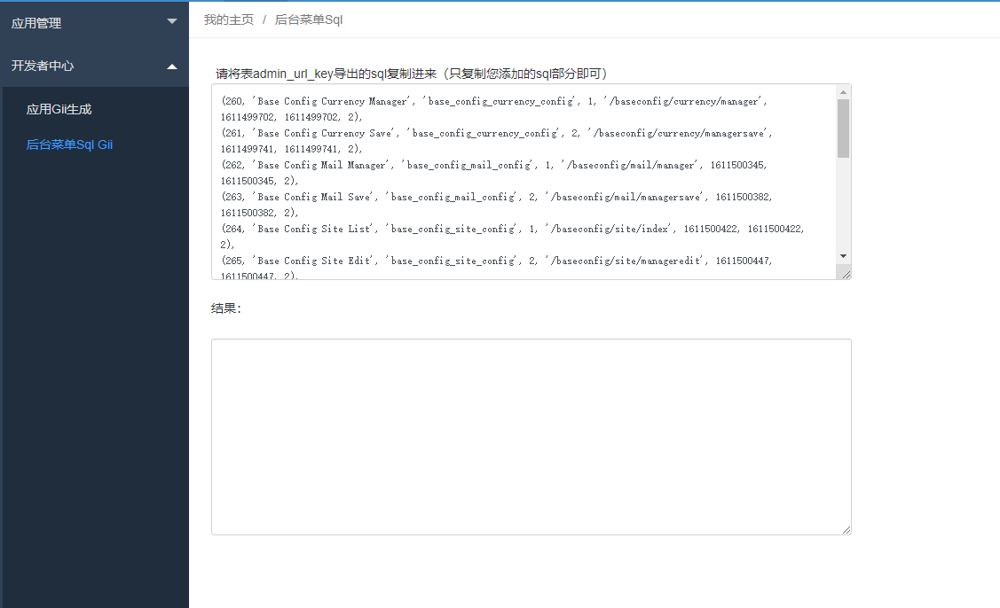
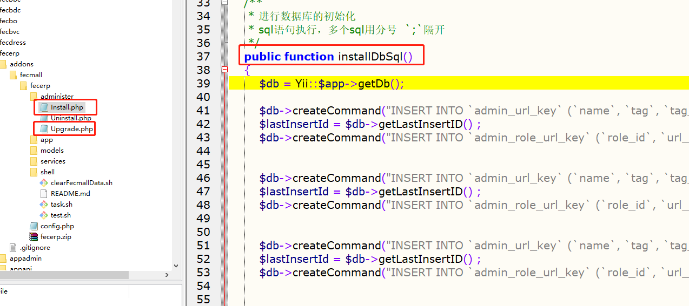

Fecmall-后台菜单Admin Url Key Gii工具
===============

> 本工具，是开发扩展过程中，添加的后台菜单，如何将这些sql快速的格式化成插件安装的sql


### Fecmall-后台菜单Admin Url Key

作为开发者，在fecmall后台添加了菜单，由于fecmall的菜单的权限控制部分，在后台配置后，是写到数据库的，因此
，在插件初始化安装的时候，需要导出来sql，本部分是如何快速的将数据库sql导出来格式化的插件install.php里面的格式


1.如何在添加菜单，开发功能，以及设置权限，这里就不详细说了

2.打开phpmyadmin，打开表 `admin_url_key`,进行表数据导出。





在导出的sql中，复制您新建的权限内容数据，如图：



3.进入后台，`应用中心` --> `开发者中心` --> `后台菜单Sql Gii`




将内容复制进去，然后点击`生成`按钮, 在结果栏目里面即可生成内容, 譬如：


```
$db->createCommand("INSERT INTO `admin_url_key` (`name`, `tag`, `tag_sort_order`, `url_key`, `created_at`, `updated_at`, `can_delete`) VALUES ( 'Product Center Base Category', 'product_center_base_category', 1, '/basegoods/category/index',1614254163,1614254163, 1)")->execute();
$lastInsertId = $db->getLastInsertID() ;
$db->createCommand("INSERT INTO `admin_role_url_key` (`role_id`, `url_key_id`, `created_at`, `updated_at`) VALUES (4, " . $lastInsertId . ", 1614254163, 1614254163)")->execute();


$db->createCommand("INSERT INTO `admin_url_key` (`name`, `tag`, `tag_sort_order`, `url_key`, `created_at`, `updated_at`, `can_delete`) VALUES ( 'Product Center Base Product', 'product_center_base_product', 1, '/basegoods/product/index',1614254163,1614254163, 1)")->execute();
$lastInsertId = $db->getLastInsertID() ;
$db->createCommand("INSERT INTO `admin_role_url_key` (`role_id`, `url_key_id`, `created_at`, `updated_at`) VALUES (4, " . $lastInsertId . ", 1614254163, 1614254163)")->execute();


$db->createCommand("INSERT INTO `admin_url_key` (`name`, `tag`, `tag_sort_order`, `url_key`, `created_at`, `updated_at`, `can_delete`) VALUES ( 'Product Center Base Attr', 'product_center_base_attr', 1, '/basegoods/attr/index',1614254163,1614254163, 1)")->execute();
$lastInsertId = $db->getLastInsertID() ;
$db->createCommand("INSERT INTO `admin_role_url_key` (`role_id`, `url_key_id`, `created_at`, `updated_at`) VALUES (4, " . $lastInsertId . ", 1614254163, 1614254163)")->execute();

```


4.将结果内容复制出来, 打开您的扩展的 `administer/Install.php` 或者  `administer/Upgrade.php` 文件





将代码复制进去即可。


到此就完成了。


