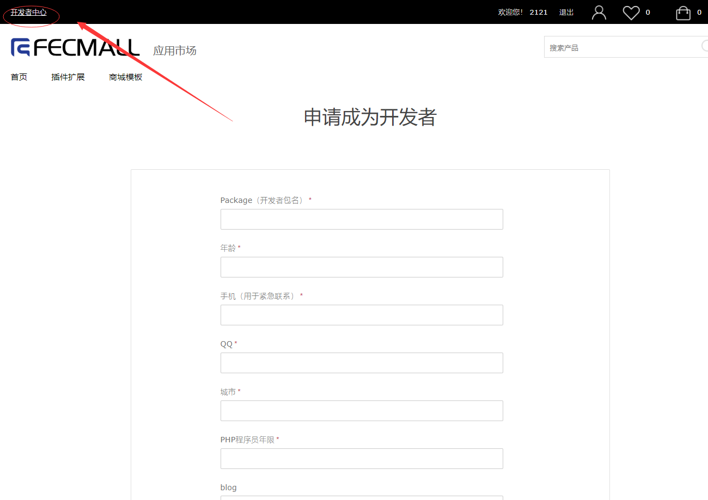
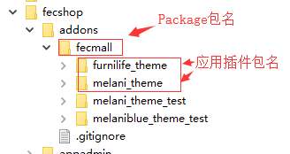
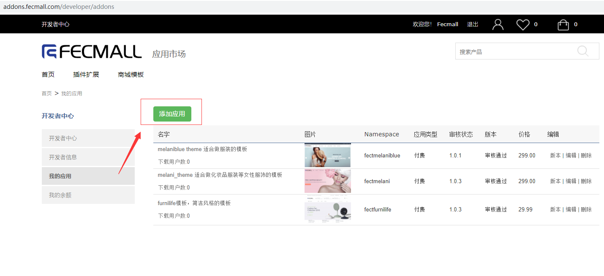
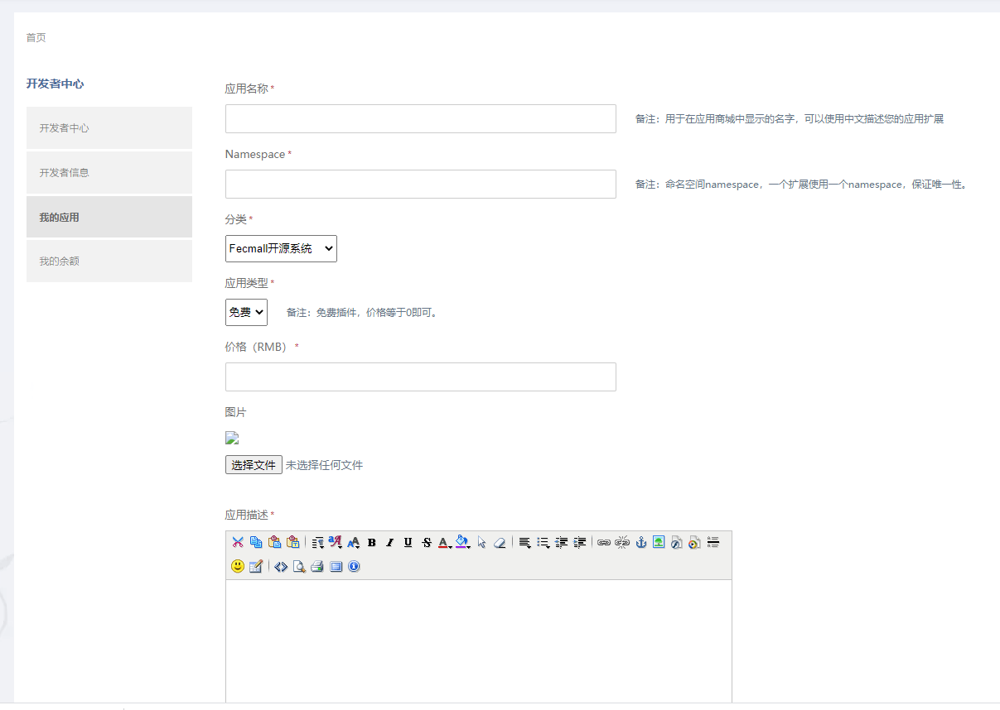
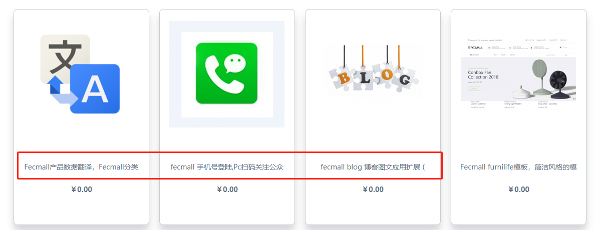
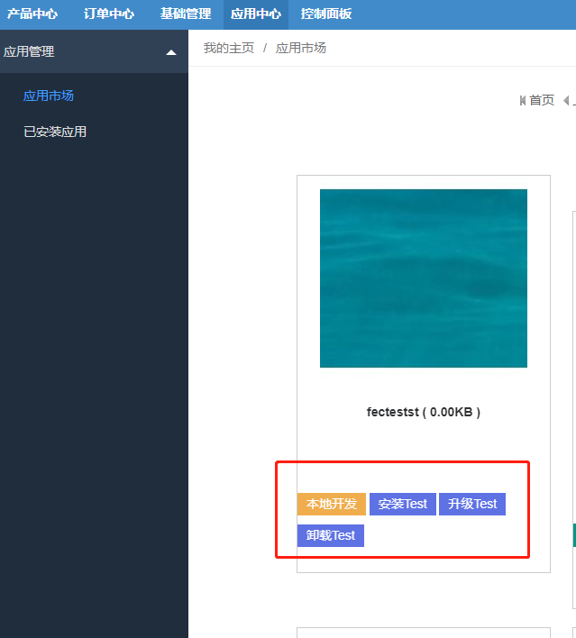
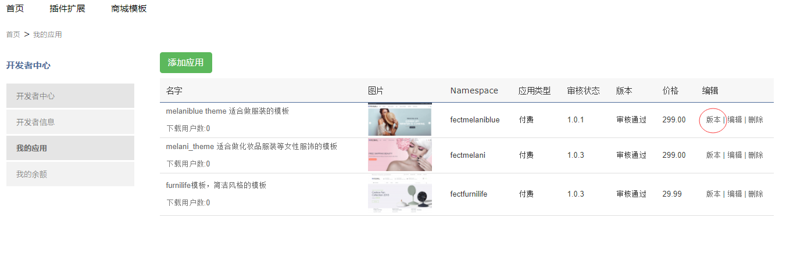
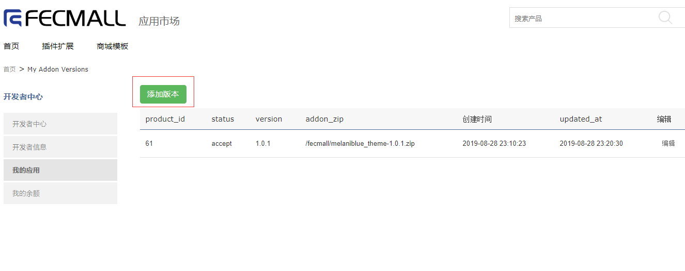

Fecmall-开发者中心-创建发布升级应用
=============


> 如果您想成为开发者,你需要先注册成为用户，然后才能申请成为开发者

### Fecmall 开发者申请

1.注册用户： http://addons.fecmall.com/customer/account/login
，并登陆用户

2.点击右上角开发者中心



页面刷新后，填写申请资料，等待管理员审核


`Package（开发者包名）`: 这个需要英文，您的应用安装后都放到这个包里面，
这个值是必须唯一的，如果您填写的这个被其他人占用，请使用其他的名字




`支付宝账户（用于收款）`： 该项是你的支付宝账户，如果您的付费插件赚取了费用，
进行提现，应用平台将汇款到该账户

`自我介绍（不少过1000字）`：您的自我介绍，是通过开发者审核的有力凭证，
请认真填写，提高通过率


### Fecmall 开发者添加应用

当您有了开发者资质，那么就可以在fecmall应用市场中，点击`开发者中心`
，`我的应用` ， `添加应用`, 进行应用的添加。




编辑应用表单信息：





`应用名称`： 用于在应用商城中显示的名字，可以使用中文描述您的应用扩展，如图：




`Namespace`: 命名空间namespace，一个扩展使用一个namespace，保证唯一性。譬如：fectmelaniblue，
命名`Namespace`，一定要加个前缀，譬如 多商户bbc，命名fecbbc，您可以将您的所有的扩展命名都加同一个前缀，
避免`Namespace`冲突，譬如命名`base`是不可取的，可以命名成 `furbase`。


`分类`: 应用显示的分类

`应用类型`: 免费应用 or 付费应用

`价格（RMB）`: 如果是付费应用，这里填写价格

`应用描述`： 插件的说明，描述信息，您可以把插件安装的说明写到这里


### Gii创建应用文件

> fecmall应用市场创建应用后，我们需要开发应用扩展， 我们可以使用Gii工具，初始创建应用，自动创建应用文件。

Gii创建应用文件

您可以在fecmall后台，使用gii工具创建初始化扩展文件：[Fecmall-应用初始化Gii工具](fecmall-addons-developer-init-tools.md)

需要注意的是，应用市场添加应用的`namespace`和gii生成填写表单的`namespace`, 必须一致。


### Fecmall扩展开发

查看Gii创建应用后的文件路径

Gii创建应用文件后，就会生成一些文件，您进入文件夹查看文件，进入文件夹：`@addons/package包名/应用插件包名/`,
可以看到文件

`config.php`： 应用配置文件

`README.md`：说明文件

`administer/Install.php`：应用安装文件

`administer/Uninstall.php`：应用卸载文件

`administer/Upgrade.php`：应用升级文件


在开发之前，您阅读一下文档：

[Fecmall-应用Config文件](fecmall-addons-developer-config-example.md)

[Fecmall-应用安装和加载原理](fecmall-addons-developer.md)


### Fecmall辅助工具测试安装，升级，卸载等

辅助工具解决哪些问题？当我们在本地开发了扩展，除了`代码文件`实现功能，还有`sql安装`，`图片复制`
等，而`sql安装`，`图片复制`都是在扩展安装的时候执行一次，测试`sql安装`，`图片复制`是否有效成了难题，
按照常理逻辑，必须等插件在应用市场发布才能安装测试，这对开发测试显然是不够友好的

因此，当我们开发完成了扩展，在administer/Install.php, administer/Upgrade.php, administer/Uninstall.php中加入了
sql安装，图片复制等一些扩展安装执行的操作，我们可以通过辅助工具来测试

1.辅助工具使用：

当您在fecmall应用市场添加了应用，本地创建了应用文件，两者的`namespace`一致

您进入fecmall后台菜单：`应用中心` --> `应用管理` -->  `应用市场`

您可以看到自己创建的扩展, 以及 `应用开发辅助工具` 按钮




2.辅助工具使用，测试`插件安装`，`升级`等

2.1您可以先备份一下`mysql`（`备份A`），然后手动删除您的扩展安装的sql（也就是还原成安装该插件之前的mysql数据库状态），
还原后再备份一下`mysql`（`备份B`），方便
后面测试

2.2点击辅助工具的`安装Test`,进行安装测试，看一下是否有问题

2.3如果测试有问题，那么您可以`debug`代码查看原因，修改代码，然后使用`备份B`
还原mysql重新测试安装.

没有问题后，就可以进行zip打包扩展应用了


### Fecmall扩展插件文件打包

> 当您本地开发fecmall扩展完成后，需要打包上传到应用市场，然后才能让其他的用户在线安装


进入文件夹：`@addons/package包名/应用插件包名/`

```
zip -r   应用插件包名.zip  ./*
```

注意，一定要进入`应用插件包名`里面进行打包，然后上传。

`应用插件包名.zip`，直接使用您的namespace的名称即可，譬如`fecbbc.zip`


### Fecmall 应用市场上传应用，审核发布

通过上面的步骤，我们打包了我们开发的应用文件，我们需要到fecmall应用市场上传`版本zip压缩包`。

一个插件应用，对应多个`版本`，每个`版本`添加后，都需要管理员`审核`后才能发布

点击版本：



点击添加`应用版本`



填写版本号，以及上传`zip`压缩包


对于第一个版本，可以命名版本号：`1.0.0`

提交后，等待管理员审核，在未通过审核的期间，您可以编辑该`应用版本`的内容

对于审核通过的`应用版本`，不可以编辑修改

审核后，该`应用版本`会发布

版本发布后，您可以看到应用状态的变化，然后，您可以在分类产品中查看到该应用。

对于开发者发布的应用，会直接添加到`账户中心-->我的应用`中，因此开发者发布的付费应用，
开发者自身是不需要购买就可以下载的。

### 应用升级

当您的应用发版后，可以继续进行二次开发，修改代码，如果有数据库的更改，您需要到
administer/Upgrade.php 中添加升级的sql

假设您现在的版本号为1.0.0，然后修改代码，添加sql，升级为1.1.0

1.sql升级

打开：administer/Upgrade.php, 下面是一个例子。

```
<?php
/**
 * Fecmall Addons
 */
namespace fecyo\administer;
use Yii;
/**
 * 应用安装类
 * 您可以在这里添加类变量，在配置中的值可以注入进来。
 */
class Upgrade implements \fecshop\services\extension\UpgradeInterface
{
    public $versions = [
        '1.1.0',
    ];

    public function run($version)
    {
        
        switch ($version)
        {
            case '1.1.0' :
                $this->upgrade110();
                $this->copyImageFile110;
                break;
        }
        
        
        return true;
    }


    // 1.1.0
    public function upgrade110()
    {
        $db = Yii::$app->getDb();

        $db->createCommand(
            "
                ALTER TABLE `admin_coupon` ADD `is_show_in_product_page` INT( 5 ) NOT NULL DEFAULT '1' COMMENT '是否在产品页面显示该优惠券，1代表显示，2代表不显示'
            "
        )->execute();
        
        return true;
    }


    /**
     * 复制图片文件到appimage/common/addons/{namespace}，如果存在，则会被强制覆盖
     */
    public function copyImageFile110()
    {
        /*
        $sourcePath = Yii::getAlias('@fecyo/app/appimage/common/addons/fecyo');
        
        Yii::$service->extension->administer->copyThemeFile($sourcePath);
        */
        return true;
    }
}

```

2.测试扩展sql升级

您可以使用辅助工具进行测试升级，是否有效。

3.打包上传


升级应用和安装应用在打包上传是一样的，进入插件目录执行

```
zip -r   fecbbc.zip   ./*

```

进入fecmall开发者中心，打开应用版本，然后添加新的版本号，上传文件即可。


当管理员审核通过后，您可以重新测试一下是否有效。


