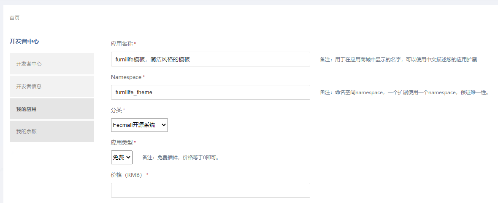

Fecmall-Furnilife应用实例讲解
================


为了更好的讲解开发应用的原理，特将Furnilife模板改为`9.99`(原599)，
您可以在这块
找到Furnilife模板应用：
http://addons.fecmall.com/41928926

购买后，在fecmall后台在线安装后，然后按照应用描述，配置一下就可以使用了

### Fecmall-Furnilife模板应用文件

1.应用文件夹路径

安装完成后，您可以再这里找到应用文件 @addons/fecmall/furnilife_theme

`@addons`: 这个是应用安装的根目录

`fecmall`: 这个是开发者的包名（这个是terry开发的，命名的包名为fecmall）


`furnilife_theme`: 这个是该应用的应用文件夹名




### Fecmall-Furnilife模板应用配置文件

文件路径：@addons/fecmall/furnilife_theme/config.php

furnilife_theme模板应用安装后，在数据库表extensions中的
`config_file_path`字段，可以看到对应的配置文件路径，
这个配置文件路径是固定的（约定优于配置）

因此您开发新应用的时候，新建应用为：

```
@addons/开发者package/应用文件夹名/config.php
```

打开这个config.php可以看到配置内容

1.设置namespace

```
Yii::setAlias('@fectfurnilife', dirname(dirname(dirname(__DIR__))).'/addons/fecmall/furnilife_theme/');
```

2.设置应用信息

```
'info'  => [
    'name' => 'theme_furnilife',
    'title' => 'furnilife theme',
    'description' => 'furnilife theme',
    'author' => 'terry',
],
```

以上信息只起一个记录的描述作用，没有其他的用处


3.插件的安装，升级，卸载

```
// 插件管理部分
    'administer' => [
        'install' => [
            'class' => 'fectfurnilife\administer\Install',
            // 其他引入的属性，类似yii2组件的方式写入即可
            'test' => 'test_data',
        ],
        'upgrade' => [
            'class' => 'fectfurnilife\administer\Upgrade',
        ],
        'uninstall' => [
            'class' => 'fectfurnilife\administer\Uninstall',
        ],
    ],
```

`Install` : 因为上面定义了namespace， `@fectfurnilife`就是文件夹`@addons/fecmall/furnilife_theme`,
因此install部分对应的class文件为
`@addons/fecmall/furnilife_theme/administer/Install.php`

必须继承：`\fecshop\services\extension\InstallInterface`，并定义初始安装版本号类变量
`public $version = '1.0.0';`


在插件安装的时候，会执行里面的 `run()`, 因此您可以在该方法里面写一些安装需要初始化数据表的sql，
以及文件复制等等


`Upgrade`: 升级文件，文件位置和`install`类似，
如果您的新版本需要进行一些数据库sql操作，或者文件复制等，可以写到该文件中


`Uninstall`：卸载文件，文件位置和`install`类似，


4.功能重写和扩展部分


写在 `'app'`里面的是功能重写和扩展部分

按照入口进行区分，如果是公用的配置，可以写到`common`中,
其他的写到相应的入口中即可。


```
'app' => [
    'common' => [
    
    ],
    'appfront' => [
    
    ],
    'appadmin' => [
    
    ],
    'apphtml5' => [
    
    ],
    'appserver' => [
    
    ],
    'appapi' => [
    
    ],
    'console' => [
    
    ],

]
```

4.1Yii ClassMap重写部分的配置

```
'yiiClassMap' => [
    
],
```

关于Yii classMap的资料可以参看：http://www.fecmall.com/doc/fecshop-guide/develop/cn-1.0/guide-fecshop-rewrite-func.html#7yii2classclassmapfecshop


4.2FecMall RewriteMap重写部分，用于重写block和model

```
'fecRewriteMap' => [
    '\fecshop\app\appfront\modules\Cms\block\home\Index'  => '\fectfurnilife\app\appfront\modules\Cms\block\home\Index',
    '\fecshop\app\appfront\modules\Customer\block\address\Edit'  => '\fectfurnilife\app\appfront\modules\Customer\block\address\Edit',
],
```


4.3模块配置部分

```
'modules' => [

],
```

4.4services配置部分

```
'services' => [

]
```

5.原理


这个部分的配置，和fecmall系统的配置思路是一样的，这个配置文件和fecmall的配置文件
在初始化的时候，都需要进行merge成一个config数组，
知道这个原理，您就可以灵活的添加配置，进行扩展和重写功能了


