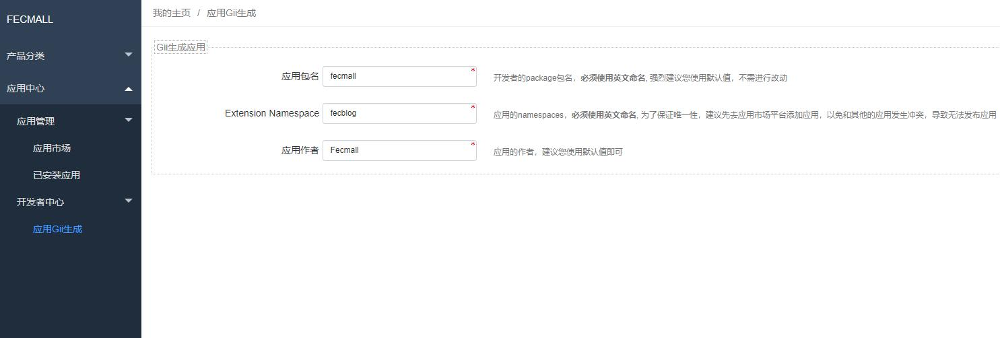
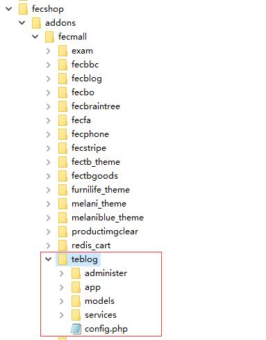
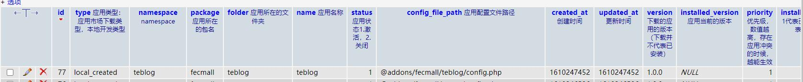
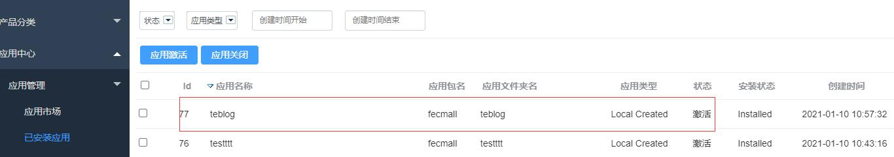

Fecmall-应用Gii初始化工具
============

> 开发者开发应用，可以通过初始化工具，快速创建应用，
使用该工具，可以帮助开发者初始化创建应用文件包，
然后您在这个文件包的基础上进行开发会更方便快捷

### Fecmall后台初始化Gii应用工具

在后台可以看到：

`应用包名`: 开发者的`package包名`, 命名`插件包名`，譬如您命名了   `terry`，那么将会创建  `./addons/terry`文件夹，作为您的包名

`Extension Namespace`: 应用插件的`namespace`，同时也作为插件的`文件夹名`，插件的名字，譬如：您填写了`teblog`，那么将会创建
`./addons/terry/teblog`文件夹作为插件的根目录， `@teblog` 指向 `./addons/terry/teblog`， 插件的名字为`teblog`.

`应用作者`: 应用的作者，仅仅是一个描述，使用默认值即可

Gii初始化生成插件初始文件

1.进行配置，如上图，填写`Extension Namespace`（下面的截图以该值填写teblog为例子），点击`生成`按钮

2.创建成功后

2.1创建应用初始化文件，具体的文件夹为`@addons/fecmall/teblog`

2.2extentions表会自动增加配置

2.3在fecmall后台`已安装应用`，可以看到您创建的`应用扩展`

您可以关闭和激活，您本地创建的扩展

3.进行二次开发

初始化的文件，是一些简单的初始化配置，
您可以在配置中添加您的应用配置和功能，进行二次开发。

