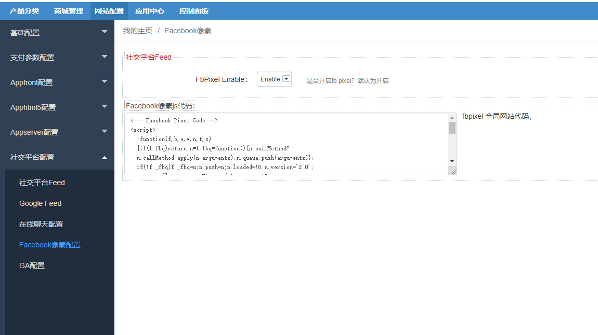

Fecmall扩展-Facebook Pixel像素
===============

> fecmall对接Facebook Pixel像素的追踪js，在商城前端埋点，将数据传送给facebook，方便广告统计

fecmall`版本`要求：`2.16.1+`

### Facebook Pixel插件支持的系统

由于Facebook Pixel是跨境电商使用的，因此fecmall只有跨境部分的进行了对接，目前执行Facebook Pixel插件的应用有：

1.fecmall开源系统本身

2.fecmall模板： `melaniblue_theme`,  `melani_theme`，`Furnilife_theme`

3.系统级别扩展：`fecro`企业跨境单商户（支持安装fecrot扩展），`fecwbbc`企业跨境多商户，

4.国内电商系统**不支持**，譬如：fecyo，fecbbc等.


Fecebook Pixel开发文档：https://developers.facebook.com/docs/facebook-pixel

### Facebook Pixel像素 扩展安装

您需要先安装fecmall开源系统，然后再进行插件的安装

1.fecmall应用市场地址：http://addons.fecmall.com/75565418

2.如何应用市场`安装`应用，请参看文档：[Fecmall安装应用](https://www.fecmall.com/doc/fecshop-guide/addons/cn-2.0/guide-fecmall-addons-install.html)

3.安装完成后，您需要设置Facebook Pixel插件的优先级,设置成最高，如何设置插件优先级，
请参看：[Fecmall-应用扩展优先级设置](https://www.fecmall.com/doc/fecshop-guide/addons/cn-2.0/guide-fecmall-addons-score.html)

**注意**：如果您同时安装了`fecga`插件和`fecfbpixel`插件，那么`fecga`插件 的优先级`必须大于``fecfbpixel`插件优先级。


4.fecmall后台查看Facebook Pixel的配置部分 

后台：`网站配置` -> `社交平台配置` -> `Facebook像素配置`




`FbPixel Enable`：开启`Facebook Pixel`，如果不需要可以关闭


`Facebook像素js代码`：将`Facebook Pixel`追踪的js代码片段填写进去，
如果获取`Facebook像素js代码`? 请参看文档：   https://developers.facebook.com/docs/facebook-pixel/implementation

填写完成后，保存即可


### `Facebook Pixel`插件配置验证

1.打开chrome浏览器，进入商城pc入口首页，查看html源代码，

2.在html源代码中，查看到如下代码，即配置成功

fecfbpixel-2.png


3.配置完成后，需要等一段时间，就会有用户行为数据。


### Fecmall数据对接说明


1.facebook pixel通用代码，也就是：https://developers.facebook.com/docs/facebook-pixel/implementation

2.首页，分类页，搜索页等产品列表加入购物车

文档：https://developers.facebook.com/docs/facebook-pixel/implementation/pixel-for-collaborative-ads

在fecro，fecwbbc等系统中，可以在这些页面打开弹框，选择规格属性，将产品加入购物车，
而不需要进入产品详情页，对加入购物车的产品数据进行了对接

fb示例代码：

```
fbq('track', 'AddToCart', {
  contents: [
    { id: 'SKU-1', quantity: 2 }
  ],
  content_type: 'product',
  value: 100,
  currency: 'USD',
})
```

3.产品详情页访问

fb示例代码：

```
fbq('track', 'ViewContent', {
  contents: [
    { id: 'SKU-1', quantity: 1 }
  ],
  content_type: 'product',
  value: 50,
  currency: 'USD',
})
```

4.产品详情页加入购物车

fb示例代码：

```
fbq('track', 'AddToCart', {
  contents: [
    { id: 'SKU-1', quantity: 2 }
  ],
  content_type: 'product',
  value: 100,
  currency: 'USD',
})
```

5.产品搜索


```
fbq('track', 'Search', {
   search_string: 'xxxx',
  contents: [
    { id: 'SKU-1', quantity: 2 }
  ],
  "content_category": "search product",
  content_type: 'product',
  value: 100,
  currency: 'USD',
})
```

6.用户初始下单（进入下单页面）


```
fbq("track", "InitiateCheckout", {
    "contents": [
        { id: 'SKU-1', quantity: 2 }
    ],
    "num_items": 3,
    "value": 99.88,
    "currency": "USD"
});
```

7.用户填写好订单信息，点击支付按钮


```
fbq("track", "AddPaymentInfo", {
    "contents": [
        { id: 'SKU-1', quantity: 2 }
    ],
    "num_items": 3,
    "value": 99.88,
    "currency": "USD"
});
```


8.用户支付订单成功，进入订单支付成功页面


```
fbq('track', 'Purchase', {
  contents: [
    { id: 'SKU-1', quantity: 2 },
    { id: 'SKU-2', quantity: 1 },
  ],
  content_type: 'product',
  value: 130,
  currency: 'USD',
})
```

通过上面的数据发送，来对广告用户流量进行更为深入的了解


