Fecmall GA扩展功能说明以及疑问解答
=================

> 关于GA插件更给力的解读


### Fecmall GA对接的细节功能说明，以及疑惑解说


1.看了源代码，`ga js`是在顶部`head`里面加载的，而不是尾部，放到顶部`head`里面会不会堵塞网站的加载？

答：GA的js是`异步加载`的，因此，放到顶部`head`里面并`不会堵塞`网站的加载


2.GA`跨设备`用户识别，是如何做的？

答：`GA跨设备`用户识别，是通过发送`登陆用户`的`id`来实现的，对于已注册并登陆的用户，如果电脑访问了pc，然后手机设备访问了h5入口，
并且登陆了账户，fecmall会把用户id发送给`GA`，那么`GA`会将其作为一个用户处理，详细参看[GA 设置 User ID](https://developers.google.com/analytics/devguides/collection/gtagjs/cookies-user-id#set_user_id)

fecmall进行了对接，如果您按照上面的步骤配置完成了，打开pc商城(您必须先登陆商城用户)，查看`源代码`，可以看到


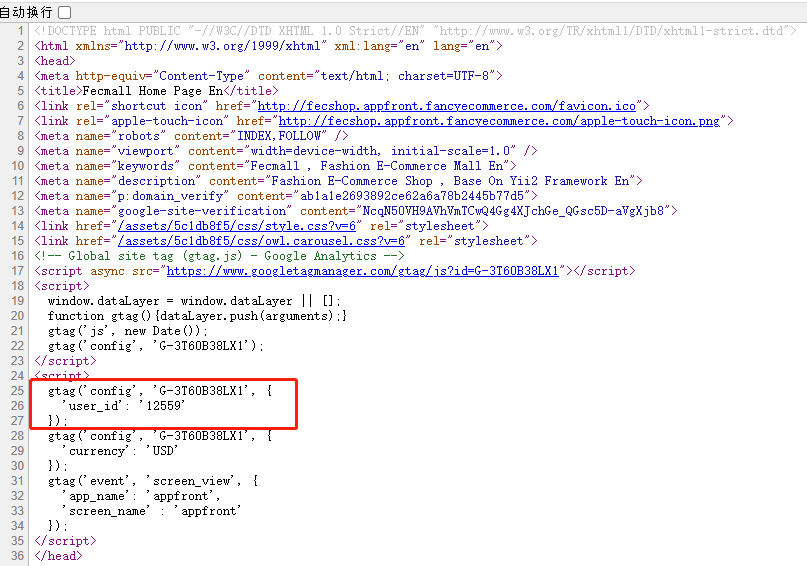

```
gtag('config', 'G-3T60B38LX1', {
    'user_id': '12559'
  });
  
```

`12559`就是当前用户的id。


3.传递给GA的产品`价格货币`，是什么？`当前货币`，还是fecmall设置的`基础货币`

答：fecmall的`基础货币`，而不是当前货币，在上图，可以看到配置了货币

```
gtag('config', 'G-3T60B38LX1', {
    'currency': 'USD'
  });
```

统一用`基础货币`，这样比较好处理数据，GA增强电子商务的金额统计更加方便。


4.GA增强型电子商务，对接了哪些数据？

答：GA增强型电子商务功能，请参看官方文档：[GA增强型电子商务](https://developers.google.com/analytics/devguides/collection/gtagjs/enhanced-ecommerce)

以下是该文档指导下，对接的详细说明。

4.1衡量商品获得的`展示`情况

如需衡量商品获得的`展示`情况，请发送 `view_item_list`，并提供相应的商品信息：

```
gtag('event', 'view_item_list', {
  "items": [
    {
      "id": "P12345",
      "name": "Android Warhol T-Shirt",
      "list_name": "Search Results",
      "brand": "Google",
      "category": "Apparel/T-Shirts",
      "variant": "Black",
      "list_position": 1,
      "quantity": 2,
      "price": 2
    },
    {
      "id": "P67890",
      "name": "Flame challenge TShirt",
      "list_name": "Search Results",
      "brand": "MyBrand",
      "category": "Apparel/T-Shirts",
      "variant": "Red",
      "list_position": 2,
      "quantity": 1,
      "price": 3
    }
  ]
});
```

`首页产品`列表，`分类产品`列表，`搜索产品``列表都进行了对接，也就是产品的`展示`，就发送给`ga`

例子：您可以打开商城首页，查看源代码，可以看到如下的js

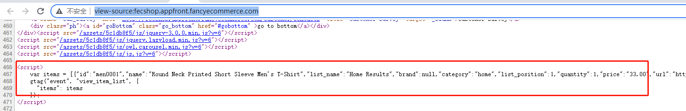


4.2衡量商品获得的`点击`情况

如需衡量商品获得的`点击`情况，请发送 `select_content `事件，将 product 指定为 `content_type`，并提供相应的商品信息：

```
gtag('event', 'select_content', {
  "content_type": "product",
  "items": [
    {
      "id": "P12345",
      "name": "Android Warhol T-Shirt",
      "list_name": "Search Results",
      "brand": "Google",
      "category": "Apparel/T-Shirts",
      "variant": "Black",
      "list_position": 1,
      "quantity": 2,
      "price": 2
    }
  ]
});
```
首页产品列表，分类产品列表，搜索产品列表都进行了对接，也就是产品进行了`点击`，就发送给ga

例子：您可以打开商城首页，查看源代码，可以看到如下的js

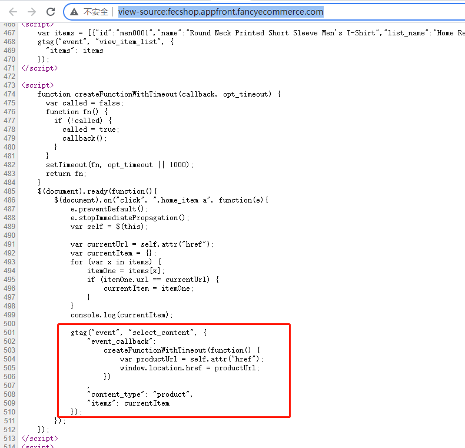


4.3衡量`商品详情`获得的`浏览`情况

点击`商品详情`后，用户会查看`商品详情`页面。如需衡量`商品详情`获得的`浏览`情况，请发送 `view_item`事件，并提供相应的商品详情：


gtag('event', 'view_item', {
  "items": [
    {
      "id": "P12345",
      "name": "Android Warhol T-Shirt",
      "list_name": "Search Results",
      "brand": "Google",
      "category": "Apparel/T-Shirts",
      "variant": "Black",
      "list_position": 1,
      "quantity": 2,
      "price": '2.0'
    }
  ]
});

`产品详情页`，进行了对接，也就是用户访问了产品详情页面，就发送给ga

例子：您可以打开商城`产品详情页`，查看源代码，可以看到如下的`js`

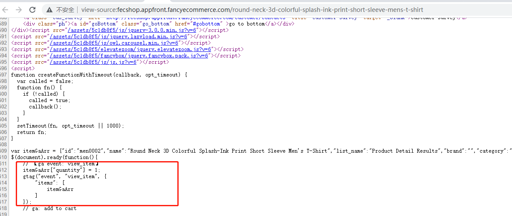


4.4衡量在`购物车`中添加商品的操作

如需衡量将商品添加到`购物车`的操作，请发送包含相应商品信息的 `add_to_cart` 事件：

```
gtag('event', 'add_to_cart', {
  "items": [
    {
      "id": "P12345",
      "name": "Android Warhol T-Shirt",
      "list_name": "Search Results",
      "brand": "Google",
      "category": "Apparel/T-Shirts",
      "variant": "Black",
      "list_position": 1,
      "quantity": 2,
      "price": '2.0'
    }
  ]
});
```

fecmall将产品加入购物车的js如下：


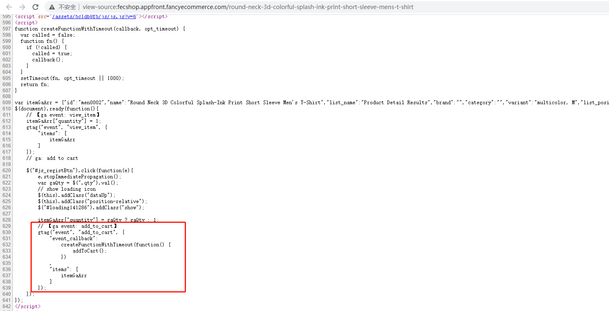


4.5衡量结帐情况


如需衡量第一个`结帐步骤`，请发送一个包含结帐商品的 `begin_checkout` 事件：

```
gtag('event', 'begin_checkout', {
  "items": [
    {
      "id": "P12345",
      "name": "Android Warhol T-Shirt",
      "list_name": "Search Results",
      "brand": "Google",
      "category": "Apparel/T-Shirts",
      "variant": "Black",
      "list_position": 1,
      "quantity": 2,
      "price": '2.0'
    }
  ],
  "coupon": ""
});
```

fecmall在此步骤进行的处理：当用户在购物车点击下单按钮，进入`下单页面`后，就会将`购物车`的`产品
数据`发送给GA，


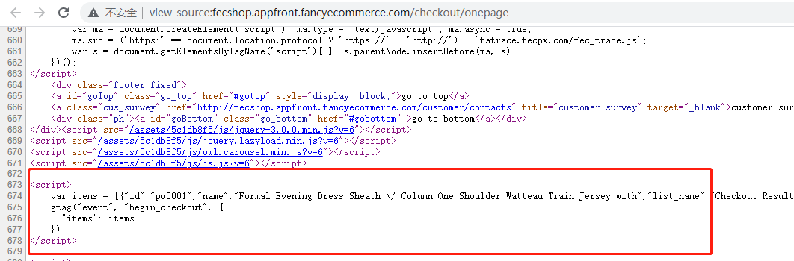


4.6如需衡量各个`后续结帐`步骤，请发送 `heckout_progress` 事件，并提供相应的`结帐商品`信息：


gtag('event', 'checkout_progress', {
  "items": [
    {
      "id": "P12345",
      "name": "Android Warhol T-Shirt",
      "list_name": "Search Results",
      "brand": "Google",
      "category": "Apparel/T-Shirts",
      "variant": "Black",
      "list_position": 1,
      "quantity": 2,
      "price": '2.0'
    }
  ],
  "coupon": "SUMMER_DISCOUNT"
});


fecmall商城，用户在下单页面，填写完成订单信息，点击`下单按钮`后，会将`订单产品`数据，通过该`event`，发送给GA

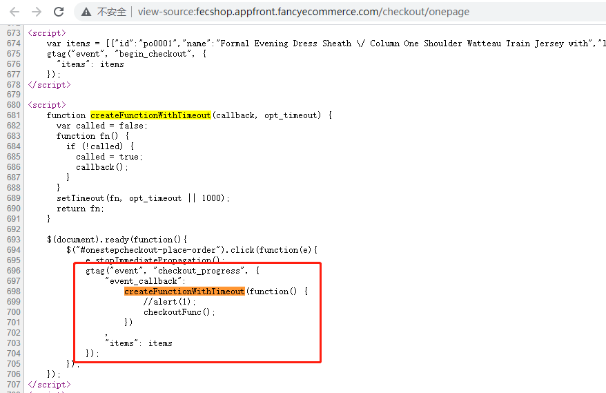


4.7衡量购买情况

如需衡量交易情况，请发送 `purchase` 事件，并提供相应交易所涉及的商品：

```
gtag('event', 'purchase', {
  "transaction_id": "24.031608523954162",
  "affiliation": "Google online store",
  "value": 23.07,
  "currency": "USD",
  "tax": 1.24,
  "shipping": 0,
  "items": [
    {
      "id": "P12345",
      "name": "Android Warhol T-Shirt",
      "list_name": "Search Results",
      "brand": "Google",
      "category": "Apparel/T-Shirts",
      "variant": "Black",
      "list_position": 1,
      "quantity": 2,
      "price": '2.0'
    },
    {
      "id": "P67890",
      "name": "Flame challenge TShirt",
      "list_name": "Search Results",
      "brand": "MyBrand",
      "category": "Apparel/T-Shirts",
      "variant": "Red",
      "list_position": 2,
      "quantity": 1,
      "price": '3.0'
    }
  ]
});
```
用户进行订单支付，支付成功后，进入fecmall支付成功页面（`/payment/success`），
会将订单以及订单产品数据发送给GA


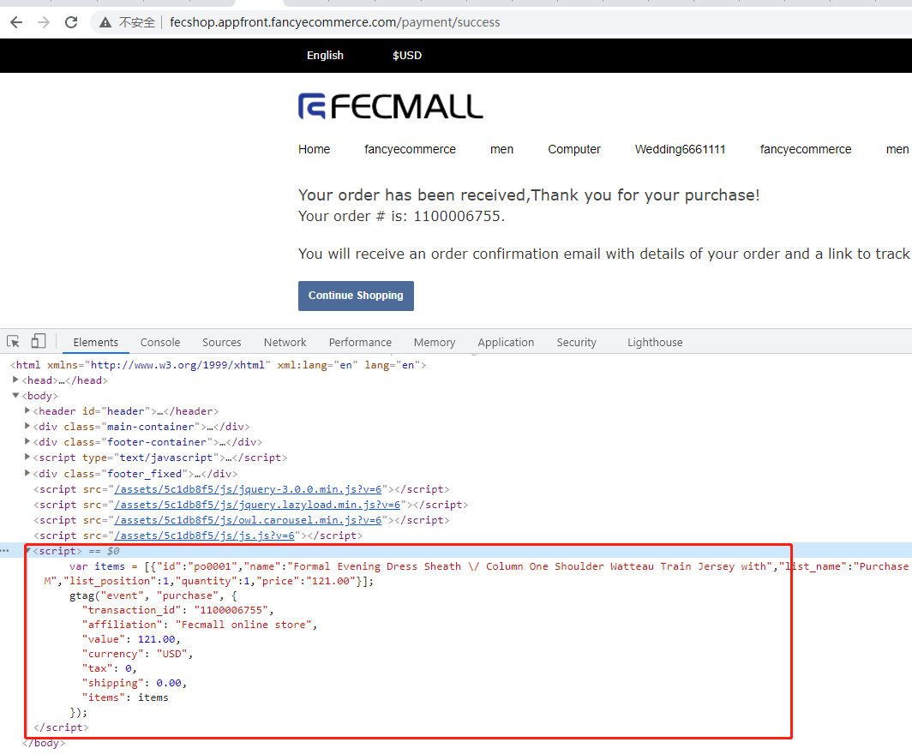


4.8用户搜索

使用此事件可为`搜索操作`提供背景信息。此事件有助于您找出应用中最热门的内容。

事件文档：https://developers.google.com/gtagjs/reference/event#search


```
gtag('event', 'search', {
  search_term: 't-shirts'
});
```

fecmall搜索页面，进行了对接，将用户进行的`搜索语句`发送给GA


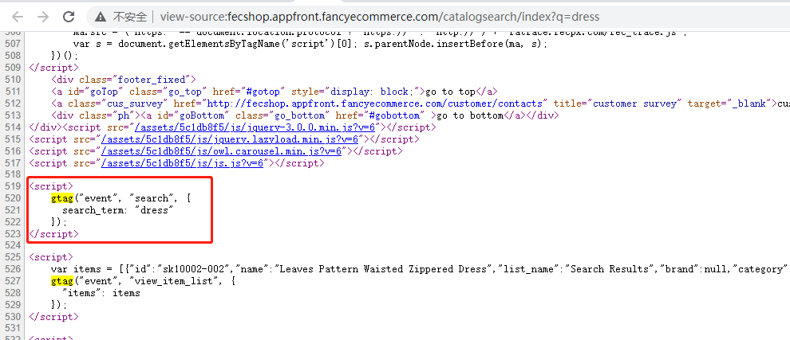


5.对于`fecro`，`fecwbbc`等，用户可以在首页，分类，搜索等产品列表页面，进行产品加入购物车，在这些 
页面的加入购物车是否也发送给了GA

答：在fecro，fecwbbc等系统，用户是可以`不需要`进入产品详情页，将产品加入购物车的，如图，鼠标访问产品图片，会
出现一个按钮

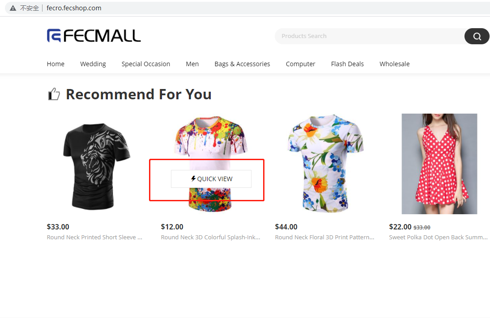

点击`按钮`，弹出产品框

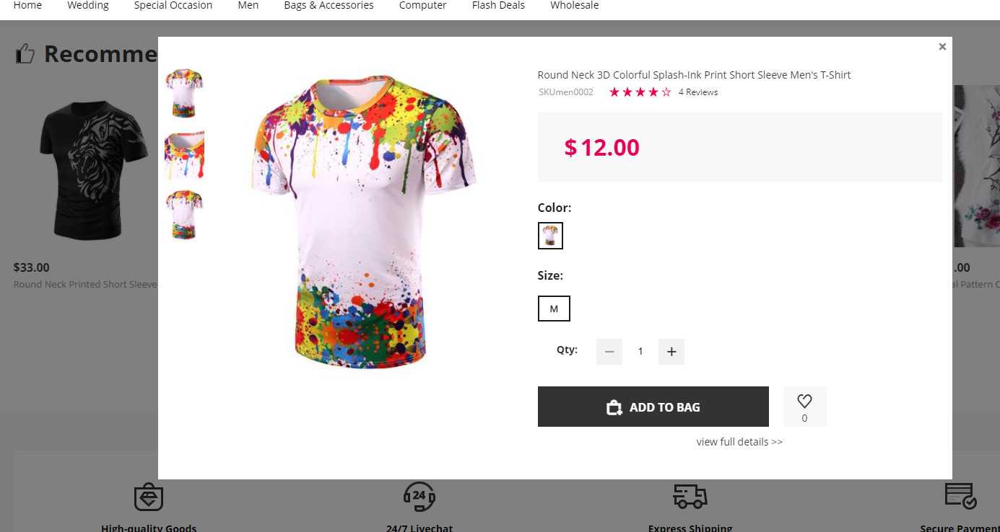

然后用户点击加入`购物车按钮`，即可将产品加入`购物车`

这个操作，GA插件也进行了对接，这个对接是比较麻烦的，但是也是非常有必要的

安装fecro并配置好`ga插件`后，进入首页，查看js，即可看到如下的对接js代码：

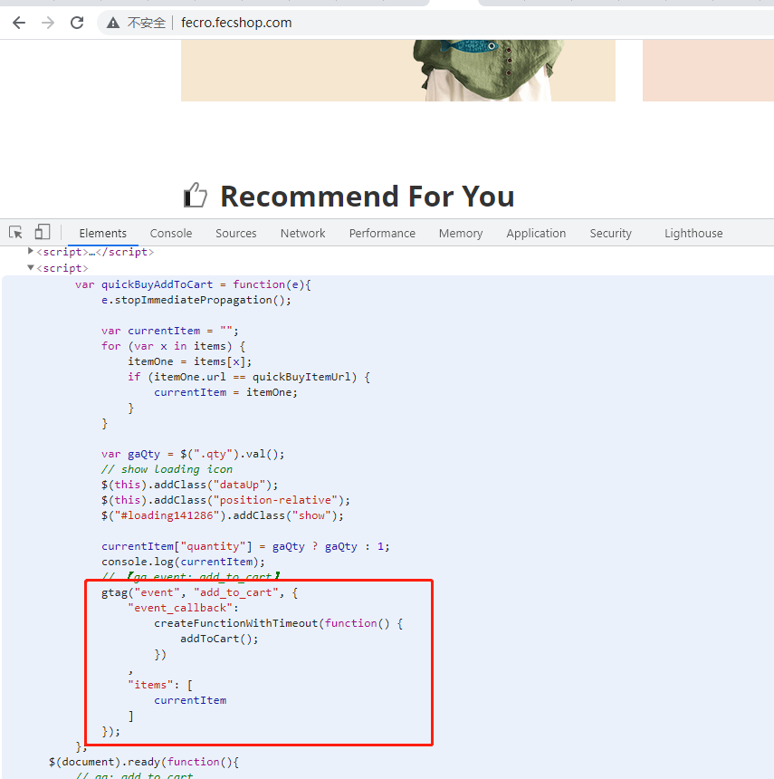

6.对于点击产品，点击加入`购物车`等操作，如果因为网络原因，`<script async src="https://www.googletagmanager.com/gtag/js?id=G-DKP1VG6TLR"></script>`, 
ga的js文件`加载失败`，而这里需要先执行ga的函数，然后才能执行加入购物车函数，
是否会因为`gtag js加载失败`而`无法执行`？导致产品无法加入购物车，网站流程阻塞？


答：有这个问题的，肯定是专业的程序员会思考的，这个的确是个问题，不过`ga插件`进行了处理，
如果`gtag js`没有加载，那么会触发一个`延迟执行`的函数（js`timeout`函数），目前设置的`延迟时间`为1秒，
也就是如果一秒内没有执行，那么这个`延迟函数`将会执行，触发`addToCart`函数，因此不会对网站的流程造成问题，
唯一的遗憾是会导致慢一秒（延迟一秒），不过这个也是可以接受的

以addToCart为例子：


打开产品详情页，查看源代码，找到js如图：


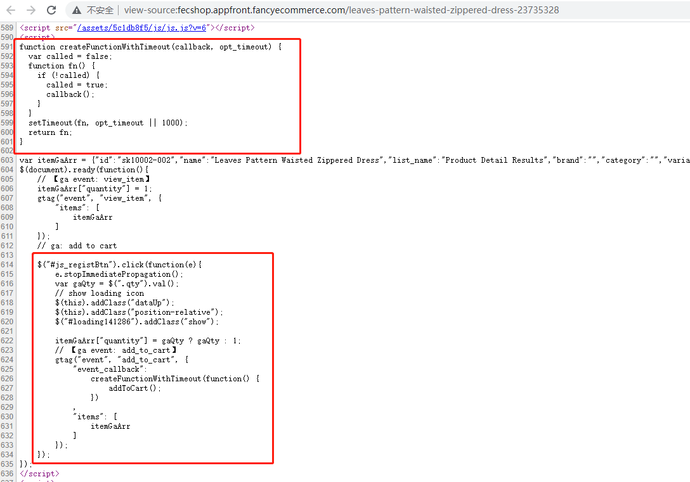


为了更加容易读，将这段js复制出来，如下：


```
function createFunctionWithTimeout(callback, opt_timeout) {
  var called = false;
  function fn() {
    if (!called) {
      called = true;
      callback();
    }
  }
  setTimeout(fn, opt_timeout || 1000);
  return fn;
}
var itemGaArr = {"id":"sk10002-002","name":"Leaves Pattern Waisted Zippered Dress","list_name":"Product Detail Results","brand":"","category":"","variant":"blue, L","list_position":1,"quantity":1,"price":"22.00"};
$(document).ready(function(){
    // 【ga event: view_item】
    itemGaArr["quantity"] = 1;
    gtag("event", "view_item", {
        "items": [
            itemGaArr
        ]
    });
    
    // ga: add to cart
    $("#js_registBtn").click(function(e){
        e.stopImmediatePropagation();
        var gaQty = $(".qty").val();
        // show loading icon
        $(this).addClass("dataUp");
        $(this).addClass("position-relative");
        $("#loading141286").addClass("show");
        
        itemGaArr["quantity"] = gaQty ? gaQty : 1;
        // 【ga event: add_to_cart】
        gtag("event", "add_to_cart", { 
            "event_callback": 
                createFunctionWithTimeout(function() {
                    addToCart();
                })
            ,
            "items": [
                itemGaArr
            ]
        });
    });
}); 
</script>

```

js解读：

6.1加入购物车的按钮 `<button id="js_registBtn" >Add To Cart</button>`

6.2当用户点击按钮后，将会触发GA插件的`$("#js_registBtn").click()`，js 点击事件

6.3由于femall里面也有一个js 点击事件,因此这里有一个`堵塞`其他click执行的js语句
`e.stopImmediatePropagation();`
，最后通过触发函数`addToCart()`;

6.4执行`gtag("event", "add_to_cart", {})`函数，`event_callback`是执行后的回调函数配置，
也就是执行`createFunctionWithTimeout()`

6.5在`createFunctionWithTimeout()`函数里面有一个语句`setTimeout(fn, opt_timeout || 1000);`,
这个代表延迟1秒后执行


该部分js处理超时的方案，是GA给与的，有兴趣的可以参看ga文档：[ga发送数据处理超时](https://developers.google.com/analytics/devguides/collection/gtagjs/sending-data#handle_timeouts)


7.GA数据对接完成后，如何核验准确性


答：如果您是新的网站，可以进行一些操作，譬如访问分类发送产品展示数据，点击购物车等，
然后进入GA查看事件，事件数是否会`+1`（注意，要在`GA实时部分`查看，一般会延迟5-10秒）

8.除了fecmall对接的这些常用的电子商务ga event，是否还有其他的event

答：有的，详细参看：[GA事件参考](https://developers.google.com/gtagjs/reference/event#search)


9.除了fecmall支持GA插件安装，还有哪些模板和扩展系统支持安装GA插件？

答：9.1fecmall开源系统本身

9.2fecmall模板： `melaniblue_theme`,  `melani_theme`，`Furnilife_theme`

9.3系统级别扩展：`fecro`企业跨境单商户（支持安装fecrot扩展），`fecwbbc`企业跨境多商户，

9.4国内电商系统**不支持**，譬如：fecyo，fecbbc等.


