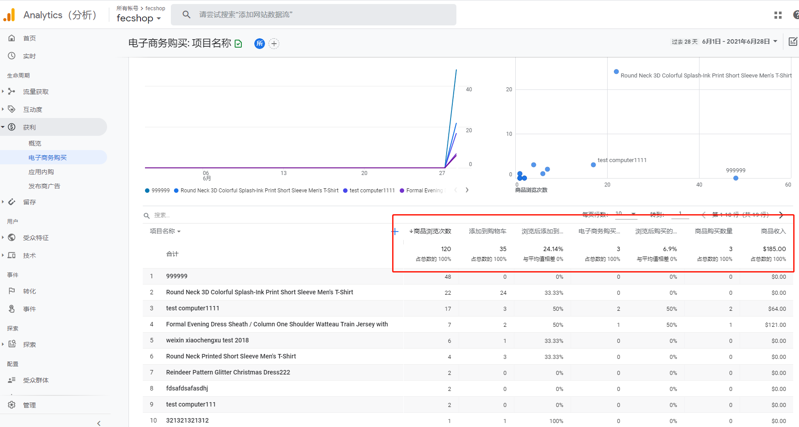
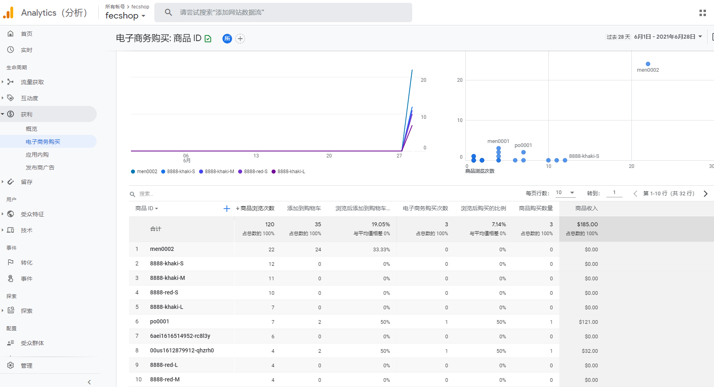
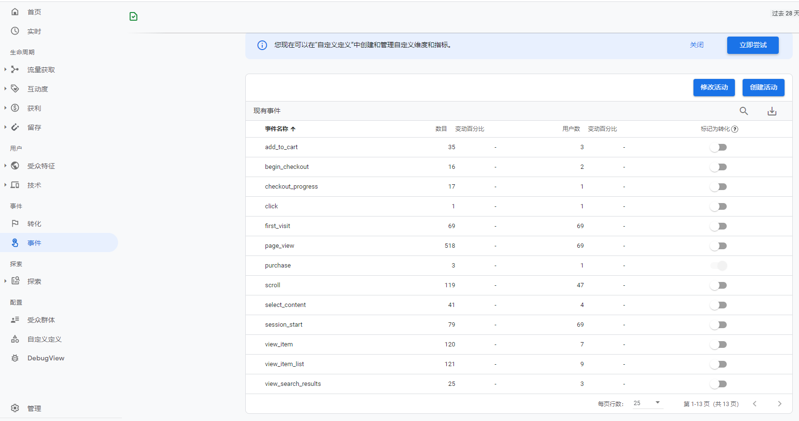

Fecmall GA 电子商务插件介绍
=================

> Google Analytics是谷歌公司针对网站用户访问数据，进行数据统计的工具，
Ga插件在网站打点传递数据，除了普通的数据外，还有产品，下单等电子商务数据。

### 关于Google Analytics

1.关于Google Analytics，你可以参看：[GA说明文档](https://developers.google.com/analytics/devguides/collection/gtagjs)

2.Ga事件说明：[GA事件说明](https://developers.google.com/gtagjs/reference/event)

### GA电子商务插件

GA插件进行了一下的数据对接

1.基本的`数据统计`，譬如浏览器，pv，ip，等，对用户和流量的通用统计

2.`登陆用户跨设备识别`，利用 `User ID` 进行跨设备分析会话组

详细参看GA文档: [GA 用户识别](https://developers.google.com/analytics/devguides/collection/gtagjs/cookies-user-id#set_user_id)

3.GA`增强型电子商务`统计，加入了一系列的事件数据发送，主要有以下event

3.1衡量商品获得的`展示`情况，详细参看GA文档：https://developers.google.com/analytics/devguides/collection/gtagjs/enhanced-ecommerce#measure_product_impressions

首页产品列表，分类页产品列表，搜索页产品页面，都加入了该event事件，
用于统计各个产品展示的次数。

3.2衡量商品获得的`点击`情况，详细参看GA文档：https://developers.google.com/analytics/devguides/collection/gtagjs/enhanced-ecommerce#measure_product_clicks

首页产品列表，分类页产品列表，搜索页产品页面，都加入了该event事件，
用于统计各个产品被用户点击的次数。

3.3衡量商品详情获得的`浏览`情况，详细参看GA文档：https://developers.google.com/analytics/devguides/collection/gtagjs/enhanced-ecommerce#measure_product_detail_views

商城产品详情页面，加入了该event事件，用于统计产品详细页面访问的次数

3.4衡量在购物车中`添加商品`的操作，详细参看GA文档：https://developers.google.com/analytics/devguides/collection/gtagjs/enhanced-ecommerce#measure_additions_to_and_removals_from_shopping_carts

商城`产品详情页`加入`购物车`，以及`产品列表页`加入`购物车`的产品`数据统计`

3.5衡量结帐情况，详细参看GA文档：https://developers.google.com/analytics/devguides/collection/gtagjs/enhanced-ecommerce#measure_checkouts

3.5.1用户进入`checkout下单`页面，将用户下单的购物车产品数据发送给`GA`，也就是事件`begin_checkout`

3.5.2用户在`heckout下单`页面，填写收货地址，物流，支付方式等信息，`点击`下单付款按钮时，
会把下单的产品信息发送给`GA`，也就是事件`checkout_progress`

3.6衡量购买情况，详细参看GA文档：https://developers.google.com/analytics/devguides/collection/gtagjs/enhanced-ecommerce#measure_purchases

当用户下单，并且付款成功后，就会跳转到下单`支付成功页面`，在该页面，将已支付
订单信息发送给`GA`，也就是事件`purchase`

3.7衡量搜索情况，将用户`搜索词`数据发送给`GA`，也就是事件`search`

GA插件在fecmall商城内打点，将产品业务数据发送给`GA`，可以得到更全面的`电子商务数据`统计。

### GA电子商务数据展示（截图看不清，请放大浏览器页面，或者复制图片url，在浏览器新tab打开）

电子商务购买 - `产品名称`

电子商务购买 - `产品Sku`

电子商务购买 - `事件`

