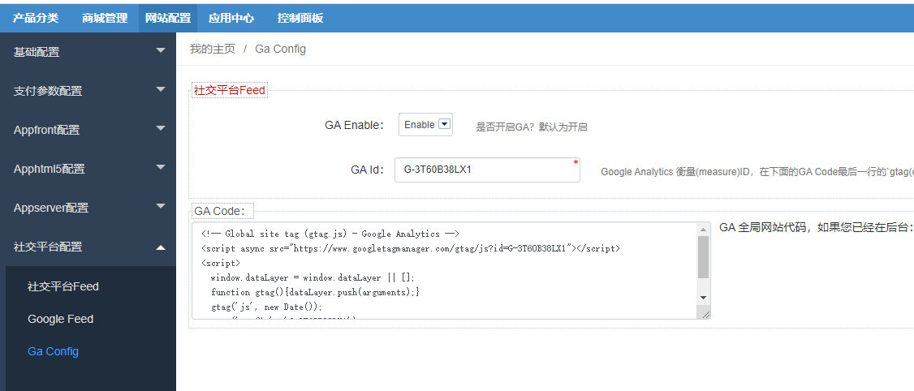
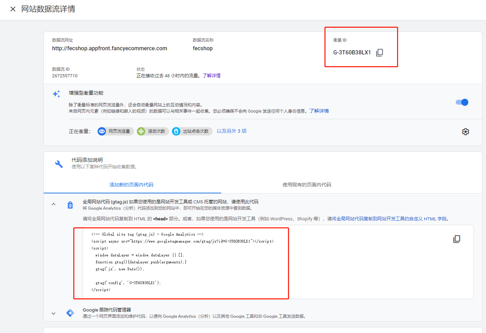
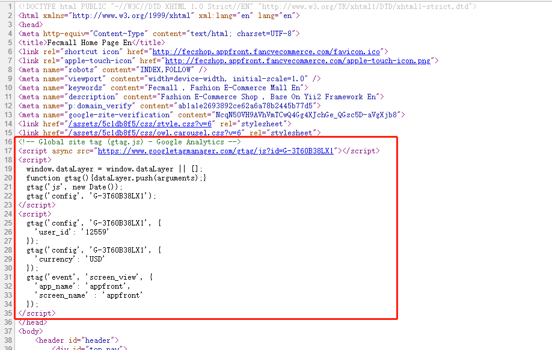
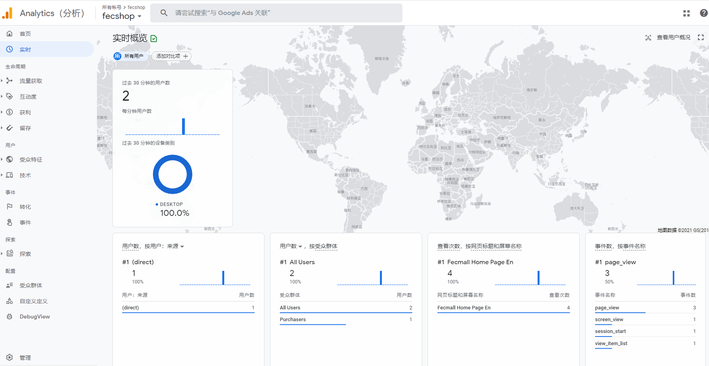

Fecmall GA扩展插件安装和配置
=================

> 如何安装Ga插件，以及相应的配置过程

GA，也就是google analytics，是类似于百度统计的一款谷歌公司的统计系统，可以通过网站js埋点，将
网站的用户行为数据发送给GA，然后ga给与统计结果的一款工具

由于ga是跨境电商使用的，因此fecmall只有跨境部分的进行了对接，目前执行GA插件的应用有：

1.fecmall开源系统本身

2.fecmall模板： `melaniblue_theme`,  `melani_theme`，`Furnilife_theme`

3.系统级别扩展：`fecro`企业跨境单商户（支持安装fecrot扩展），`fecwbbc`企业跨境多商户，

4.国内电商系统**不支持**，譬如：fecyo，fecbbc等.

### GA插件安装

您需要先安装fecmall开源系统，然后再进行插件的安装

1.fecmall应用市场地址：http://addons.fecmall.com/53783528

2.如何应用市场`安装`应用，请参看文档：[Fecmall安装应用](https://www.fecmall.com/doc/fecshop-guide/addons/cn-2.0/guide-fecmall-addons-install.html)

3.安装完成后，您需要设置GA插件的优先级,设置成最高，如何设置插件优先级，
请参看：[Fecmall-应用扩展优先级设置](https://www.fecmall.com/doc/fecshop-guide/addons/cn-2.0/guide-fecmall-addons-score.html)

4.fecmall后台查看GA的配置部分 

后台：`网站配置` -> `社交平台配置` -> `Ga Config`

### GA配置

1.您需要在先申请google账户，然后访问：https://analytics.google.com/analytics/web

进行登陆账户

2.获取到您的GA追踪信息，例子：

如上图：`衡量ID` ， 和`追踪js代码`，您需要进入后台：`网站配置` -> `社交平台配置` -> `Ga Config`
，进行配置

`GA Enable`: 设置为Enable

`GA Id`: `衡量ID`,也就是上面google analysis图片中的`衡量ID`

`GA Code`: `追踪js代码`，也就是上面google analysis图片中的`全局网站代码`

后台填写后，保存即可完成配置。

3.如果您在fecmall中配置了GA，请去掉，也就是后台菜单

3.1后台：`网站配置` -->  `appfront配置` -->  `基础配置`    ，查看   `第三方追踪Js片段`   ， 是否设置了GA的js，如果设置了请去掉.

3.2后台：`网站配置` -->  `apphtml5配置` -->  `基础配置`    ，查看   `第三方追踪Js片段`   ， 是否设置了GA的js，如果设置了请去掉。

### GA插件配置验证

1.打开chrome浏览器，进入商城pc入口首页，查看html源代码，

2.在html源代码中，查看到如下代码，即配置成功

3.配置完成后，需要等一段时间，`GA实时`部分就会有用户行为数据。

