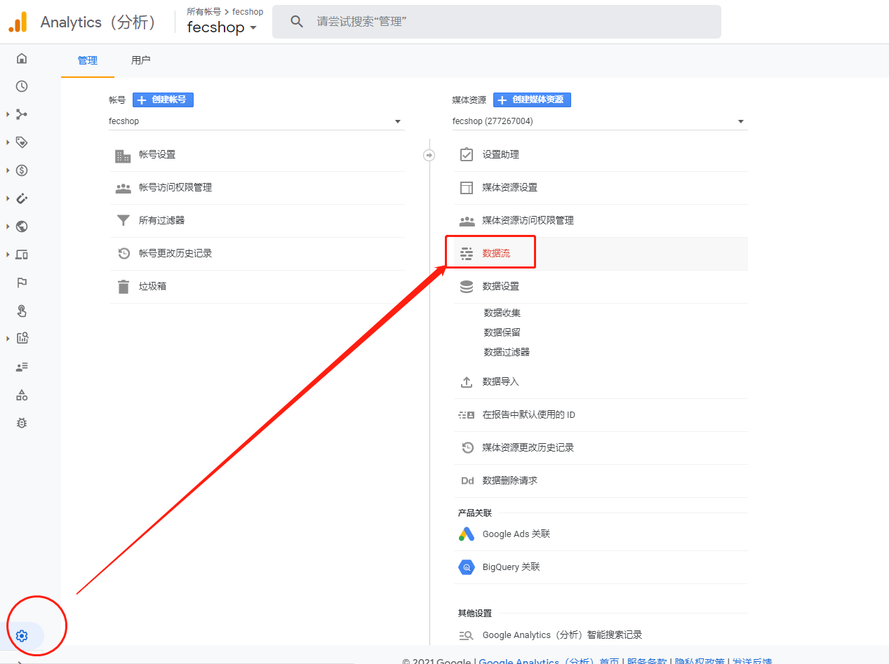

Fecmall GA如何查看ga追踪代码，以及添加多个网站
===========================

> GA控制面板如何查看ga追踪代码，以及GA如何添加多个网站

###  GA如何查看ga追踪代码

在GA的新建账户都会有一个引导，引导过程中给与`全局网站代码 (gtag.js) `，如果您关闭了，那么可以在菜单中查找

进入Google Analytics控制台，点击`设置`图标，然后点击`数据流`

您可以查看，以及创建了的`数据流`,或者新建新的`数据流`, 类型选择`网站`

创建完成后，即可查看`全局网站代码 (gtag.js) `,和`衡量ID`

