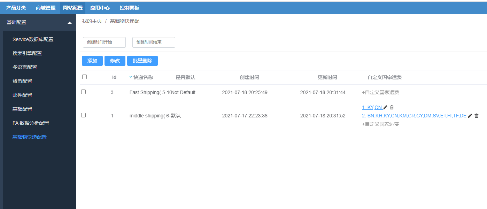
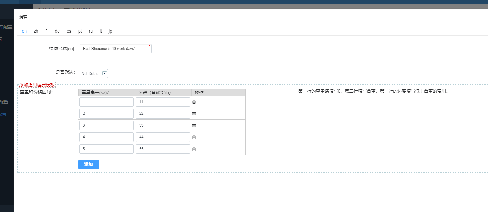
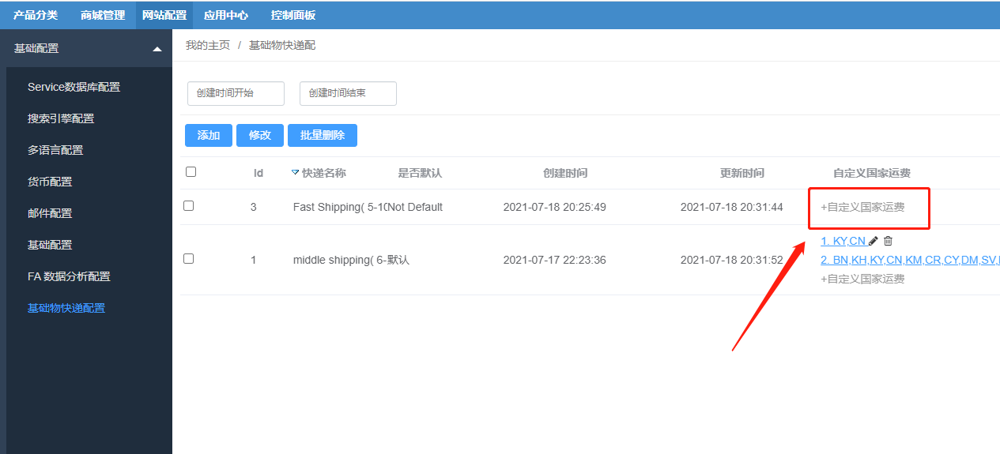
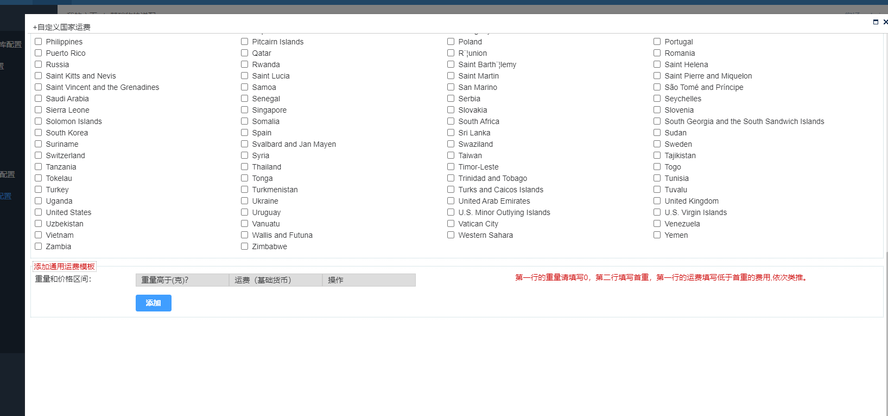

Fecmall扩展-跨境电商 Shipping 运费扩展
=================

> fecmall默认的运费设置是在文件里面，本扩展对shipping部分进行了重写，您可以方便
的在后台进行配置物流快递以及运费

### 跨境电商 Shipping 运费扩展

注意：该扩展是用于**跨境单商户**电商的扩展，譬如：fecmall开源版本，fecro等。
国内电商请勿使用该扩展设置运费。

您需要先安装fecmall开源系统，然后再进行插件的安装

1.fecmall应用市场地址：http://addons.fecmall.com/67779335

2.如何应用市场`安装`应用，请参看文档：[Fecmall安装应用](https://www.fecmall.com/doc/fecshop-guide/addons/cn-2.0/guide-fecmall-addons-install.html)

3.安装扩展成功后，进入fecmall后台，进入`基础快递配置`菜单, 如下图

3.1您可以创建新的物流方式

填写各个重量区间，对应的快递的费用，创建完成后保存即可

3.2如果您对某些国家进行自定义，可以点击`自定义国家运费`

勾选国家，然后设置重量区间运费即可。

最后，需要强调的是，fecmall开源版本的shipping配置是在配置文件里面的，
通过配置文件和csv配置，功能还是非常强的，缺点就是需要进入配置文件，不能后台修改

本扩展让用户可以在后台设置跨境国家运费，但是支持的功能有限，只能进行国家级别的运费自定义，
如果您的需求通过国家层面进行运费设置，不需要国家下面的省市这种更细粒的自定义运费，那么可以使用该扩展。

