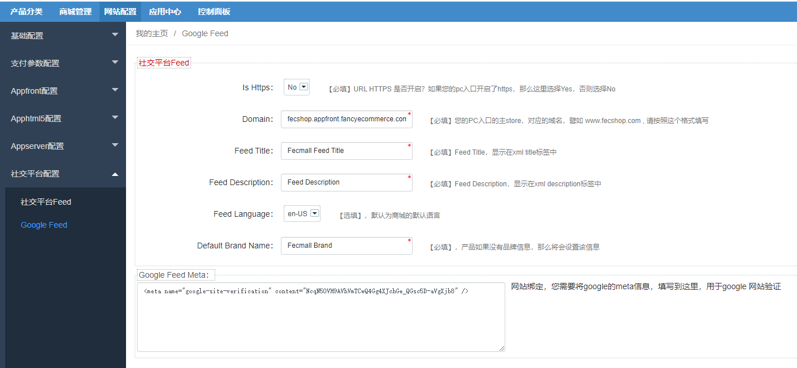
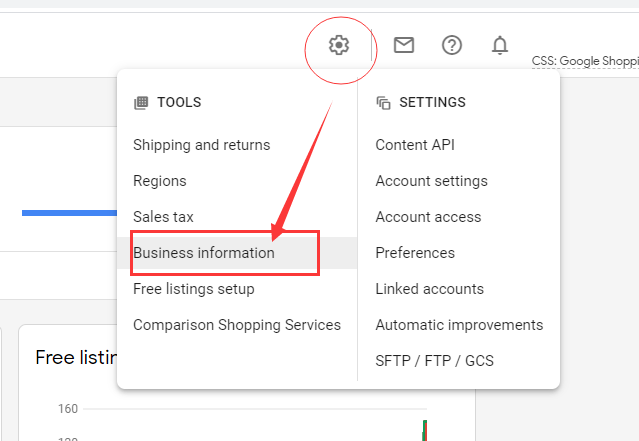
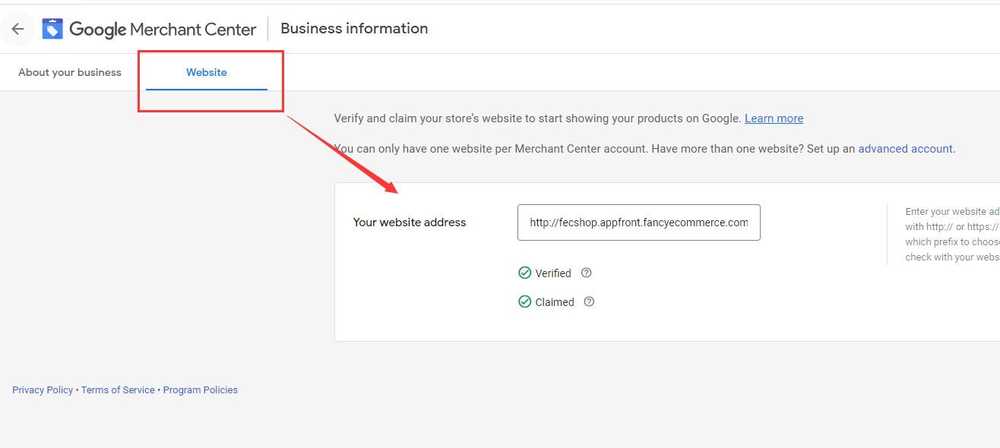
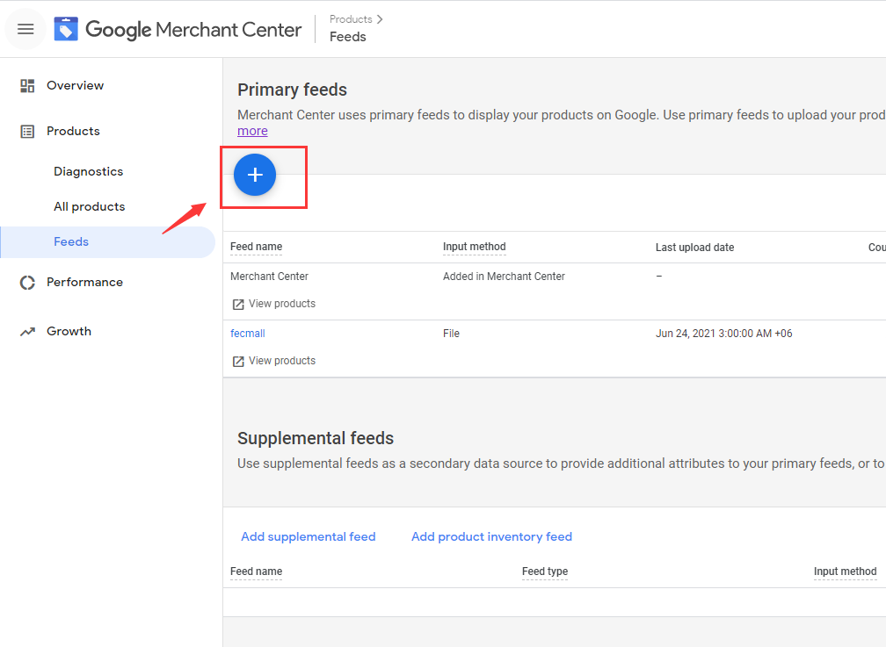
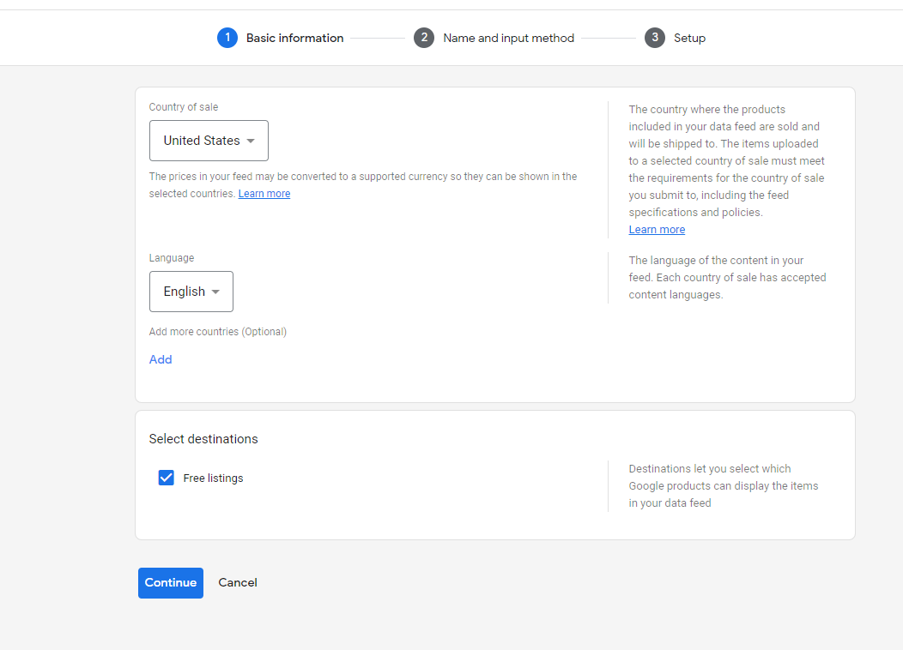
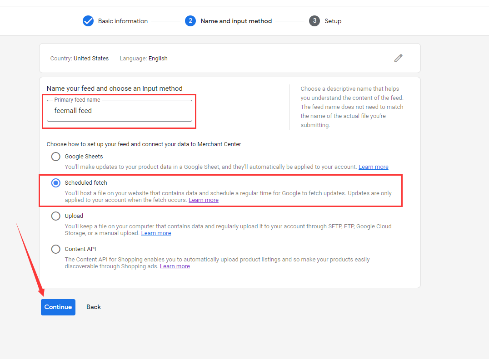
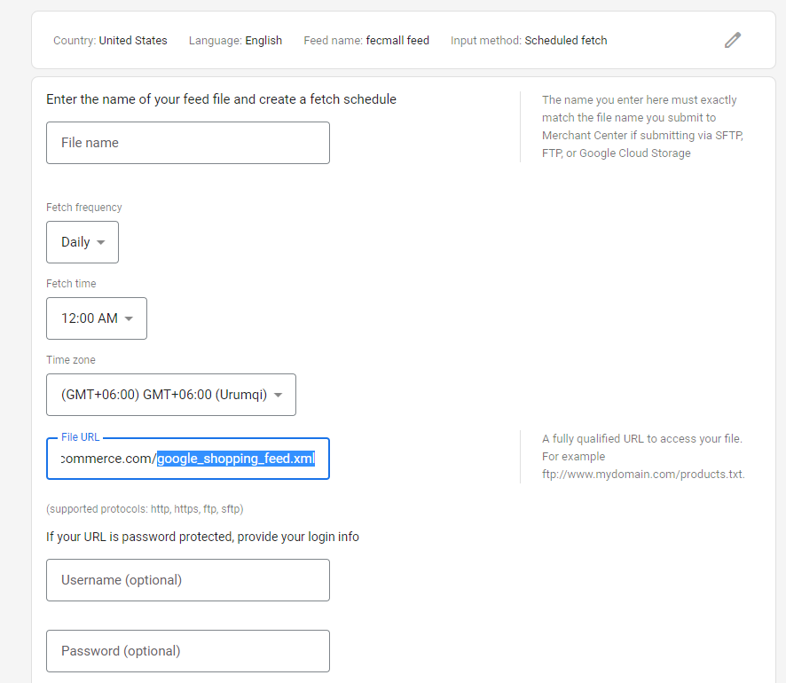
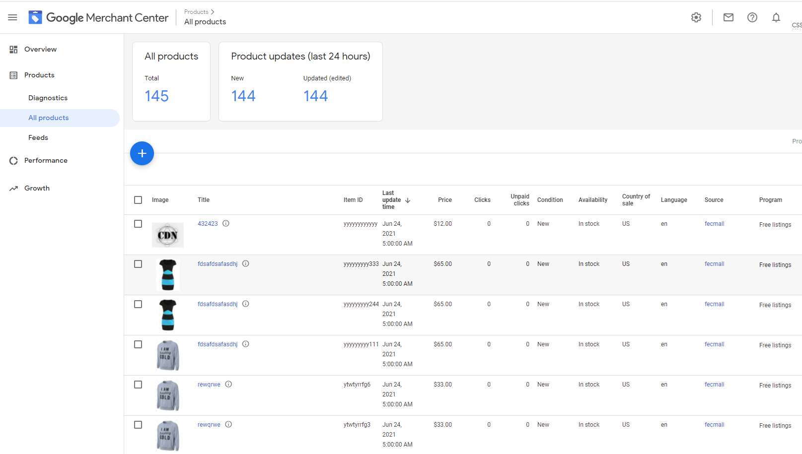

Fecmall扩展-Google Shopping Feed
=================

> 通过该扩展，您可以生成xml格式的Google Shopping Feed，提交到`Google merchant center`, 进而在Google Shopping
搜索中展示您的产品


### 扩展介绍

1.fecmall生成xml格式的feed内容，譬如：http://fecshop.appfront.fancyecommerce.com/google_shopping_feed.xml
，提交到`google merchant center`，进行收录

2.添加到`Google merchant center` feed后，您可以获取免费用户流量，以及，您可以继续进行广告推广

3.如果您对Google Shopping Feed不够了解，可以参看一下的资料：


3.1巨详细的操作手册！谷歌的Google Shopping怎么用？（上篇）：https://www.cifnews.com/article/48173

3.2巨详细的操作手册！谷歌的Google Shopping怎么用？（下篇）： https://www.cifnews.com/article/48178


### 扩展安装和配置

您需要先安装fecmall开源系统，然后再进行插件的安装

1.fecmall应用市场地址：http://addons.fecmall.com/26697547

2.如何应用市场`安装`应用，请参看文档：[Fecmall安装应用](https://www.fecmall.com/doc/fecshop-guide/addons/cn-2.0/guide-fecmall-addons-install.html)


3.安装扩展成功后，进入fecmall后台，进行配置




`Is Https`: URL HTTPS 是否开启？如果您的pc入口开启了https，那么这里选择Yes，否则选择No

`Domain`：您的PC入口的主store，对应的域名，譬如 www.fecshop.com , 请按照这个格式填写

`H5 Domain`：您的H5入口的主store，对应的域名，譬如 m.fecshop.com , 关于该字段，详细参看：https://support.google.com/merchants/answer/6324459
，填写后，如果是移动设备，将会访问h5入口的url。

`Feed Title`：Feed Title，显示在xml title标签中, 您可以参看例子：http://fecshop.appfront.fancyecommerce.com/google_shopping_feed.xml

`Feed Description`：Feed Description，显示在xml title标签中, 您可以参看例子：http://fecshop.appfront.fancyecommerce.com/google_shopping_feed.xml

`Feed Language`: 根据您选择的语言，feed xml文件生成的时候，会获取相应的产品语言数据，写入xml

`Default Brand Name`： google shopping feed语法中，变种产品（规格产品）必须有品牌信息，如果您的产品没有品牌信息
，将从该值获取。


`Google Feed Meta`: 用于google绑定网站，在文档的下面会用到。

3.访问 https://merchants.google.com/ ， 进入`Google merchant center`，如果没有账号请注册账号

3.1绑定网站

登陆[Merchant Center account](https://merchants.google.com/) ， 点击设置图标，在下拉条
菜单中点击`Business information`



3.2点击website tab



填写url进行下一步，然后选择html meta验证，将meta信息复制出来，譬如：

```
<meta name="google-site-verification" content="NcqN50VH9AVhVmTCwQ4Gg4XJchGe_QGsc5D-aVgXjb8" />
```

将meta信息，复制到fecmall的配置中，如下图，保存即可


3.3回到[Merchant Center account](https://merchants.google.com/) ，点击验证，通过后即网站绑定成功


### 生成google shopping feed

当后台配置feed完成，以及google绑定网站成功，我们就可以生成feed了

```
./addons/fecmall/fecggfeed/shell

sh googleShoppingFeed.sh
```

执行log如下：

```
[root@iZ942k2d5ezZ shell]# sh googleShoppingFeed.sh 
begin google shopping feed generate
add product url to sitemap xml
There are 2 page product to process
Page 1 done
Page 2 done
end google shopping feed generate
end success
[root@iZ942k2d5ezZ shell]# 

```


完成后，查看xml文件，打开 `./appfront/web/google_shopping_feed.xml`, 查看是否有内容，如果没有内容，请
检查文件是否可写（升级fecmall过来，可能没有可写权限）

如果xml文件中有内容，则代表生成成功


4.提交xml feed

4.1得到访问url，譬如：http://fecshop.appfront.fancyecommerce.com/google_shopping_feed.xml

4.2进入`Google merchant center`，点击添加图标



选择country和language，点击`continue`



填写`feed name`,  选择   `Scheduled fetch`, 点击`continue`



继续填写信息，File Url部分，填写您的feed xml文件的url地址




点击`Create feed`按钮，创建，即可完成

4.3创建完成后，您需要等待一段时间，google会在您设置的时间过来读取您的xml文件中的内容


4.4被google shopping收录后，可以在`All Products`中查看




### Google shopping feed的资料


1.google shopping feed字段说明：https://support.google.com/merchants/answer/7052112?hl=en

2.巨详细的操作手册！谷歌的Google Shopping怎么用？（上篇）：https://www.cifnews.com/article/48173

3.巨详细的操作手册！谷歌的Google Shopping怎么用？（下篇）： https://www.cifnews.com/article/48178

4.RSS 2.0 specification：https://support.google.com/merchants/answer/160589

5.Product data specification：https://support.google.com/merchants/answer/7052112#zippy=%2Cquick-reference


