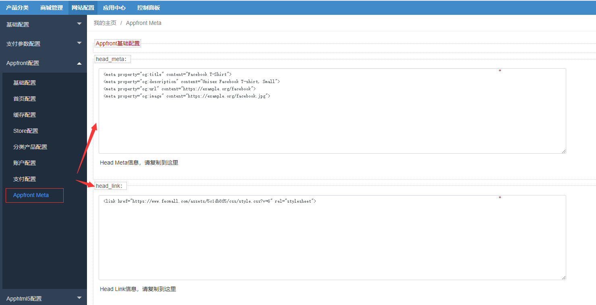
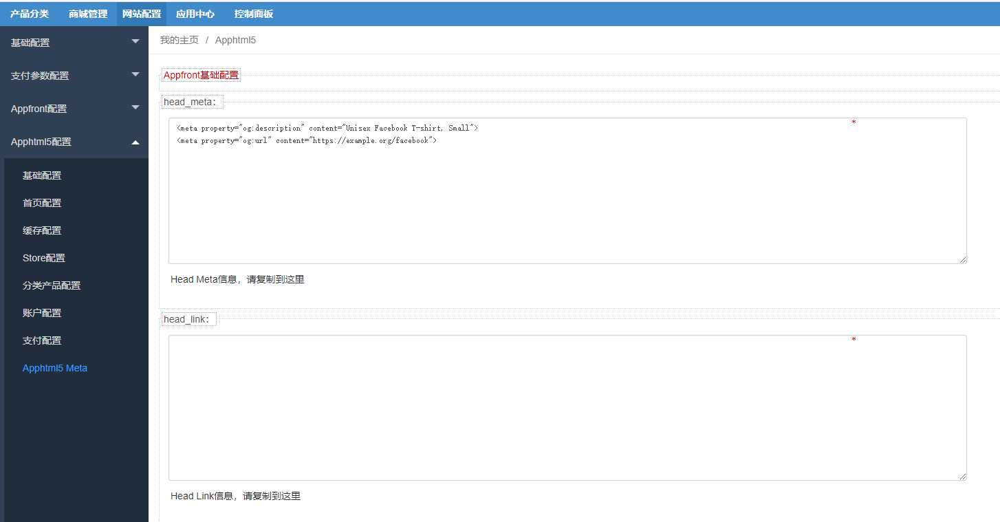
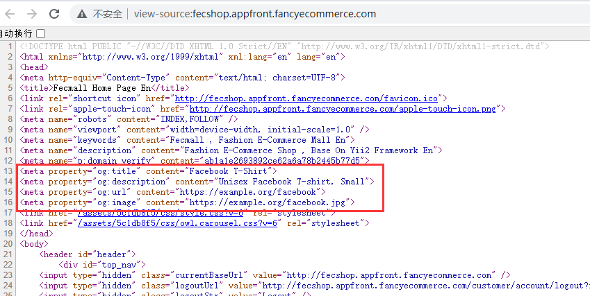

Fecmall扩展-Head Meta自定义添加
===============

> 当做营销推广，可能需要加一些社交平台的meta信息，嵌入数据对接，通过本插件，可以非常方便的
> 在后台添加自定义的meta信息


### Head Meta自定义扩展安装

您需要先安装fecmall开源系统，然后再进行插件的安装

1.fecmall应用市场地址：http://addons.fecmall.com/19853359

2.如何应用市场`安装`应用，请参看文档：[Fecmall安装应用](https://www.fecmall.com/doc/fecshop-guide/addons/cn-2.0/guide-fecmall-addons-install.html)

###  Head Meta自定义扩展使用

安装完插件后，就可以进行使用

1.复制出来您需要添加到fecmall商城的meta和link信息，譬如：

```
<meta property="og:title" content="Facebook T-Shirt">
<meta property="og:description" content="Unisex Facebook T-shirt, Small">
<meta property="og:url" content="https://example.org/facebook">
<meta property="og:image" content="https://example.org/facebook.jpg">

```

2.进入fecmall后台

2.1appfront（pc）配置将meta信息复制到如图位置，然后保存




2.2apphtml5（h5）配置将meta信息复制到如图位置，然后保存




3.进入pc首页，查看源代码



可以看到添加成功。


