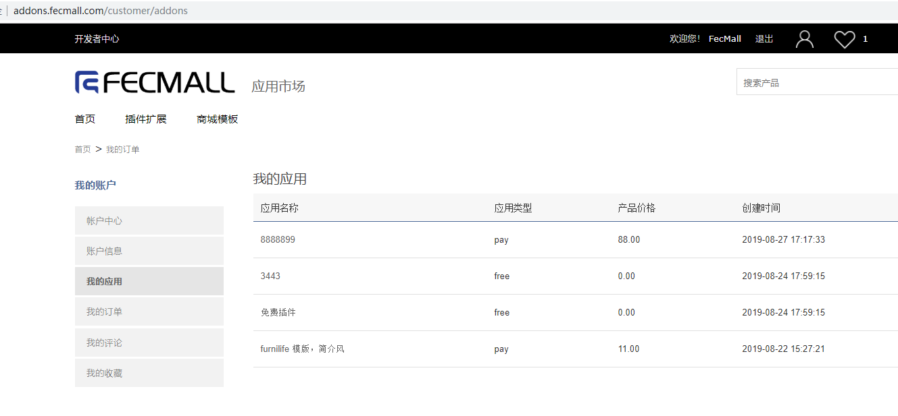

Fecmall-安装应用
============

FecMall应用市场
-----------

1.FecMall应用市场地址：http://addons.fecmall.com/

2.点击右上角的登陆账户按钮，然后点击注册用户，即可注册成为应用市场用户

3.在应用市场中浏览相应的应用，中意的应用可以添加到购物车进行下单

4.下单成功后，既可以在我的应用中心查看

5.用户安装FecMall电商系统，登陆fecmall admin后台，点击应用市场，登陆用户（注意：是fecmall应用市场的注册账户）

登陆成功后，即可看到我的应用列表：

6.用户点击安装，即可安装应用

有的插件可以几十MB，下载需要时间，您需要耐心等待插件下载完成并安装

7.按照应用扩展说明，进行其他的一些配置即可使用。

在应用的描述部分，可能有一些安装的说明，仔细阅读，按照他的方法进行配置即可。

8.如果您安装插件过程中遇到问题，出现错误等，可以用chrome
浏览器查看一下ajax的报错信息，发帖到fecmall论坛即可。（然后将帖子地址发给应用开发者）

