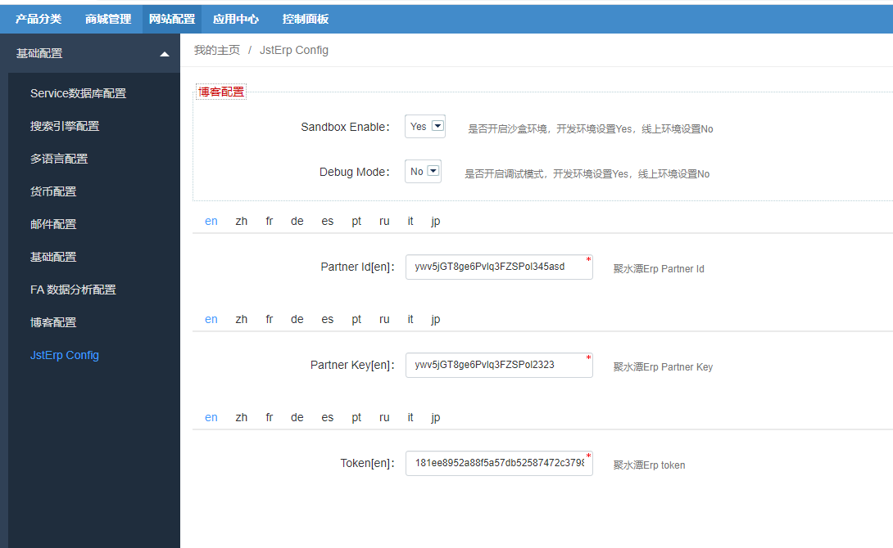

Fecmall扩展-聚水潭Erp对接
===========

> Fecmall商城，对接聚水潭erp的库存，订单推送，订单物流状态获取等


### 关于聚水潭ERP

1.介绍：聚水潭是一个第三方saas模式的erp，开账户付费才可以使用，详细参看：https://www.jushuitan.com/


2.聚水潭二次开发文档地址：https://open.jushuitan.com/document.aspx

3.聚水潭二开的沙盒地址以及账户：

3.1沙盒网址:http://c.jushuitan.com ： 

3.2沙盒账户： 帐号: `kfcs@jst.com` 密码: `qwe123qwe!`

3.3沙盒开发信息

```
PartnerId：ywv5jGT8ge6Pvlq3FZSPol345asd 
PartnerKey：ywv5jGT8ge6Pvlq3FZSPol2323 
TOKEN：181ee8952a88f5a57db52587472c3798 
```
### 安装扩展

1.应用市场地址：http://addons.fecmall.com/92147744

2.如果安装fecmall应用扩展，请参看：[Fecmall-安装应用](fecmall-addons-install.md)

3.安装完成后，进入后台进行设置参数



这些参数，由聚水潭erp提供，如何接入参看：https://open.jushuitan.com/document.aspx
，或者咨询jsterp的销售/
，或者这些参数后，在如上图，填写配置信息，保存即可。


### 关于Fecmall和聚水潭erp的api对接

目前对接了3个api，分别为
`商品库存Api对接`,`推送订单Api对接``,`聚水潭erp订单物流信息Api对接`，


一共3个shell脚本， 执行这些脚本即可执行，您可以通过设置cron计划任务进行周期执行。

### 商品库存Api

将jsterp的库存`主仓实际库存`同步到fecmall中，erp的商品和fecmall的商品要一致。

1.同步脚本地址

```
./addons/fecmall/fecjst/shell/syncQty.sh
```

2.原理

遍历fecmall的商品，按照分页取到sku数组，进行Api对接，jstErp库存查询Api：https://open.jushuitan.com/document/1020.html

3.cron设置

您可以设置半个小时，一个小时不等，进行库存同步
, 关于如何使用cron，可以参看：[Fecmall Cron 脚本 - 如何设置CRON](https://www.fecmall.com/doc/fecshop-guide/instructions/cn-2.0/guide-fecmall_cron_script.html#cron)

### 推送订单，将fecmall的订单推送到jstErp

1.同步脚本地址

```
./addons/fecmall/fecjst/shell/pushOrder.sh
```

2.原理

按照时间区间，遍历fecmall的订单，将订单数据推送到聚水潭erp中（通过api接口）

3.cron设置

您可以设置半个小时，一个小时不等，进行订单推送
, 关于如何使用cron，可以参看：[Fecmall Cron 脚本 - 如何设置CRON](https://www.fecmall.com/doc/fecshop-guide/instructions/cn-2.0/guide-fecmall_cron_script.html#cron)


### 同步聚水潭erp的订单发货信息到fecmall商城中

1.同步脚本地址

```
./addons/fecmall/fecjst/shell/syncShipping.sh
```

2.原理

按照时间区间，通过api获取聚水潭erp的订单物流信息，然后同步到fecmall商城订单表的物流字段中

3.cron设置

您可以设置几个小时不等，进行物流信息获取
, 关于如何使用cron，可以参看：[Fecmall Cron 脚本 - 如何设置CRON](https://www.fecmall.com/doc/fecshop-guide/instructions/cn-2.0/guide-fecmall_cron_script.html#cron)


