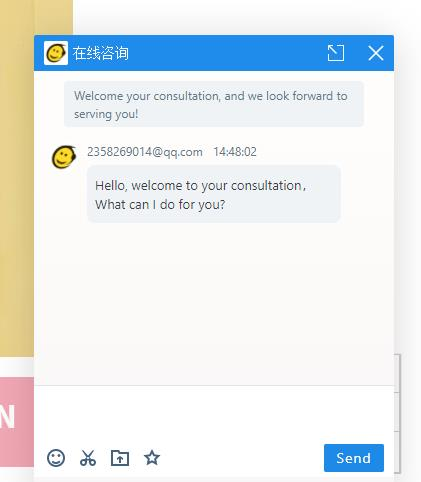
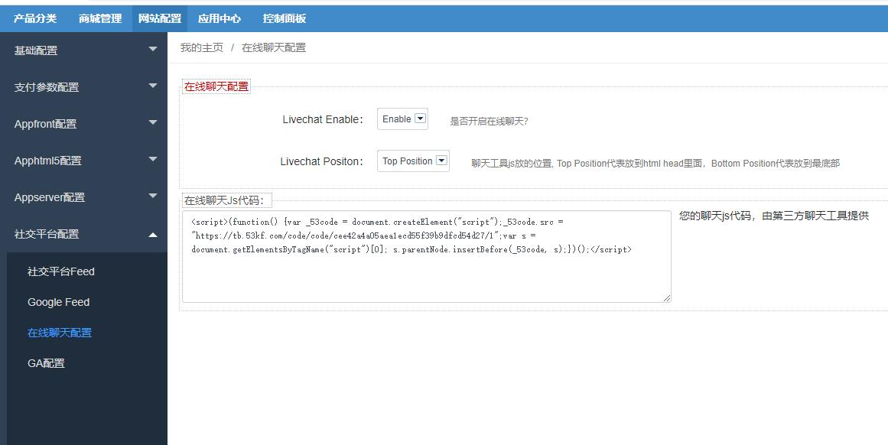
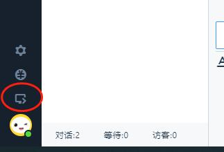
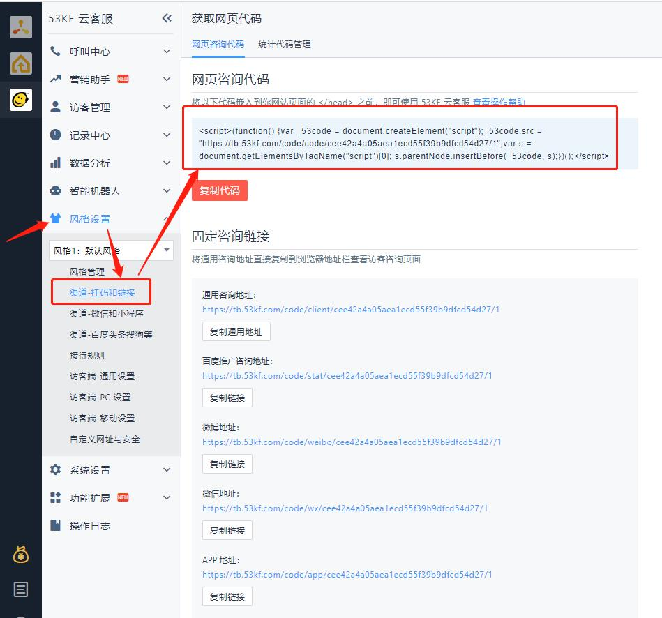
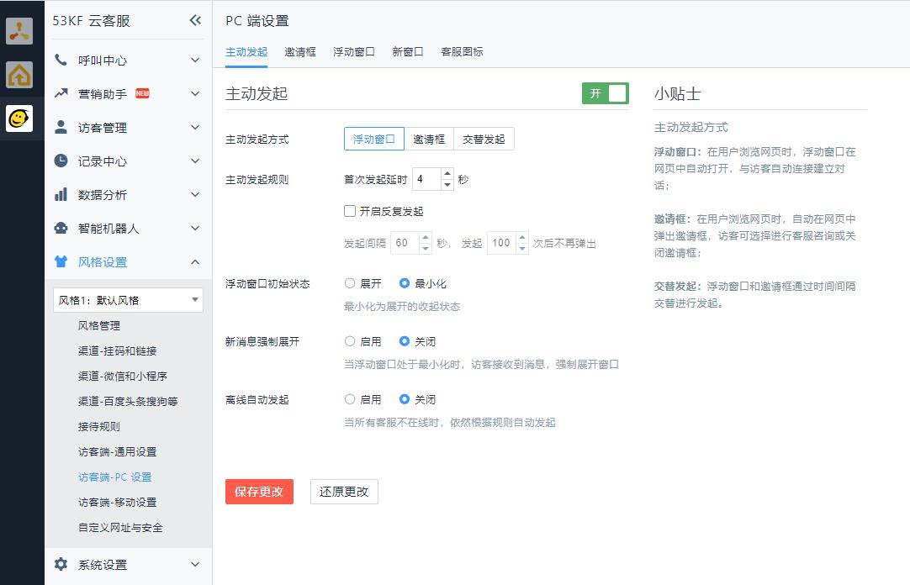
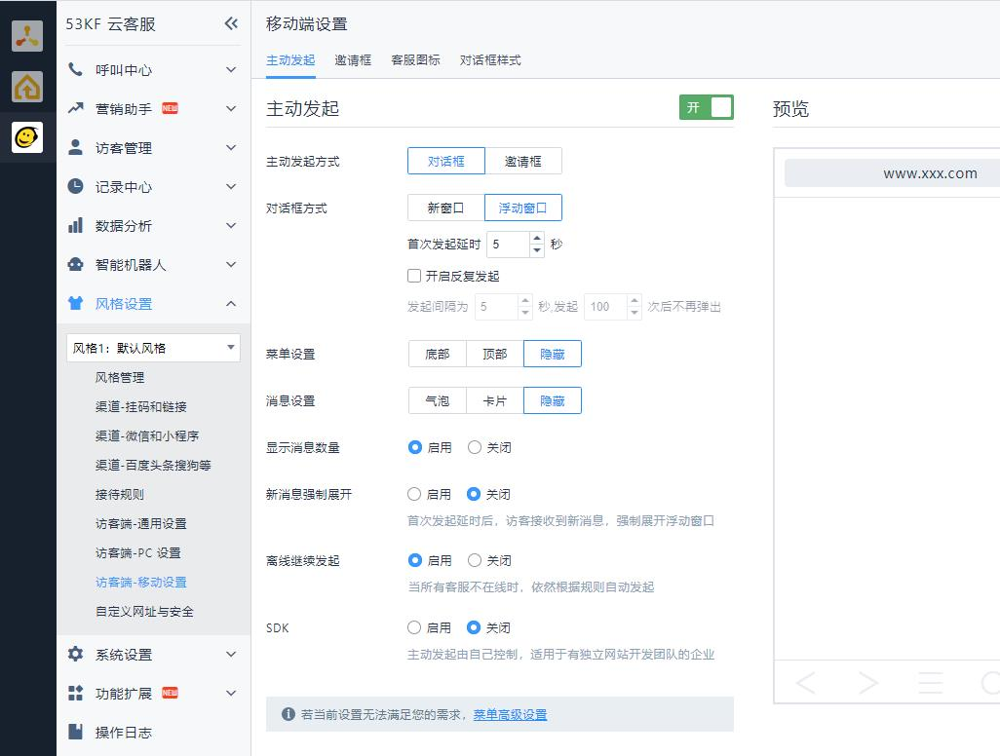
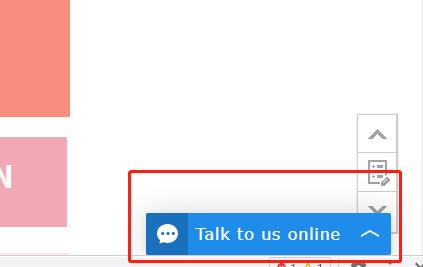
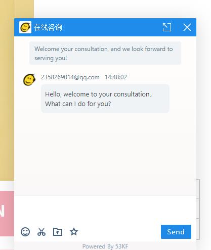
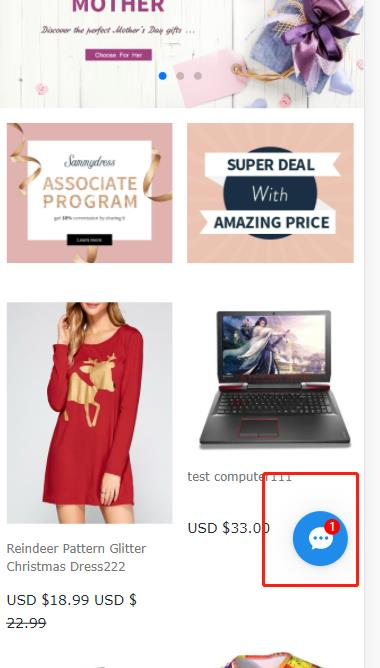
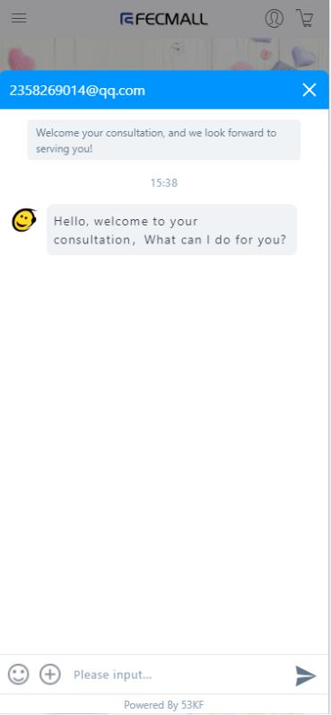

Fecmall扩展-LiveChat在线聊天扩展
=================

> LiveChat在线聊天扩展，该扩展是为了方便用户快捷的添加第三方聊天工具的js片段

fecmall`版本`要求：`2.16.1+`

### LiveChat在线聊天介绍

用户访问商城，在商城右下角弹出聊天收缩框，用户点击后，即可和客服进行沟通，如图：



通过该工具可以方便的和在线访问的用户沟通，提升用户体验。

### FecmallLiveChat在线聊天扩展


您需要先安装fecmall开源系统，然后再进行插件的安装

1.fecmall应用市场地址：http://addons.fecmall.com/73391653

2.如何应用市场`安装`应用，请参看文档：[Fecmall安装应用](https://www.fecmall.com/doc/fecshop-guide/addons/cn-2.0/guide-fecmall-addons-install.html)

3.安装完成后，您需要设置GA插件的优先级,设置成最高，如何设置插件优先级，
请参看：[Fecmall-应用扩展优先级设置](https://www.fecmall.com/doc/fecshop-guide/addons/cn-2.0/guide-fecmall-addons-score.html)


4.fecmall后台查看GA的配置部分 

后台：`网站配置` -> `社交平台配置` -> `Livechat Config（在线聊天配置）`




`Livechat Enable`: 是否开启在线聊天？

`Livechat Positon`: 聊天工具`js`放的位置,`Top Position`代表放到`html head`里面，`Bottom Position`代表放到`最底部`


`在线聊天Js代码`: 您的聊天js代码，由第三方聊天工具提供, 譬如：

```
<script>(function() {var _53code = document.createElement("script");_53code.src = "https://tb.53kf.com/code/code/cee42a4a05aea1ecd55f39b9dfcd54d27/1";var s = document.getElementsByTagName("script")[0]; s.parentNode.insertBefore(_53code, s);})();</script>
```

注意，这里需要写入`<script>`,也就是完整的js片段代码

5.保存，然后在商城前端，查看html代码，是否添加成功。


### 53KF在线聊天系统

53KF在线聊天，是一款国内的，第三方开发的在线聊天工具，本人已经测试，还是比较靠谱，
所以就整理了一下，如果确定需要53KF在线聊天系统，可以阅读一下文档


本人咨询了以下费用，大致50一个月，开户费200，需要先充值1000（2021年7月初咨询的，
他们的官网是：http://www.53kf.com/ ， 请自行咨询联系，这个只供参考）。

1.账号申请，可以到官网联系他们的客服（ http://www.53kf.com ），下面是本人之前测试联系的53KF的客户经理，
您也可以扫码添加他的微信（索要53kf试用账户）


2.经过巴拉巴拉的一些审核，就可以使用了，进入53KF的后台，点击如图图标





3.如下图，点击，找到js代码




 fecmall后台： `网站配置` --> `社交平台配置` --> `在线聊天配置`   

将其复制，拷贝到`在线聊天Js代码`, `LiveChat Enable` 选择`Enable`，`LiveChat Position`选择`Top`或者`Bottom`,
保存即可


4.进入53KF后台，进行设置

pc设置：



移动h5设置：



5.然后去商城查看，具体效果

pc:默认效果



pc:点击弹出




h5:默认效果




h5:点击弹出





6.对于53KF的后台自定义配置选项很多，可以根据自己的需求灵活配置，具体如何操作，请咨询他们的客服


