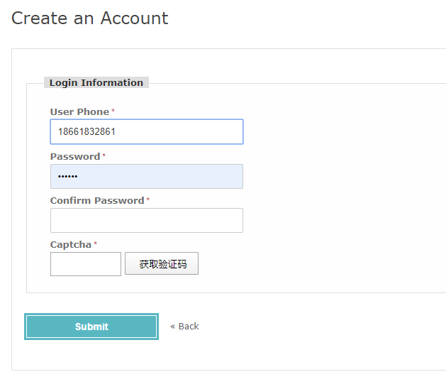
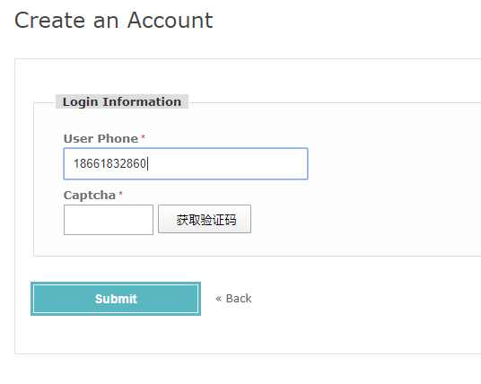
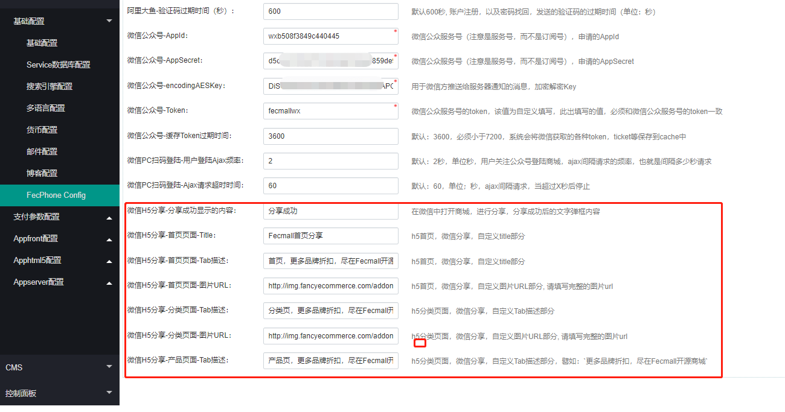

Fecmall扩展-微信登陆,微信分享,手机帐号
=============

> fecmall定位全球电商系统，默认使用邮箱作为账户，而国内电商喜欢用手机号做账户，另外国家也强制规定需要用手机号，
因此开发了手机作为账户替代邮箱，另外开发了微信第三方登陆，来支持国内电商

### Fecmall 扩展介绍


功能介绍：

1.使用`手机号`替代`邮箱账户`登陆

帐号主体，由`邮箱`改为`手机号`，因为手机号需要验证码，因此，集成了`阿里大鱼`的手机发送验证码的功能，邮箱账户进行了废弃。


1.1手机号`注册`，通过`阿里大鱼短信服务`发送验证码，验证通过后注册账户

1.2手机号`登陆`，以及修改密码

1.3手机账户`忘记密码`，通过短信验证码找回密码

1.4订单下单后，发送短信通知订单支付消息


2.PC入口，微信扫码`关注公众号`登陆

appfront，pc入口，在手机账户登陆的基础商，加入了`微信扫码登陆`部分，这个部分，您需要首先注册微信公众服务号（必须是服务号才行），
当用户使用微信扫描二维码`关注公众号`后，即可进行登陆账户。


3.微信公众号打开h5商城，`静默登陆`账户

`微信静默登陆`：指的是不弹出获取信息确认框，在用户无感知的情况下获取微信用户的`openid`。

当用户在微信内部访问h5商城，系统加入了判断，如果是微信内部访问，则进行微信`静默登陆`，用户首次需要绑定手机号（如果用户在pc入口已经绑定手机号，那么
在h5部分就不需要进行绑定了，帐号是互通的），绑定后，第二次登陆就直接`静默登陆`了。


4.微信公众号，h5商城，产品页面`自定义分享`

微信打开h5页面，进行分享的时候，默认的分享页面信息太少，因此，可以自定义分享tab，做推广的时候更有力

目前只对首页，分类页，产品详情页进行了`自定义微信分享`

4.1首页分享：可以在后台自定义微信分享的`title`, `描述`，`图片`

4.2分类分享：可以在后台自定义微信分享的  `描述`，`图片`，`title`使用分类的名称

4.3产品分享：可以在后台自定义微信分享的  描述，图片使用产品的主图，title使用产品的name


### 安装扩展

1.应用市场扩展购买地址：http://addons.fecmall.com/61267738

2.购买后，在后台应用中心在线安装即可，关于应用市场的使用，可以参看：[Fecmall 应用市场文档](http://www.fecmall.com/doc/fecshop-guide/addons/cn-2.0/guide-README.html)


### 手机账户 - 申请阿里云通信服务


1.阿里云通信（阿里大鱼改名为阿里云通信）

购买地址: https://www.aliyun.com/product/sms

2.购买成功后，进入控制台，查看`AccessKey`


您可以`创建AccessKey`，就会获取到`AccessKeyID`和 `AccessKeySecret`

3.添加签名


3.1如果您只想发送验证码，用户订单不进行短信通知，那么只创建`验证码签名`类型即可

3.2如果用户订单需要进行`短信通知`，您需要创建`通用签名`, 当然创建`通用签名`有点麻烦需要提交`三证合一`等信息(如果是个人阿里云账户)


4.创建短信模板


4.1创建短信模板 - `注册账户`短信验证码

```
模版类型:验证码
模版名称:注册账户短信验证码
模版内容:您的注册账户验证码为：${code}，该验证码 5 分钟内有效，非本人操作，请忽略该短信。
申请说明:用于注册账户发送验证码
```

4.2创建短信模板 - `密码找回`短信验证码

```
模版类型:验证码
模版名称:帐号密码找回
模版内容:您正在操作账户密码，验证码为：${code}，5分钟内有效！
申请说明:用户密码找回
```

4.3创建短信模板-`订单支付成功`通知

> 订单支付成功通知，是`短信通知`类型，而不是`验证码`类型，因此，需要第3步骤创建的签名为`通用签名`才会生效，否则无法发送

```
模版类型:短信通知
模版名称:订单支付成功通知

模版内容:你的订单已经支付成功，订单编号：${increment_id} ，多谢您的支持。
变量属性:increment_id-其他号码；
申请说明:商城订单支付成功后，发的短信
```

提交后，您会看到短信`模板CODE`, 譬如：`SMS_183765261`


`短信模板`和`签名`都需要阿里云审核，`审核通过`才可以使用


### 网站配置阿里云通信信息

上面，阿里云通信得到的信息，填写到fecmall的后台，即可


设置完成后，即可查看商城的改变

1.帐号登陆


2.帐号注册



3.帐号密码短信找回


4.帐号密码修改


### 微信公众平台设置（微信服务号）

> 狗日的框架设计，那么多人说张小龙是什么牛逼的产品经理，吹个锤子，微信的开放平台，公众平台（公众号，服务号），小程序，
都需要独立注册，而且需要不同的邮箱，同一个邮箱不能注册了开放平台账户，在注册公众平台，吐血的是，每次注册的账户都要进行审核，
需要花300块，需要用户弄一堆邮箱账户，没见过这么傻逼的设计，难道就是为了要那300块的认证费？
每次认证，都需要上传那一堆营业执照等一堆乱七八糟的，真TM的傻逼设计。

微信公众平台申请，必须申请**服务号**，而不是订阅号，订阅号无法生成二维码，TX脑残设计，申请错了白扔300！！

微信公众平台申请，必须申请**服务号**，而不是订阅号，订阅号无法生成二维码，TX脑残设计，申请错了白扔300！！

微信公众平台申请，必须申请**服务号**，而不是订阅号，订阅号无法生成二维码，TX脑残设计，申请错了白扔300！！


登陆微信公众号：https://mp.weixin.qq.com/


1.获取appId和appsecret

开发 --> 基本配置


获取微信服务号的`appId`和`appsecret`


2.开发配置 - 服务器配置

`开发`--> `基本配置` ， 对`服务器配置`，进行`修改编辑`


`URL格式`：`http://www.domain.com/customer/wx/token`,将 http://www.domain.com 换成您的`appfront`的域名

`Token`: 这个自定义，填写随机字符串即可，譬如：`fecmallxdtsfd`,这个填写的字符串需要保存号，需要后台配置该值

`EncodingAESKey`:AES加密解密的key，`随机生成`

`消息加解密方式`：必须选择`安全模式`(因为fecmall实现的是安全模式，选择其他模式将无法使用)


填写完成后，先不要保存，因为保存的时候，需要对`http://www.domain.com/customer/wx/token`进行检测，因此需要先去fecmall后台设置


填写这几个值，都是上面操作获取的，进行保存，fecmall后台配置保存成功后，然后去微信服务号管理后台保存 `服务器配置`（就是上面等待保存的部分）


保存成功后，一定要**启用**，否则无法接收微信的通知消息（fecmall通过`http://www.domain.com/customer/wx/token`来接收
微信的通知消息），我在这里被坑了2个小时才找到原因。


2.Js配置安全域名

设置  --> 公众号设置


2.1配置`JS接口安全域名`

配置JS接口安全域名时，注意是 域名 不需要填写`http/https`，如果填写的话，
在代码执行wx.config()时，会报 `config:fail,Error: invalid url domain` 错误，正确示例：`fecshop.apphtml5.fancyecommerce.com`

这里需要吧pc的域名和h5的域名都填写进去，将验证文件上传到 `@appfront/web`,  `@apphtml5/web`

2.2配置`网页授权域名`

需要将pc的域名和h5的域名都填写进去，2.1步骤已经将验证文件上传，这个步骤不需要重新上传 `MP_verify_TetB4xxxxxxx.txt`

譬如将 `www.wesavxxxxc.cn` 和 `m.wesavxxxxc.cn` 填写上去保存即可。


3.设置ip白名单

开发 --> 基本配置


到这里我们就把微信服务号方面的配置做完了


###Fecmall 后台设置

后台进行其他的参数的配置


红框中的这些参数，都有默认值，可以先不填写，测试完成后在更改。


### 微信PC扫码登陆：扫描二维码，关注公众号，登陆账户


当这些都设置好后，我们就可以查看功能了

1.pc端，微信扫码关注公众服务号，登陆账户

http://www.domain.com/customer/account/login


1.1登陆pc端，点击二维码图片，切换到微信扫码登陆部分


1.2打开手机微信，扫描二维码，关注微信公众号


1.3公众号关注后，如果以前已经绑定过手机号，那么直接就会登陆成功，进入账户中心界面

如果用户没有绑定过手机号，那么就会进行手机号绑定阶段




绑定成功后，进入账户中心


2.账户密码设置

2.1微信扫码登陆绑定的手机号，如果，用户没有用这个手机号在商城注册账户，也就是说这个手机号是一个`新用户`，
那么用户可以在账户中心-账户信息部分，进行 `密码设置`


直接设置新密码即可保存

2.2微信扫码登陆绑定的手机号，如果，用户用这个手机号在商城注册过账户，那么账户密码就是以前的密码
，修改密码，需要填写`当前密码`


### H5微信内部访问，静默登陆

对于H5入口的账户部分，加入了微信访问环境的判断，如果监测是微信环境访问h5，那么就会进入微信静默登陆

[fecmall 检测微信环境,微信访问js判断](http://www.fecmall.com/topic/2415)


1.通过微信打开h5商城，点击进入账户登陆（`/customer/account/login`）页面

1.1系统检测到微信环境，就会进入`静默登陆`，获取到微信用户的`openid`,查看`openid`在fecmall用户表中是否存在，如果存在，
那么直接登陆，进入账户中心页面

1.2系统检测到微信环境，就会进入`静默登陆`，获取到微信用户的`openid`,查看`openid`在fecmall用户表中是否存在，如果不存在，那么就会进入手机号绑定页面，
填写手机号，以及获取的验证码，进行绑定


绑定成功后，进入账户中心页面


2.用户在pc入口，如果微信和手机进行了绑定，那么在h5端是互通的，也就是说h5就不需要重复绑定了

3.绑定过的用户，点击用户登陆页面，直接就会登陆账户，大大的方便了用户


4.新用户，可以在账户中心-账户信息，设置初始密码


### H5微信内部访问，进行分享


微信h5分享：指的是，在微信内部，打开公众号h5商城，然后点击右上角，发送给微信好友，或者朋友圈的分享方式/

微信h5分享支持的为：`分享给朋友`，`分享到朋友圈`，`分享到QQ`，`分享到QQ空间`。

微信默认的分享是这样的


推广友好度不够，我们希望自定义标题，描述，以及图片

微信分享部分，本扩展只对`首页`，`分类页面`，`产品页面`进行了微信分享自定义,
其他的页面还是使用微信默认的分享

1.后台设置分享





1.1首页微信h5分享自定义

微信首页：可以定义`title`，`描述`，以及`图片url`，您可以自己ftp上传图片

fecmall图片域名对应的是文件路径`appimage/common/`

1.2微信h5分类页分享自定义

分类页：可以自定义`描述`，`图片url`，而，`title`使用的是分类的名称


1.3微信h5产品页分享自定义

产品页：可以自定义`描述`，而，`图片url`使用的是产品的主图，`title`使用的是产品的名称


2.设置完成后，进行分享测试：


至此，微信分享的部分就讲述完成。


### 缓存文件权限


微信的access_token2个小时过期一次，需要进行本地保存，因此使用缓存是最方便的

fecmall默认的缓存是文件缓存，文件存放在@app/runtime/cache/ 下面

fecmall安装的时候已经设置了 `@appfront/runtime/cache/` , `@apphtml5/runtime/cache/`
为`777`, 如果您的二维码没有出来，您可以查看一下文件权限，设置的命令为

```
chmod 777 -R  ./appfront/runtime/cache
chmod 777 -R  ./apphtml5/runtime/cache
```

### 微信自定义菜单

为了微信关注公众号登陆，在公众管理平台设置了`服务器配置`, 用来接收微信服务器的消息通知，设置后，
将导致在微信公众管理平台将无法设置`自定义菜单`, 只能通过接口设置，因此fecmall加入了该功能

微信自定义菜单文档地址：https://developers.weixin.qq.com/doc/offiaccount/Custom_Menus/Creating_Custom-Defined_Menu.html


`网站配置` --> `基础配置` --> `Fecphone config`    ， 在配置底部可以看到一个文本框`微信- 自定义菜单`

注意: 您需要先保存微信的`appid`  `appsecret`等设置保存后，然后重新打开编辑`微信自定义菜单`。


example:


```

{
	"button": [{
			"type": "view",
			"name": "官网",
			"url": "http://www.fecmall.com/"
		},
		{
			"name": "产品",
			"sub_button": [{
					"type": "view",
					"name": "开源系统",
					"url": "http://www.fecmall.com/fecmall"
				},
				{
					"type": "view",
					"name": "多商户系统",
					"url": "http://www.fecmall.com/fecbbc"
				},
				{
					"type": "view",
					"name": "多商户分销",
					"url": "http://www.fecmall.com/fecbdc"
				},
				{
					"type": "view",
					"name": "分销商城演示",
					"url": "http://fecbdch5.fecshop.com/cn"
				}


			]
		},
		{
			"name": "文档",
			"sub_button": [{
					"type": "view",
					"name": "开发文档",
					"url": "http://www.fecmall.com/doc/fecshop-guide/develop/cn-2.0/guide-README.html"
				},
				{
					"type": "view",
					"name": "帮助文档",
					"url": "http://www.fecmall.com/doc/fecshop-guide/instructions/cn-2.0/guide-README.html"
				},
				{
					"type": "view",
					"name": "应用市场",
					"url": "http://www.fecmall.com/doc/fecshop-guide/addons/cn-2.0/guide-README.html"
				},


				{
					"type": "view",
					"name": "多商户文档",
					"url": "http://www.fecmall.com/doc/fecmall-guide/instructions/cn-1.0/guide-README.html"
				},
				{
					"type": "view",
					"name": "多商户分销",
					"url": "http://www.fecmall.com/doc/fecmall-guide/fecbdc/cn-1.0/guide-README.html"
				}


			]
		}
	]
}


```


保存，查看您的公众号即可，需要注意的是，微信公众号存在缓存，你需要先`不关注公众号`，然后`重新关注公众号`，才能看到`自定义菜单`变化


