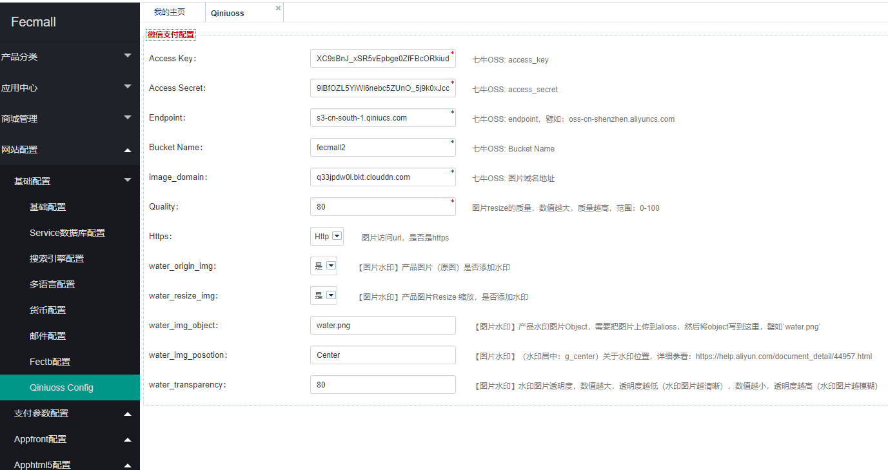

Fecmall扩展-七牛云OSS存储产品图片
===================


> 使用七牛云oss存储fecmall的图片，并进行缩放，加水印等操作。


### Fecmall-七牛云OSS存储产品图片-功能介绍


1.历史`本地产品`图片通过脚本，将`fecmall本地图片`，`同步`到七牛云`OSS`

2.后台产品`新建`，`编辑`等，图片将会同步到七牛云`OSS`，本地不会存储产品图片。

3.图片显示，将使用七牛云`oss`的图片地址，显示图片

4.支持图片`比例缩放`

5.支持`图片水印`


### 七牛云OSS开通，配置


1.七牛云oss购买地址：https://www.qiniu.com/products/kodo

2.七牛云OSS配置教程：https://developer.qiniu.com/kodo


注册开通账户：https://portal.qiniu.com/signup

进入控制台：https://portal.qiniu.com/bucket


2.1创建Bucket

公共访问权限


2.2查看Access Key 和 Secret Key：https://portal.qiniu.com/user/key


2.3获取Endpoint(区域节点)


### Fecmall-七牛云`OSS`存储产品图片-应用下载

应用市场地址：http://addons.fecmall.com/75526679

下载安装后，即可使用


### Fecmall-七牛云OSS存储产品图片-后台配置

后台配置：





`Access Key`：七牛OSS: access_key 

`Access Secret`：七牛OSS: access_secret 

`Endpoint`：七牛OSS: endpoint，譬如：oss-cn-shenzhen.aliyuncs.com 

`Bucket Name`：七牛OSS: Bucket Name 

`image_domain`：七牛OSS: 图片域名地址，譬如：q33jpdw0l.bkt.clouddn.com


`Quality`：图片resize的质量，数值越大，质量越高，范围：0-100 

`Https`：Http图片访问url，是否是https 

`water_origin_img`：是【图片水印】产品图片（原图）是否添加水印 

`water_resize_img`：是【图片水印】产品图片Resize 缩放，是否添加水印 

`water_img_object`：【图片水印】产品水印图片Object，需要把图片上传到alioss，然后将object写到这里，譬如`water.png` 

`water_img_posotion`：【图片水印】（水印居中：g_center）关于水印位置，详细参看：https://developer.qiniu.com/dora/api/1316/image-watermarking-processing-watermark

`water_transparency`：【图片水印】水印图片透明度，数值越大，透明度越低（水印图片越清晰），数值越小，透明度越高（水印图片越模糊）


### 图片上传到七牛云oss

1.配置完成后，当产品保存，将会自动上传到七牛云oss

2.对于历史产品图片，您可以手动执行脚本，进行上传

```
cd ./addons/fecmall/fecqiniu/shell
sh syncProductImageToQiniuoss.sh
```


### 补充


如果设置后不生效，可以刷新一下缓存（如果page cache 开启了）


