Fecmall扩展-Rss & Pinterest Feed
=================

> fecmall数据的rss，xml格式，可以用于订阅产品，以及和一些社交平台的整合

### 扩展介绍

1.fecmall生成xml格式的rss内容，譬如：http://fecshop.appfront.fancyecommerce.com/cms/rss/product
，可以方便用于进行`rss`订阅，以及商家将网站产品提交到各个社交平台。

2.通过`RSS feed` url , 
自动将商城产品`pins`提交到`Pinterest`社交平台
让您的商品图片，批量快速的展现在pinterest社交平台。

参考资料：

1.关于`rss`格式说明资料： https://validator.w3.org/feed/docs/rss2.html#ltenclosuregtSubelementOfLtitemgt

2.Pinterest 通过`RSS feed`自动Pins： https://help.pinterest.com/en/business/article/auto-publish-pins-from-your-rss-feed

### 扩展安装和配置

您需要先安装fecmall开源系统，然后再进行插件的安装

1.fecmall应用市场地址：http://addons.fecmall.com/66888936

2.如何应用市场`安装`应用，请参看文档：[Fecmall安装应用](https://www.fecmall.com/doc/fecshop-guide/addons/cn-2.0/guide-fecmall-addons-install.html)

3.后台配置

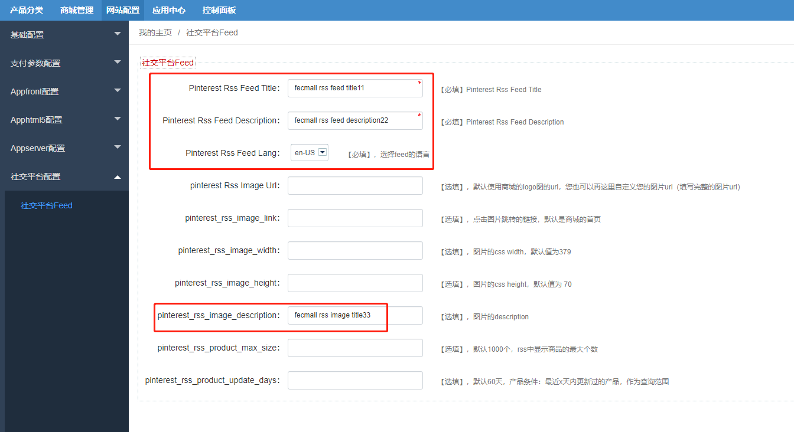

您只需要配置上面勾选出来的部分即可，其他的部分可以不填写

### 产品Rss，以及提交`rss feed` 到 `Pinterest`，用于`自动pin`提交

> 对于Pinterest，可以在产品页面，进行`pin share`到自己的pinterest账号中，
但是单个点击有点费力，可以使用pinterest的自动提交，原理如下：

一：原理

1.按照`pinterest`的格式生成`rss xml`，

2.将这个`rss feed url`提交到`pinterest`

3.pinterest会访问该`rss url`里面的内容，定期抓取一部分，自动pin到您的账号中

二：查看rss feed，以及提交

1.访问您的`appfront`的域名，url格式为

`http://fecshop.appfront.fancyecommerce.com/cms/rss/product` (请将域名替换成您自己的域名)

2.提交到pinterest。

参考资料-Pinterest 通过`RSS feed`自动Pins： https://help.pinterest.com/en/business/article/auto-publish-pins-from-your-rss-feed

2.1登陆您的pinterest账号，在账户中心，点击`setting`按钮

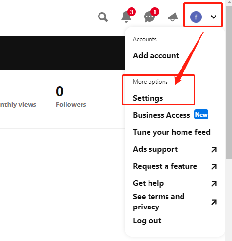

2.2绑定您的`网站`(website)

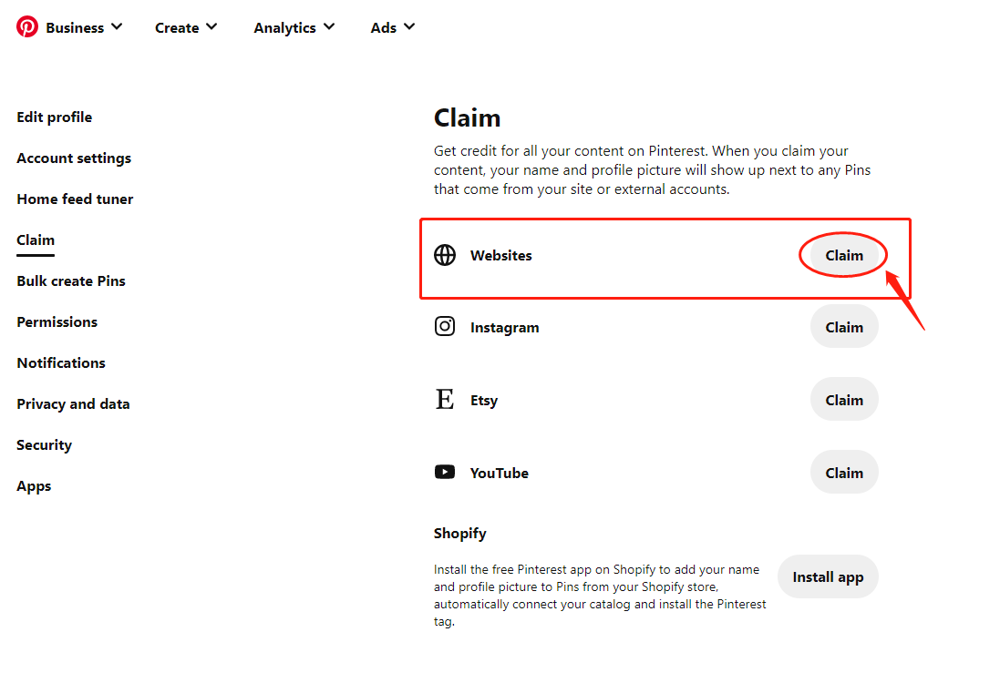

点击`绑定`网站按钮，弹出框

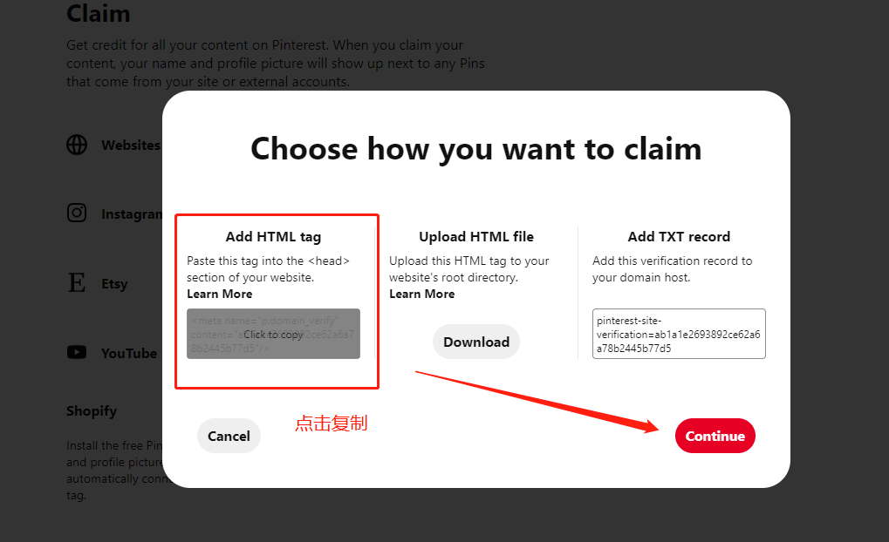

点击`Add Html Tag`部分下面的代码，进行`复制`(点击后，可以看到continue按钮由`灰色`变成了`红色`)，
将其粘贴到`fecmall后台`，进行保存。

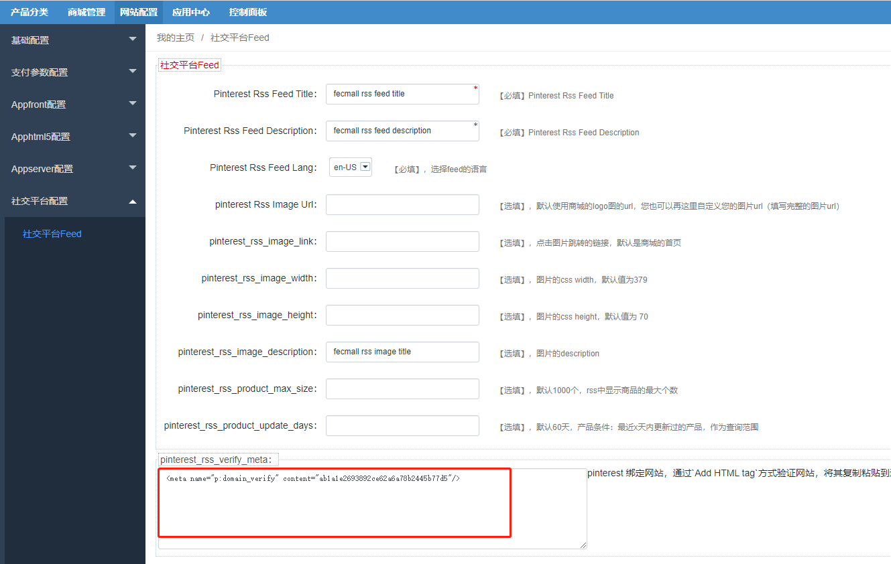

fecmall保存后，点击`continue`按钮，进入`下一步`，

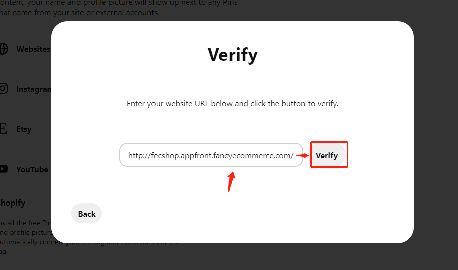

填写网站，点击`verify`按钮，等几秒后，验证成功，绑定完成，如下图：

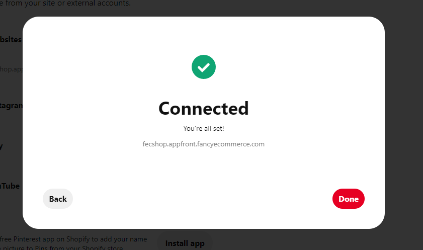

三.提交rss feed url

在pinterest `setting`中,点击左侧菜单`Bulk create Pins`，进入后，如下图

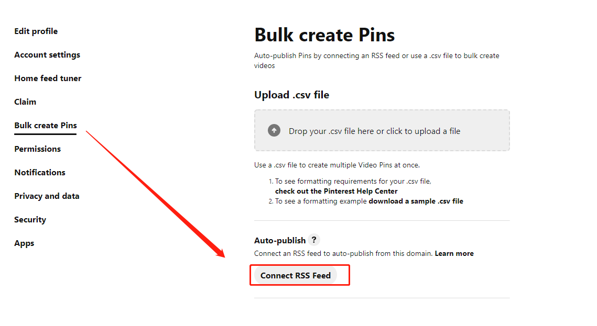

点击`connect RSS Feed`

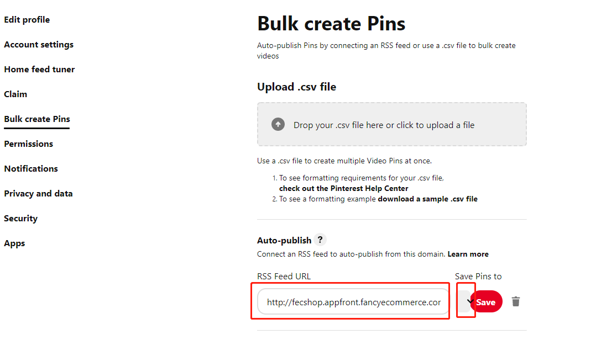

1.填写fecmall的`rss feed url`（文档上面已经说明这个），譬如：http://fecshop.appfront.fancyecommerce.com/cms/rss/product

2.选择`boards`,也就是将这些产品pin到那个`boards`

点击save保存成功

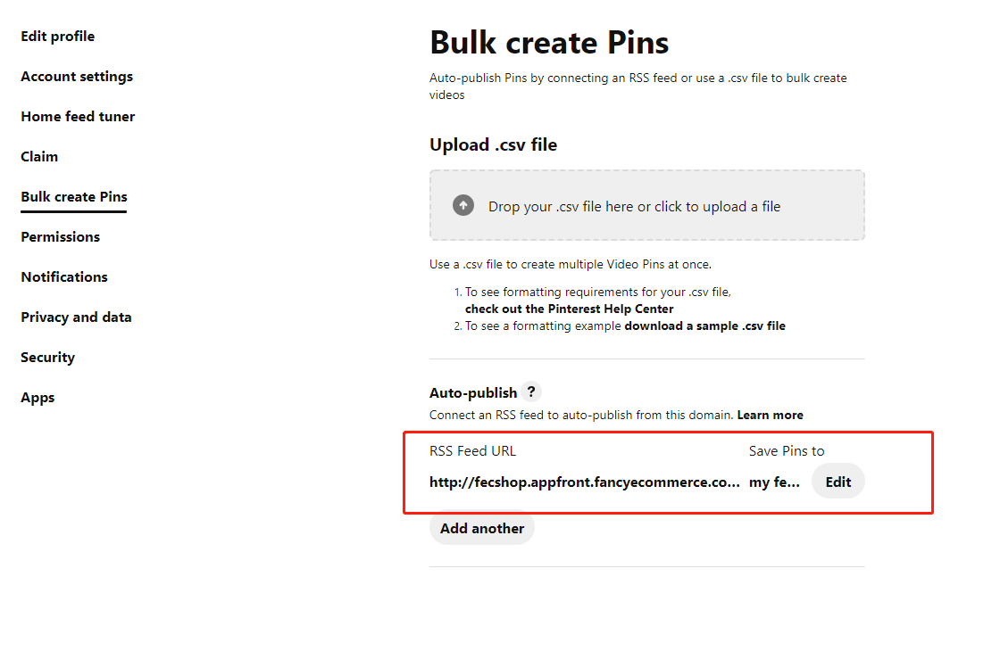

然后等待pinterest过来抓取您的`rss feed`中的产品信息，自动发布。

24 小时后可查看您在图板上创建的首张 Pin 图。更新 RSS 页面时，Pin 图将继续每天被创建。

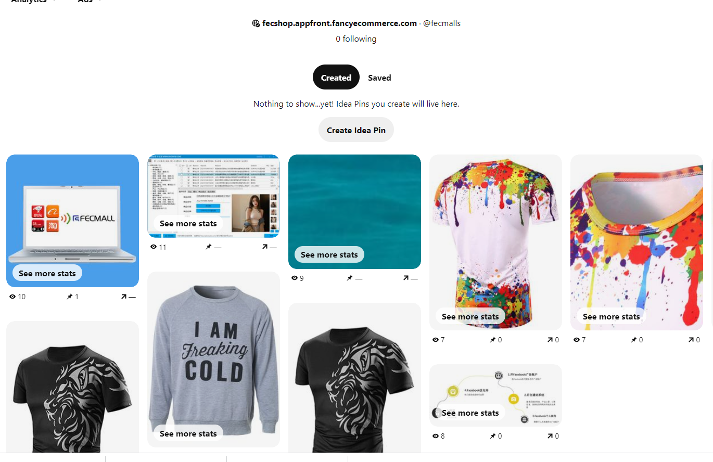

