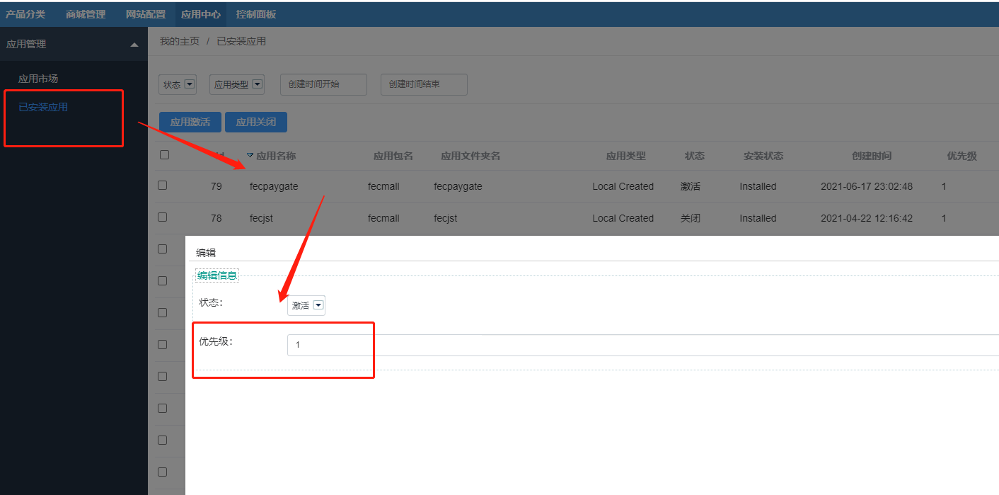

Fecmall-应用扩展优先级设置
==============

> 通过应用中心安装多个扩展，有一些扩展可能存在一定的覆盖问题，因此需要设置扩展优先级，高优先级的扩展配置，将
> 覆盖低优先级的应用扩展

### Fecmall-应用扩展优先级

fecmall后台设置应用扩展优先级，`应用中心`   --> `应用管理`  -->  `已安装应用`

值越大，优先级越高

譬如:`fecro`的优先级为`1`，`fecstripe`扩展的优先级为`10`,那么`fecstripe`
扩展的配置，将覆盖`fecro`的配置，
代码文件优先加载`fecstripe`扩展的代码文件。

