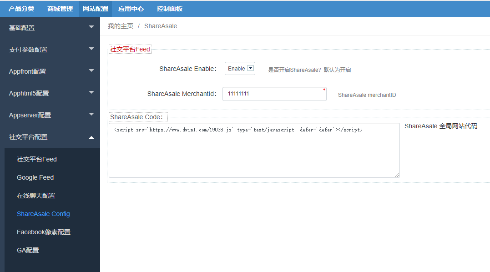

Fecmall扩展-ShareAsale扩展
================

> Fecmall 对接 -ShareAsale，定位于中小广告商的网站联盟平台。

Shareasale通常被我们简称为SAS,是另一家规模巨大的联属网络营销平台,目前拥有2000多个广告商,其中多数支持Pay-Per-Sale广告,也有少量的LEAD和CPC.

### ShareAsale扩展

您需要先安装fecmall开源系统，然后再进行插件的安装

1.fecmall应用市场地址：http://addons.fecmall.com/74495627

2.如何应用市场`安装`应用，请参看文档：[Fecmall安装应用](https://www.fecmall.com/doc/fecshop-guide/addons/cn-2.0/guide-fecmall-addons-install.html)

3.安装完成后，您需要设置ShareAsale插件的优先级,设置成最高，如何设置插件优先级，
请参看：[Fecmall-应用扩展优先级设置](https://www.fecmall.com/doc/fecshop-guide/addons/cn-2.0/guide-fecmall-addons-score.html)

4.fecmall后台查看Facebook Pixel的配置部分 

后台：`网站配置` -> `社交平台配置` -> `ShareAsale Config`

`ShareAsale Enable`: 开启

`ShareAsale MerchantId`: ShareAsale创建账户后的商户ID

`ShareAsale Code`: ShareAsale 全局js代码

### ShareAsale资料

官网：https://www.shareasale.com

https://www.shareasale.com/step3.pdf

[shareasale 安装追踪代码tracking code](https://minghao88.com/shareasale%E5%95%86%E5%AE%B6%E8%B4%A6%E6%88%B7%E8%AE%BE%E7%BD%AE%E6%95%99%E5%AD%A6/%E5%AE%89%E8%A3%85%E8%B7%9F%E8%B8%AA%E4%BB%A3%E7%A0%81/)

