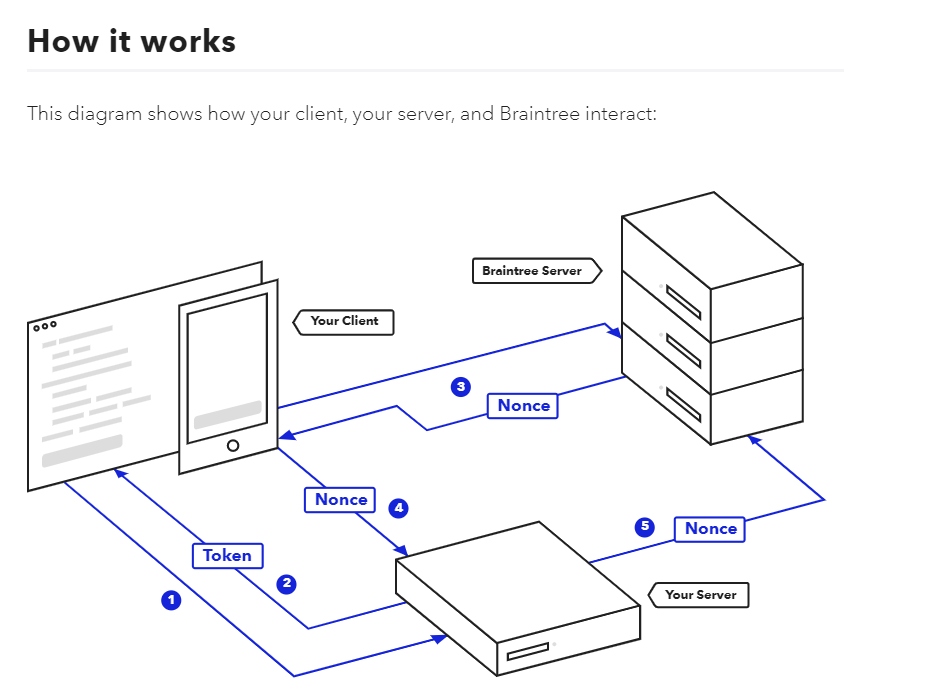
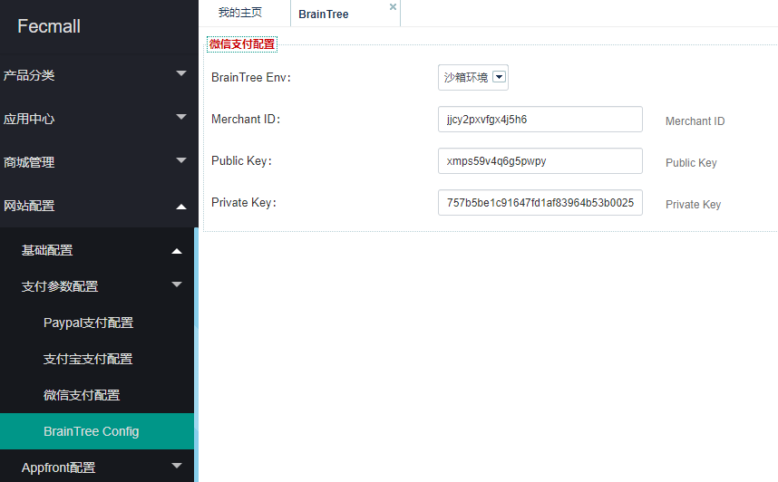
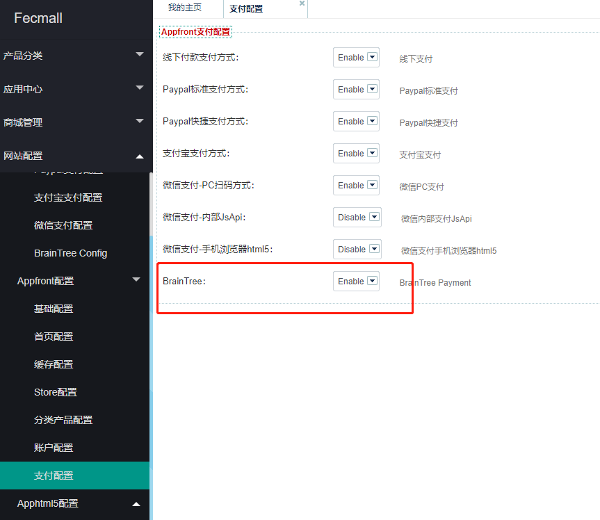

Fecmall-Braintree支付方式
=============

> braintree支付方式，和paypal，支付宝之类的支付流程不同，
braintree是再商城内部填写支付信息，进行信用卡扣款的流程

### 工作原理

### 安装配置

1.安装

应用市场地址：http://addons.fecmall.com/45263532

购买后，直接应用管理部分，在线安装即可

刷新后台界面即可

2.配置

> 目前是以沙盒环境配置

2.1注册沙盒账户

注册沙盒账户参看: http://www.fecmall.com/topic/2283

2.2开启CVV验证：

默认不显示CVV验证部分，需要去官网后台开启(https://sandbox.braintreegateway.com/merchants/jjcy2pxvfgx4j5h6/processing/cvv/edit)

go to `Settings` -> `Processing` -> `CVV`, enable CVV verification rules, and renew the client token.

详细操作参看帖子：http://www.fecmall.com/topic/2287

2.2后台填写配置信息

将资料填写下面（正式生产环境，请填写相关信息）

appfront开启braintree支付

配置完成后，就可以去前端商城进行下单支付测试了

官方沙盒测试卡：https://developers.braintreepayments.com/guides/credit-cards/testing-go-live/php

譬如：

卡号：`4111 1111 1111 1111`

过期日期：`11/2020`

CVV: `111`

支付完成后，可以看到订单的状态改为：`payment_confirmed`

然后，可以去Braintree官网登陆账户，查看是否收到款项

### 注意：

Braintree一个收款账户，只能一个`货币`，默认是`美元`，
Fecmall请将默认货币设置为`美元`，fecmall在支付的时候，使用的是`基础货币`进行计算，`而非当前货币`，
因此fecmall的`基础货币`，`必须`和Braintree的`账户货币`保持一致。

### 参考资料：

http://www.fecmall.com/topic/2283

http://www.fecmall.com/topic/2285

http://www.fecmall.com/topic/2284

http://www.fecmall.com/topic/2287

