Fecmall-中文国内电商商城系统
================

> 基于fecmall二次开发的，针对国内的电商商城系统

### 系统演示地址

H5 Demo地址：http://fectbh5.fecshop.com/cn

Pc Demo地址：http://fectb.fecshop.com/cn

购买地址：http://addons.fecmall.com/66649556

支持多语言, 多货币

### 后台配置

1.快递鸟，新人专享优惠券设置

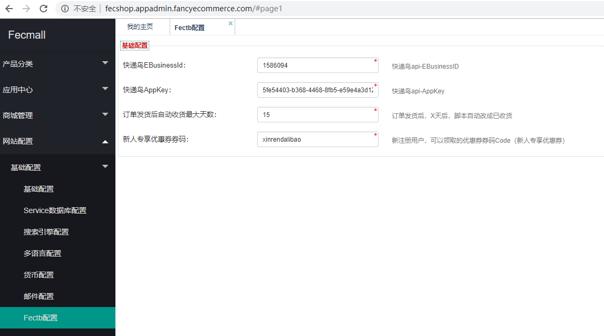

2.store模板路径设置

2.1Appfront设置: 第三方模板路径填写：`@fectb/app/appfront/theme/fectb`

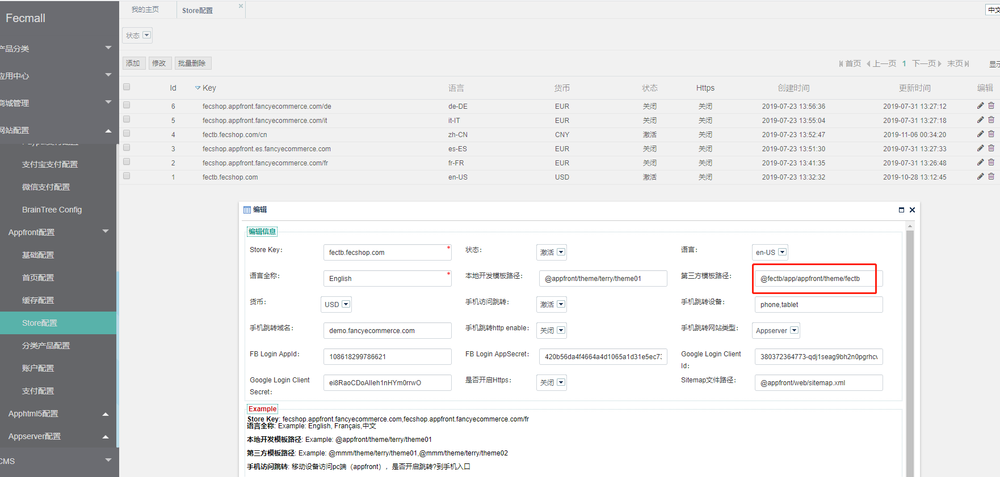

2.2Apphtml5设置: 第三方模板路径填写：`@fectb/app/apphtml5/theme/fectb`

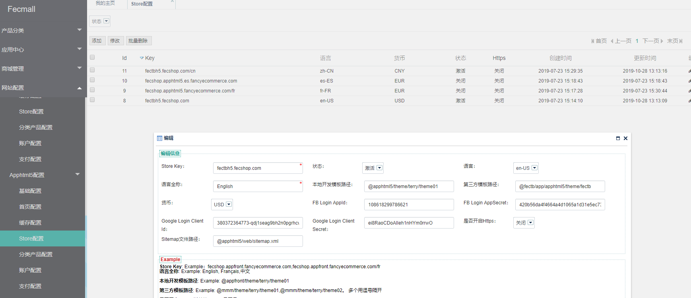

### 系统功能简介

> 针对国内电商流程的商城系统

1.采用国内的电商类型模板

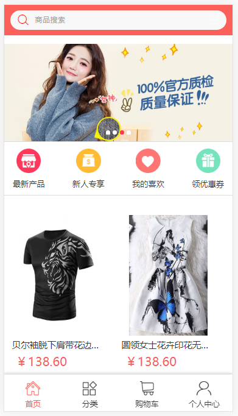

2.优惠券重构

加入发券,领券，优惠券在下单页面直接勾选使用

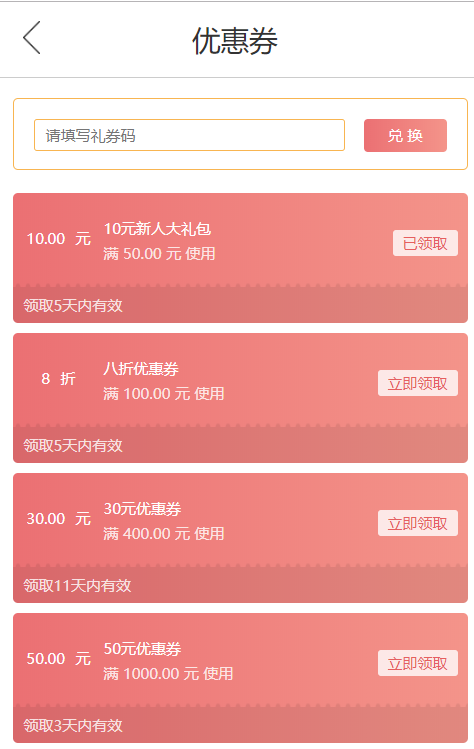

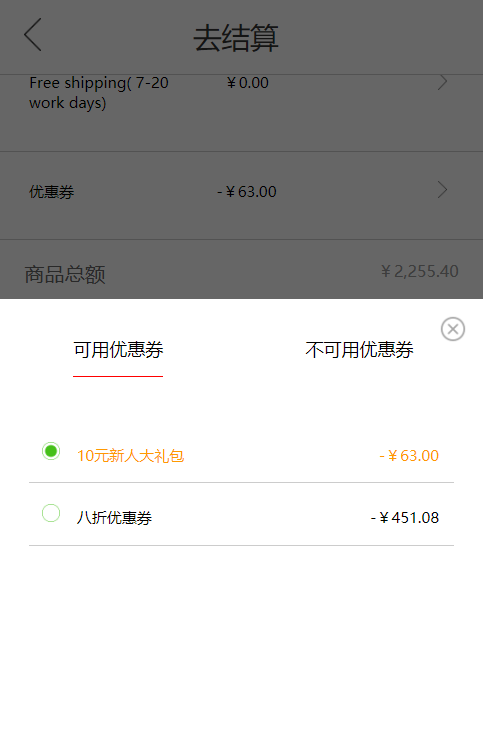

3.下单流程重构

先下单，后付款的流程

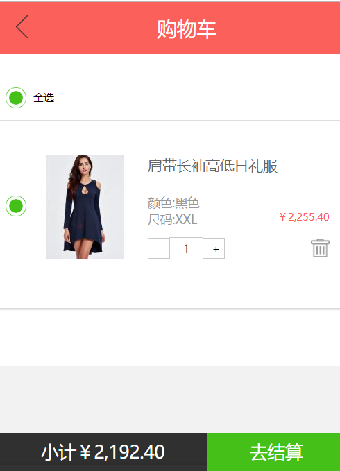

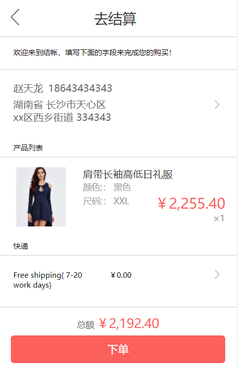

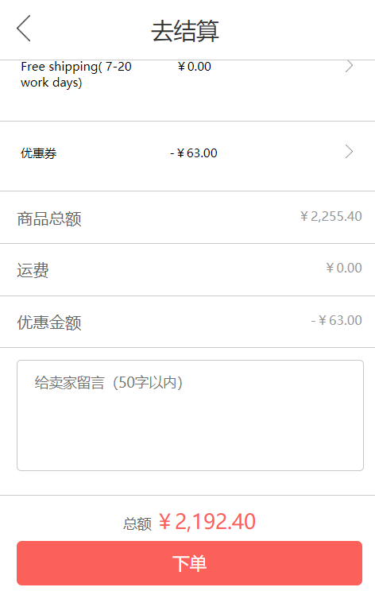

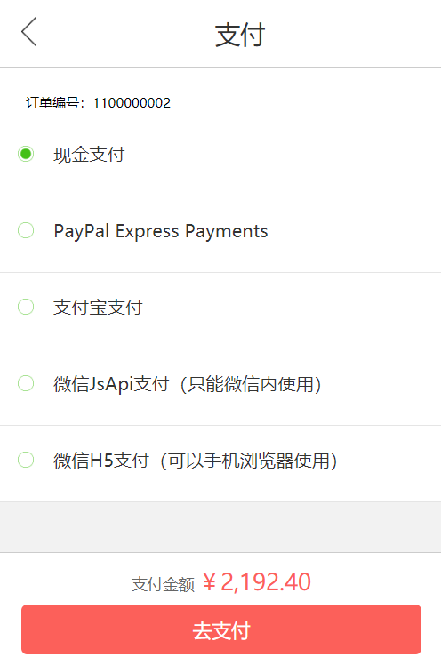

地址在下单页面直接编辑

4.后台加入订单处理流程，可以进行订单审核，订单发货等操作

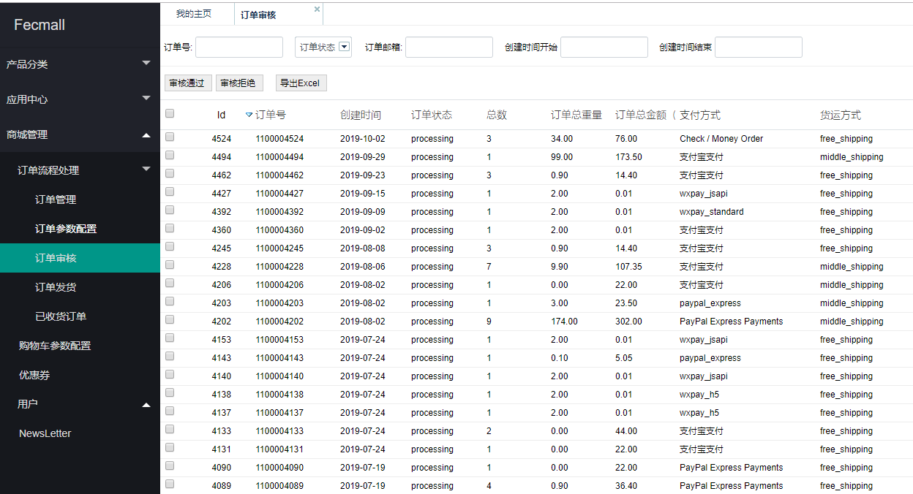

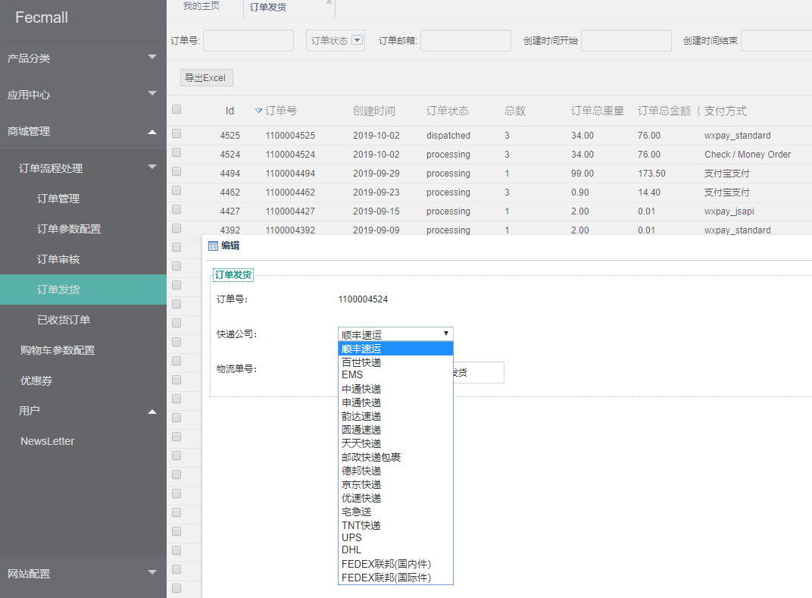

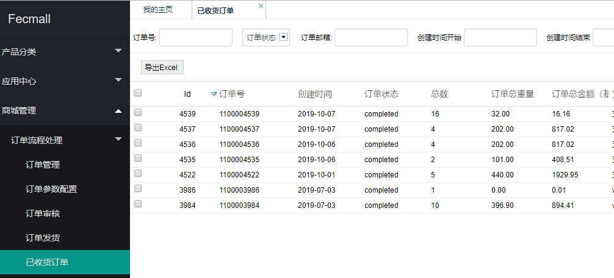

商城用户，在中心订单查看订单，进行订单的状态查看，物流信息查看，已经确认收货等操作

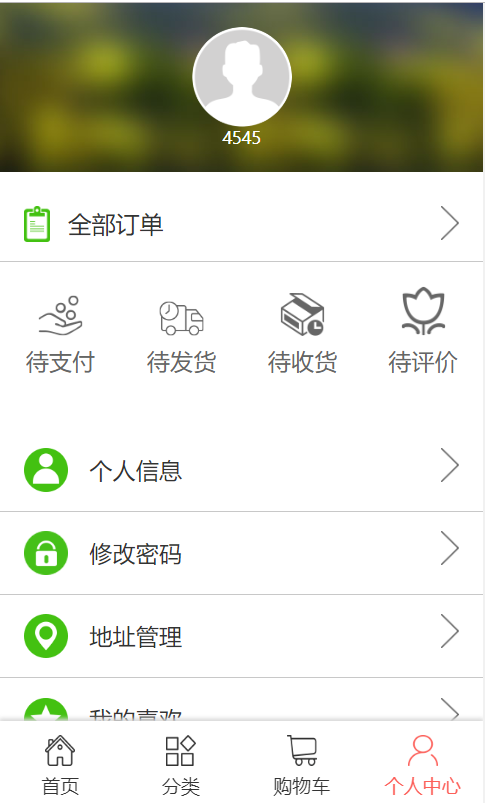

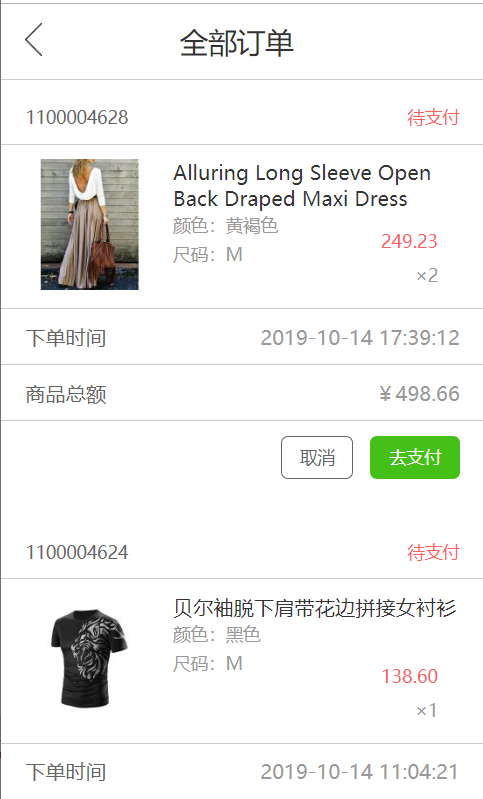

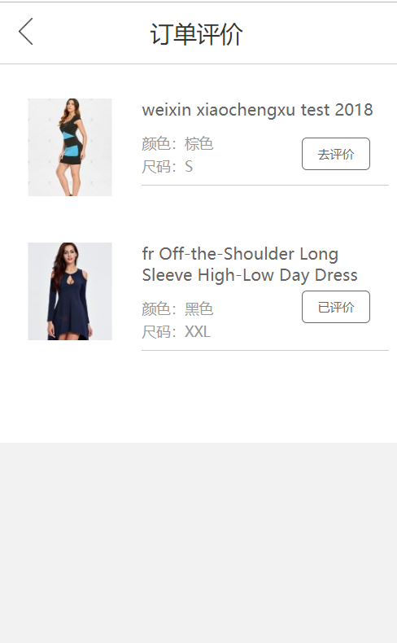

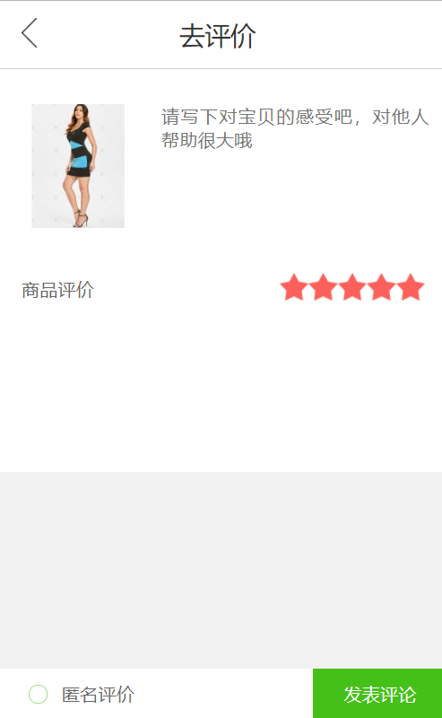

5.其他

其他的详细，请参看demo:http://fectbh5.fecshop.com/cn

