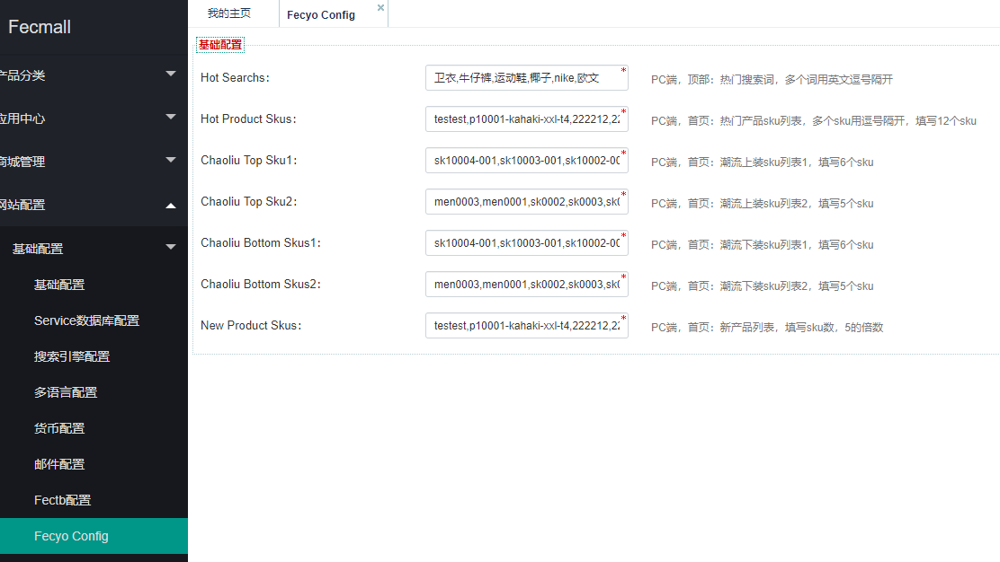
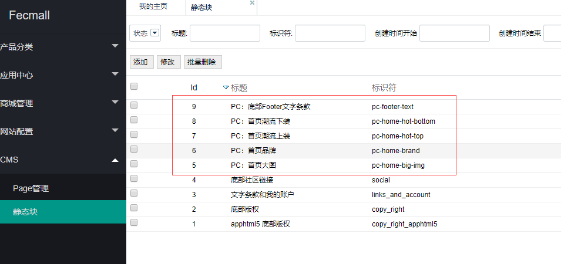
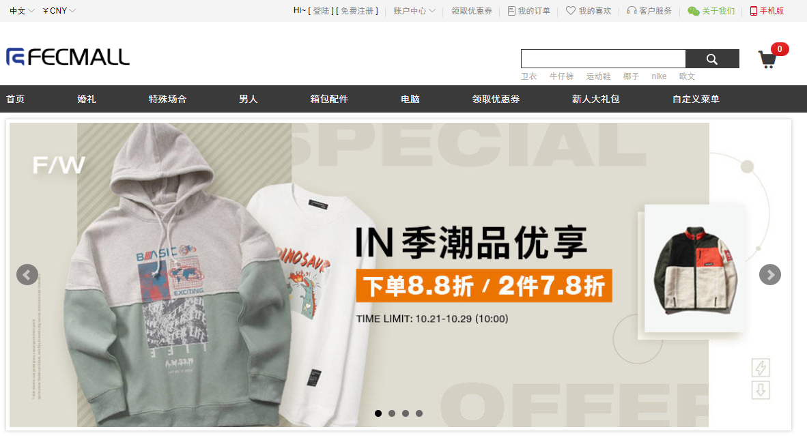
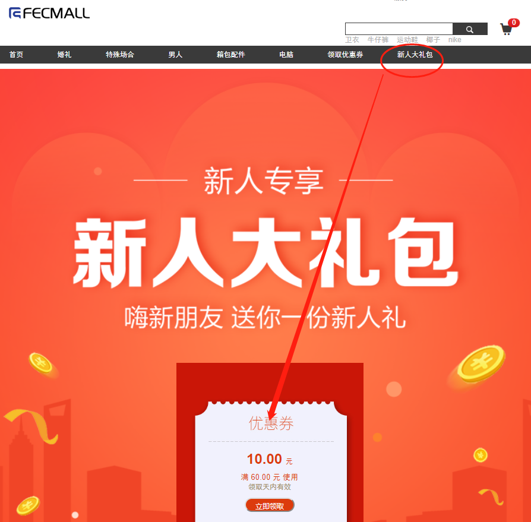
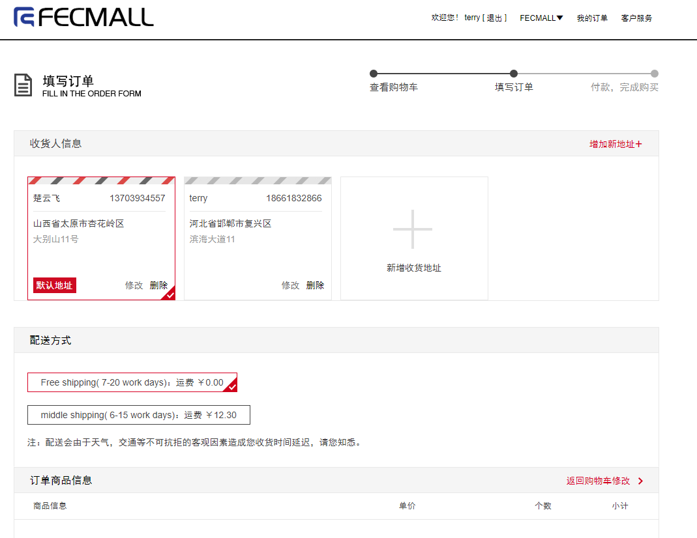
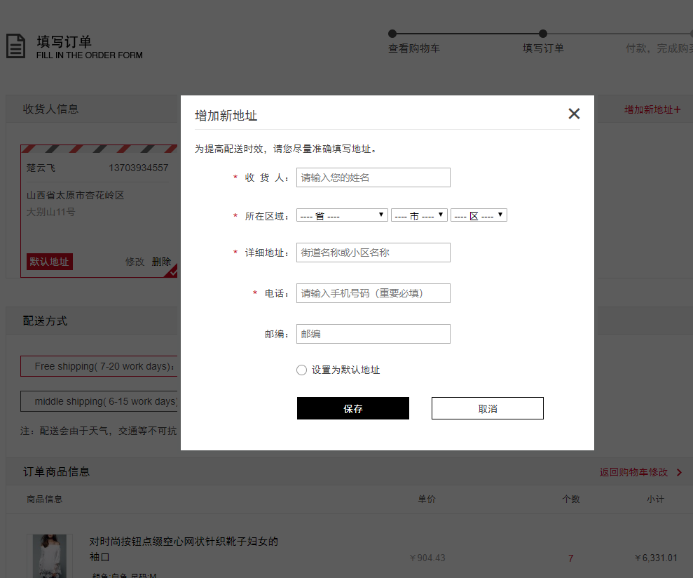
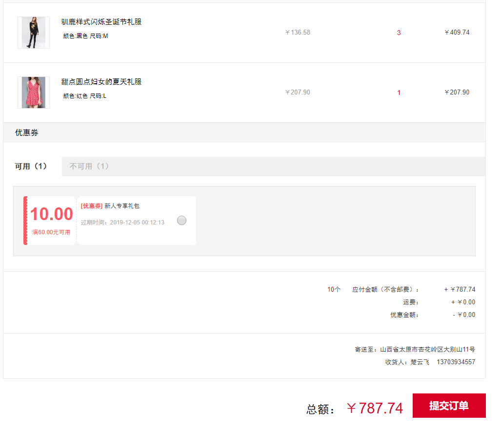
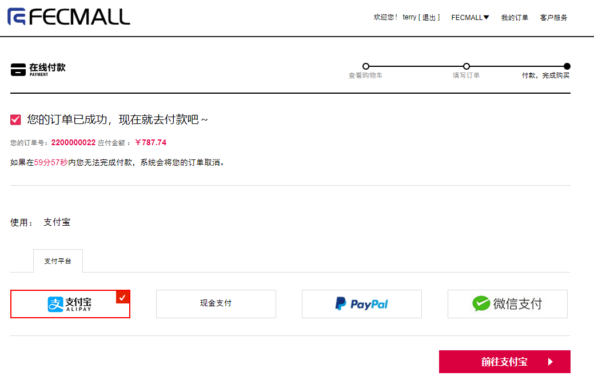
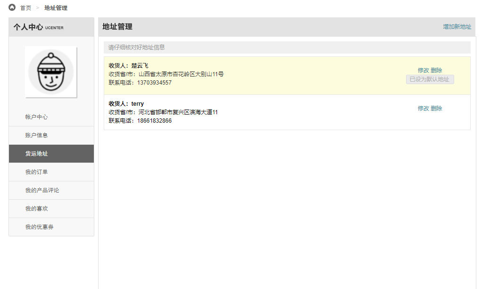
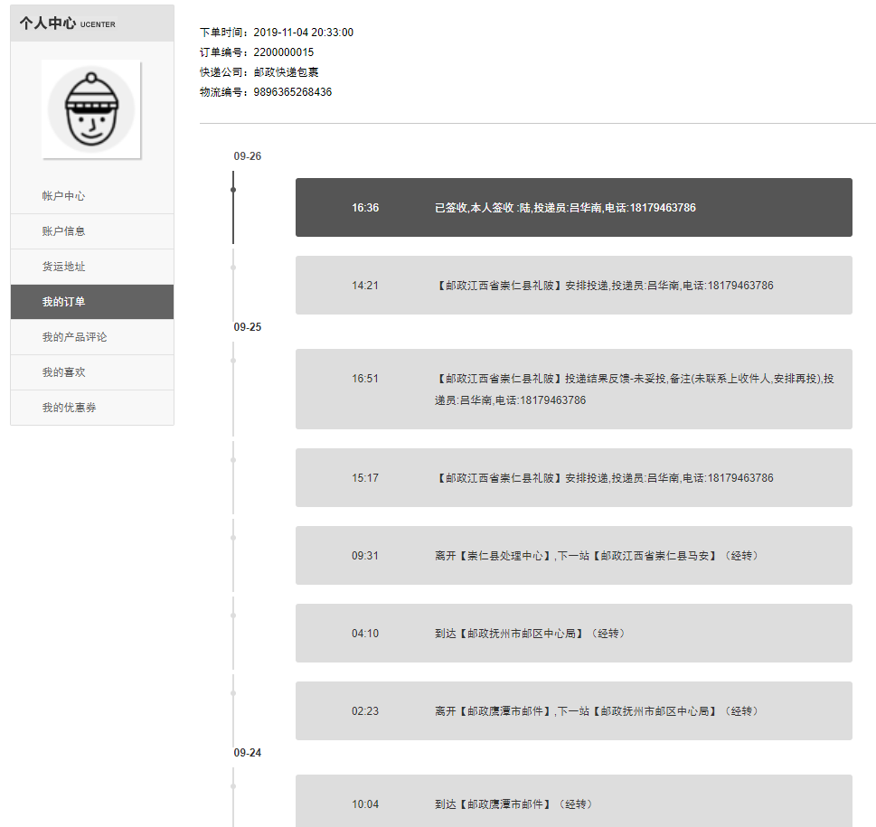

Fecmall-FecYo-中文国内电商商城系统
===================


> 基于fecmall二次开发的，针对国内的电商商城系统


一：系统演示地址DEMO
------------


Pc Demo地址：http://fecyo.fecshop.com/cn

H5 Demo地址：正在开发中

下载地址：http://addons.fecmall.com/27944278

支持多语言, 多货币

二：准备工作READY
--------

1.安装fecmall开源商城

2.应用市场购买系统，然后后台在线安装系统

3.本系统依赖于fectb，您需要先安装fectb扩展


三：安装配置INSTALL
------------------


1.参数配置

在这里配置页面顶部的搜索词，以及首页各个板块的sku（在下面截图的右侧有注释）



您可以按照下面的内容先填写上去,安装完成后，根据自己的需要更改

Hot Search: `卫衣,牛仔裤,运动鞋,椰子,nike,欧文`

Hot Product Skus：`testest,p10001-kahaki-xxl-t4,222212,22221,p10001-kahaki-xxl,p10001-black-m,op0002-33,men0003,men0001,sk0002,sk0003,sk0008`

Chaoliu Top Sku1：`sk10004-001,sk10003-001,sk10002-002,sk10002,sk1000-blue,sk2001-blue-zo`

Chaoliu Top Sku2：`men0003,men0001,sk0002,sk0003,sk0008`

Chaoliu Bottom Skus1：`sk10004-001,sk10003-001,sk10002-002,sk10002,sk1000-blue,sk2001-blue-zo`

Chaoliu Bottom Skus2：`men0003,men0001,sk0002,sk0003,sk0008`

New Product Skus：`testest,p10001-kahaki-xxl-t4,222212,22221,p10001-kahaki-xxl,p10001-black-m,op0002-33,men0003,men0001,sk0002,sk0003,sk0008,sk0002,sk0003,sk0008,sk1000-blue,sk0004,sk1000-khak`


2.首页的板块配置

后台菜单： cms-->静态块



新建如下的静态块：（点击添加按钮）

2.1首页大图(PC)

标题：PC：首页大图

标识符：pc-home-big-img

内容：()

```
<ul class="bxslider">                
	<li style="">
        <a href="{{homeUrl}}" rel="nofollow" target="_blank" title="">
            
        </a>                
	</li>                
	<li style="">                    
		<a href="{{homeUrl}}" rel="nofollow" target="_blank" title="">
            
        </a>                
	</li>                
	<li style="">                    
		<a href="{{homeUrl}}" rel="nofollow" target="_blank" title="">
            
        </a>                
	</li>                
	<li style="">                    
		<a href="{{homeUrl}}" rel="nofollow" target="_blank" title="">
            
        </a>                
	</li>            
</ul>
```

注意：对于内容部分，使用的是可视化编辑器，需要先点击`源代码`,然后在粘贴上面的`html`代码
，如图：


另外因为是`中英双语`，粘贴了`en`语言后，点击`zh`语言，然后再点击`源代码`按钮，将上面的内容html代码粘贴上去


下面的，其他的静态块的内容复制，和该处类似，都这样操作（可视化编辑器部分）


填写完成后保存即可

2.2

标识符：pc-home-brand

标题：PC：首页品牌

内容：(需要en和zh都填写，写法参看上面)

```
<div class="img-brand">            
	<ul class="img-list imgopacity clearfix">                
		<li class="img-item">
            <a href="" target="_blank" title="">
                
            </a>                
		</li>                
		<li class="img-item">                    
			<a href="" target="_blank" title="">
                
            </a>                
		</li>                
		<li class="img-item">                    
			<a href="" target="_blank" title="">
                
            </a>                
		</li>            
	</ul>        
</div>        
<div class="logo-brand imgopacity" data-shownum="16">            
	<ul>                
		<li data-page="0">                    
			<a href="" target="_blank" title="">
                
            </a>                
		</li>                
		<li data-page="0">                    
			<a href="" target="_blank" title="">
                
            </a>                
		</li>
		<li data-page="0">                    
			<a href="" target="_blank" title="">
                
            </a>                
		</li>
		<li data-page="0">                    
			<a href="" target="_blank" title="">
                
            </a>                
		</li>
		<li data-page="0">                    
			<a href="" target="_blank" title="">
                
            </a>                
		</li>
		<li data-page="0">                    
			<a href="" target="_blank" title="">
                
            </a>                
		</li>
		<li data-page="0">                    
			<a href="" target="_blank" title="">
                
            </a>                
		</li>
		<li data-page="0">                    
			<a href="" target="_blank" title="">
                
            </a>                
		</li>
		<li data-page="0">                    
			<a href="" target="_blank" title="">
                
            </a>                
		</li>
		<li data-page="0">                    
			<a href="" target="_blank" title="">
                
            </a>                
		</li>
		<li data-page="0">                    
			<a href="" target="_blank" title="">
                
            </a>                
		</li>
		<li data-page="0">                    
			<a href="" target="_blank" title="">
                
            </a>                
		</li>            
	</ul>        
</div>
```

2.3


标识符：pc-home-big-img

标题：PC：首页潮流上装

内容：


```
<div class="tpl-nav">                
	<div class="tpl-keywords">                    
		<a class="keywords0" title="" href="" target="_blank">
            
        </a>
        <a class="keywords1" title="" href="" target="_blank">
            
        </a>                
	</div>                
	<div class="tpl-category clearfix">                    
		<a href="{{homeUrl}}" title="卫衣" target="_blank">卫衣</a>
        <a href="{{homeUrl}}" title="夹克" target="_blank">夹克</a>
        <a href="{{homeUrl}}" title="毛衣/针织" target="_blank">毛衣/针织</a>
        <a href="{{homeUrl}}" title="棉衣" target="_blank">棉衣</a>
        <a href="{{homeUrl}}" title="羽绒服" target="_blank">羽绒服</a>
        <a href="{{homeUrl}}" title="风衣" target="_blank">风衣</a>
        <a href="{{homeUrl}}" title="MADNESS" target="_blank">MADNESS</a>
        <a href="{{homeUrl}}" title="DC" target="_blank">DC</a>
        <a href="{{homeUrl}}" title="gxg.jeans" target="_blank">gxg.jeans</a>
        <a href="{{homeUrl}}" title="黑鲸" target="_blank">黑鲸</a>
        <a href="{{homeUrl}}" title="viishow" target="_blank">viishow</a>
        <a href="{{homeUrl}}" title="FYP" target="_blank">FYP</a>                
	</div>            
</div>            
<div class="tpl-brands imgopacity clearfix">                
	<ul>                    
		<li>                        
			<a title="" href="" target="_blank">
                
            </a>                    
		</li>                    
		<li>                        
			<a title="" href="" target="_blank">
                
            </a>                    
		</li>                
	</ul>            
</div>            


```


2.4

标识符：pc-home-hot-bottom

标题：PC：首页潮流下装

内容：


```
<div class="tpl-nav">                
	<div class="tpl-keywords">                    
		<a class="keywords0" title="裤装" href="" target="_blank">
            
        </a>
        <a class="keywords1" title="新品VIP" href="" target="_blank">
            
        </a>                
	</div>                
	<div class="tpl-category clearfix">                    
		<a href="" title="休闲裤" target="_blank">休闲裤</a>
        <a href="" title="牛仔裤" target="_blank">牛仔裤</a>
        <a href="" title="运动裤" target="_blank">运动裤</a>
        <a href="" title="工装裤" target="_blank">工装裤</a>
        <a href="" title="束口裤" target="_blank">束口裤</a>
        <a href="" title="九分裤" target="_blank">九分裤</a>
        <a href="" title="多袋裤" target="_blank">多袋裤</a>
        <a href="" title="西裤" target="_blank">西裤</a>
        <a href="" title="COKEIN" target="_blank">COKEIN</a>
        <a href="" title="DUSTY" target="_blank">DUSTY</a>
        <a href="" title="NOTHOMME" target="_blank">NOTHOMME</a>
        <a href="" title="白卷BAIJUAN" target="_blank">白卷BAIJUAN</a>                
	</div>            
</div>            
<div class="tpl-brands imgopacity clearfix">                
	<ul>                        
		<li>                            
			<a title="" href="" target="_blank">
                
            </a>
		</li>                        
		<li>                            
			<a title="" href="" target="_blank">
                
            </a>
		</li>                
	</ul>            
</div>
```


2.5

标识符：pc-footer-text

标题：PC：底部Footer文字条款


内容：


```
<div class="footerbottom">        
	<div class="promise">            
		<div class="center-content clearfix">                
			<div class="left">                    
				<span class="iconfont rgbf"></span>
                <span class="red">100%</span>
                <span class="rgbf">品牌正品</span>                
			</div>                
			<div class="left">                    
				<span class="iconfont rgbf"></span>
                <span class="red">7天</span>
                <span class="rgbf">无理由退换货</span>                
			</div>                
			<div class="left">                    
				<span class="iconfont rgbf"></span>
                <a href="{{homeUrl}}" target="_blank" rel="nofollow">
                    <span class="red">便捷</span>
                    <span class="rgbf">在线客服</span>
                </a>                
			</div>            
		</div>        
	</div>        
	<div class="footer-help">            
		<div class="center-content clearfix">                
			<div class="left">                    
				<ul class="clearfix">                        
					<li class="left">                            
						<p>                                
							<span>新手专区</span>                            
						</p>                            
						<p>                                
							<a href="{{homeUrl}}" target="_blank" rel="nofollow">注册登录</a>                            
						</p>                            
						<p>                                
							<a href="{{homeUrl}}" target="_blank" rel="nofollow">购物结算</a>                            
						</p>                            
						<p>                                
							<a href="{{homeUrl}}" target="_blank" rel="nofollow">下单支付</a>                            
						</p>                            
						<p>                                
							<a href="{{homeUrl}}" target="_blank" rel="nofollow">收货评价</a>                            
						</p>                        
					</li>                        
					<li class="left">                            
						<p>                                
							<span>会员中心</span>                            
						</p>                            
						<p>                                
							<a href="{{homeUrl}}" target="_blank" rel="nofollow">会员制度</a>                            
						</p>                            
						<p>                                
							<a href="{{homeUrl}}" target="_blank" rel="nofollow">会员优惠</a>                            
						</p>                            
						<p>                                
							<a href="{{homeUrl}}" target="_blank" rel="nofollow">账户管理</a>                            
						</p>                            
						<p>                                
							<a href="{{homeUrl}}" target="_blank" rel="nofollow">密码管理</a>                            
						</p>                        
					</li>                        
					<li class="left">                            
						<p>                                
							<span>购物指南</span>                            
						</p>                            
						<p>                                
							<a href="{{homeUrl}}" target="_blank" rel="nofollow">发票</a>                            
						</p>                            
						<p>                                
							<a href="{{homeUrl}}" target="_blank" rel="nofollow">尺码对照</a>                            
						</p>                            
						<p>                                
							<a href="{{homeUrl}}" target="_blank" rel="nofollow">尺码解读</a>                            
						</p>                            
						<p>                                
							<a href="{{homeUrl}}" target="_blank" rel="nofollow">商品咨询</a>                            
						</p>                        
					</li>                        
					<li class="left">                            
						<p>                                
							<span>支付方式</span>                            
						</p>                            
						<p>                                
							<a href="{{homeUrl}}" target="_blank" rel="nofollow">在线支付</a>                            
						</p>                            
						<p>                                
							<a href="{{homeUrl}}" target="_blank" rel="nofollow">货到付款</a>                            
						</p>                            
						<p>                                
							<a href="{{homeUrl}}" target="_blank" rel="nofollow">分期支付</a>                            
						</p>                            
						<p>                                
							<a href="{{homeUrl}}" target="_blank" rel="nofollow">优惠券、有货币</a>                            
						</p>                        
					</li>                        
					<li class="left">                            
						<p>                                
							<span>配送方式</span>                            
						</p>                            
						<p>                                
							<a href="{{homeUrl}}" target="_blank" rel="nofollow">配送说明</a>                            
						</p>                            
						<p>                                
							<a href="{{homeUrl}}" target="_blank" rel="nofollow">运费说明</a>                            
						</p>                            
						<p>                                
							<a href="{{homeUrl}}" target="_blank" rel="nofollow">验货签收</a>                            
						</p>                            
						<p>                                
							<a href="{{homeUrl}}" target="_blank" rel="nofollow">收货样品</a>                            
						</p>                        
					</li>                        
					<li class="left">                            
						<p>                                
							<span>售后服务</span>                            
						</p>                            
						<p>                                
							<a href="{{homeUrl}}" target="_blank" rel="nofollow">退换货政策</a>                            
						</p>                            
						<p>                                
							<a href="{{homeUrl}}" target="_blank" rel="nofollow">退换货流程</a>                            
						</p>                            
						<p>                                
							<a href="{{homeUrl}}" target="_blank" rel="nofollow">投诉与建议</a>                            
						</p>                            
						<p>                                
							<a href="{{homeUrl}}" target="_blank" rel="nofollow">在线客服</a>                            
						</p>                        
					</li>                        
					<li class="left">                            
						<p>                                
							<span>APP常见问题</span>                            
						</p>                            
						<p>                                
							<a href="{{homeUrl}}" target="_blank" rel="nofollow">IPhone版</a>                            
						</p>                            
						<p>                                
							<a href="{{homeUrl}}" target="_blank" rel="nofollow">Android版</a>                            
						</p>                            
						<p>                                
							<a href="{{homeUrl}}" target="_blank" rel="nofollow">wap版</a>                            
						</p>                            
						<p>                                
							<a href="{{homeUrl}}" target="_blank" rel="nofollow">IPAD版</a>                            
						</p>                        
					</li>                    
				</ul>                
			</div>            
		</div>        
	</div>        
	<div class="footer-link">            
		<div class="center-content clearfix">                
			<div class="about-us">                    
				<div class="left-flag">                                                          
					<a href="" target="_blank" rel="nofollow">
                        
                    </a>
                    <a href="" target="_blank" rel="nofollow">
                        
                    </a>                    
				</div>                    
				<p class="links">                        
					<a href="" rel="nofollow">返回首页</a>
                    <span>|</span>
                    <a href="" rel="nofollow">FECMALL </a>
                    <span>|</span>
                    <a href="" rel="nofollow">新力传媒</a>
                    <span>|</span>
                    <a href="" rel="nofollow">联系我们</a>
                    <span>|</span>
                    <a href="" rel="nofollow">商家入驻</a>
                    <span>|</span>
                    <a href="" rel="nofollow">隐私条款</a>
                    <span>|</span>
                    <a href="" rel="nofollow">友情链接</a>
                    <span>|</span>
                    <a href="">潮流品牌大全</a>
                    <span>|</span>
                    <a href="">潮流品类大全</a>
                    <span>|</span>
                    <a href="">潮流产品大全</a>
                    <span>|</span>
                    <a href="">潮流资讯</a>
                    <span>|</span>
                    <a href="">穿衣搭配(男生版)</a>
                    <span>|</span>
                    <a href="">穿衣搭配(女生版)</a>
                    <span>|</span>
                    <a href="">潮流人气</a>
                    <span>|</span>
                    <a href="">潮流潮品</a>
                    <span>|</span>
                    <a href="">潮流视频</a>
                    <span>|</span>
                    <a target="_blank" href="" rel="nofollow">xxxx许可证</a>
                    <span>|</span>
                    <a target="_blank" href="" rel="nofollow">鲁B2-xxxxxx</a>
                    <span>|</span>
                    <a target="_blank" href="" rel="nofollow">xxxx许可证</a>                    
				</p>                
			</div>                
			<div class="copyright">                    
				<p>
				</p>                    
				<p>
                    CopyRight &copy; 2007-2019 XXXXX有限公司
                    <a class="rbg6" href="" target="_blank" rel="nofollow">ICP备XXXX号</a>
                    NewPower Co. 版权所有 xx省xx市xx区xx东街18号xx产业园xx栋xx楼 xxx-xxxxxxxx                    
				</p>                
			</div>            
		</div>        
	</div>        
	<div class="footer-link-container">            
		<div class="center-content clearfix">                
			<div class="link-info left">
				友情链接：
			</div>                
			<div class="link-section left">                    
				<ul class="clearfix">                            
					<li>
						<a href="http://www.fecmall.com" target="_blank">FECMALL</a>
					</li>                    
				</ul>                
			</div>            
		</div>        
	</div><!--/footer-link-container-->    
</div>    

```


2.6

标识符：h5-home-big-img

标题：html5：首页走马灯大图


内容：

```
<li class="swiper-slide">                                    
	<a href="" rel="nofollow">
        
    </a>                                
</li>                                
<li class="swiper-slide">                                    
	<a href="" rel="nofollow">
        
    </a>                                
</li>                                
<li class="swiper-slide">                                    
	<a href="" rel="nofollow">
        
    </a>                                
</li>
```

2.7

标识符：h5-home-banner-1

标题：html5：首页Banner图-1


内容：

```
<a href="" id="660775" name="" rel="nofollow">
    
</a>
```

2.8

标识符：h5-home-hot-category

标题：HTML5:首页热门分类


内容：

```
<li>                            
	<a href="">
         
    </a>                                                  
</li>                        
<li>                            
	<a href="">
           
    </a>                                                 
</li>                        
<li>                            
	<a href="">
         
    </a>                                                  
</li>                        
<li>                            
	<a href="">
           
    </a>                                                 
</li><li>                            
	<a href="">
         
    </a>                                                  
</li>                        
<li>                            
	<a href="">
           
    </a>                                                 
</li><li>                            
	<a href="">
         
    </a>                                                  
</li>                        
<li>                            
	<a href="">
           
    </a>                                                 
</li><li>                            
	<a href="">
         
    </a>                                                  
</li>                        
<li>                            
	<a href="">
           
    </a>                                                 
</li><li>                            
	<a href="">
         
    </a>                                                  
</li>                        
<li>                            
	<a href="">
           
    </a>                                                 
</li>
```

2.9

标识符：h5-home-banner-2

标题：HTML5:首页banner-2


内容：

```
<a href="" id="36565" name="" rel="nofollow">
    
</a>
```


2.10

标识符：h5-home-hot-brand

标题：HTML5:首页热门品牌


内容：

```
<li class="brand">
    <a href="">
        
    </a>                    
</li>                    
<li class="brand">                        
	<a href="">
        
    </a>                    
</li>                    
<li class="brand">
    <a href="">
         
    </a>                    
</li>                    
<li class="brand">
    <a href="">
        
    </a>                    
</li>                    
<li class="brand">
    <a href="">
        
    </a>                    
</li>                    
<li class="brand">
    <a href="">
        
    </a>                    
</li>                    
<li class="more">
    <a href="">
        
    </a>                    
</li>
```

3.fecyo系统依赖于`fectb`，您需要安装`fectb`，安装后，需要在后台设置扩展优先级

`应用中心` --> `应用管理`  --> `已安装应用`

设置：`Priority`,`Fecyo`的优先级需要高于`fectb`


保存完成后，这里就配置好了

其他的配置（譬如支付，物流等），参看fecmall的文档


四：系统功能简介-ABOUT
---------------------


> 针对国内电商流程的商城系统，再fecmall基础上进行了二次开发，下面是二开的功能介绍


1.采用国内的电商类型模板



2.优惠券重构

加入发券,领券，新人专享大礼包等，优惠券在下单页面直接勾选使用

领取优惠券


新人大礼包



账户中心查看优惠券


下单部分使用优惠券


3.下单流程重构

先下单，后付款的流程










地址在下单页面直接编辑

4.后台加入订单处理流程，可以进行订单审核，订单发货等操作


5.账户中心








5.其他

其他的详细，请参看demo:http://fecyo.fecshop.com/cn


