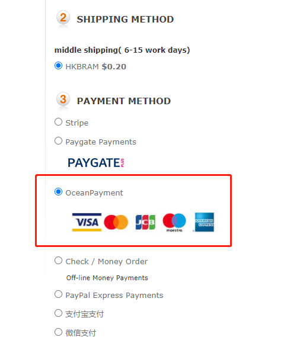

Fecmall扩展-OceanPayment钱海支付方式
====================

> OceanPayment钱海支付扩展，用于信用卡收款

### 关于钱海支付

Oceanpayment是一个专业处理国际信用卡、借记卡交易并同时提供500多种支付产品的支付方案解决商
，钱海支付支持国内企业用户开通，无需境外银行卡，和stripe，braintree等收款渠道有很大不同，
开通比较方便。

1.钱海支付官网：https://www.oceanpayment.com/


2.工作原理


3.支持`大陆公司`，`香港公司`，`新加坡公司`，`欧洲公司`等，均可支持签约。

关于钱海的更多问题，可以咨询钱海官网客服（微信扫一扫添加客服微信咨询）。


### OceanPayment支付扩展安装

**扩展支持**：

1.应用市场地址：http://addons.fecmall.com/96169264

2.如何应用市场安装应用，请参看文档：[Fecmall安装应用](https://www.fecmall.com/doc/fecshop-guide/addons/cn-2.0/guide-fecmall-addons-install.html)

安装插件后，请设置支付插件的优先级，`fecoceanpayment扩展优先级需要高出`其他插件（譬如fecro，fecwbbc等），
如何设置扩展插件优先级，请参看：[Fecmall-应用扩展优先级设置](https://www.fecmall.com/doc/fecshop-guide/addons/cn-2.0/guide-fecmall-addons-score.html)


### OceanPayment支付扩展配置


1.您需要联系钱海支付，开通账户，钱海支付官网： https://www.oceanpayment.com/


2.开通后，就会拿到

```
Account： 账号
Terminal：  终端号
secureCode： 安全编码
```

3.打开fecmall的后台


如果您填写线上生产环境的正式账号信息，`Is Sanbox Env`选择`No`,
将开通的账号信息，填写保存.


4.appfront和apphtml5入口开启钱海支付


4.1appfront入口：


4.2apphtml5入口：


开启保存即可


5.前端商城查看，下单支付





支付默认的label为：`OceanPayment`，图片描述如上图

如果您想自定义label和image，那么可以进入配置文件

./addons/fecmall/fecoceanpayment/config.php

找到

```
'label'=> 'OceanPayment',

...

'image' => 'addons/fecoceanpayment/fecoceanpayment.jpg',
```

将其更改即可，对于image的值`addons/fecoceanpayment/fecoceanpayment.jpg`对应的文件为
`appimage/common/addons/fecoceanpayment/fecoceanpayment.jpg`,您可以更换您自己的图片


