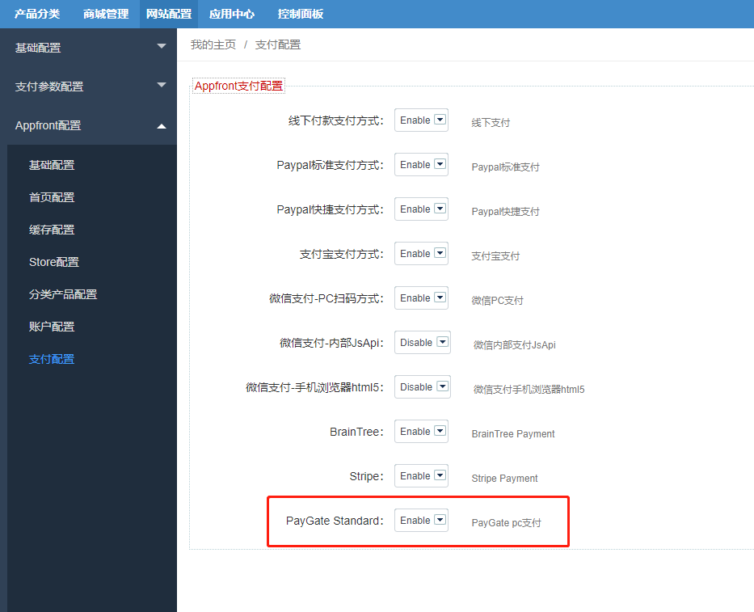
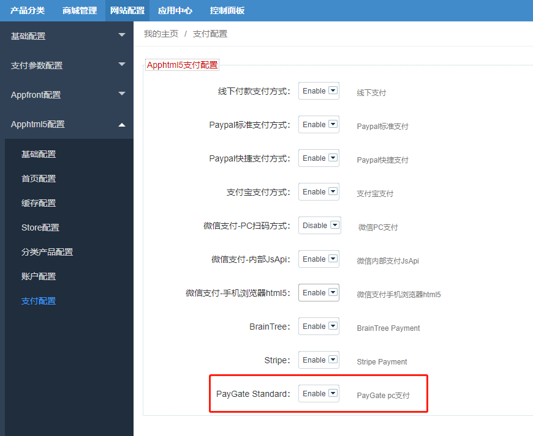
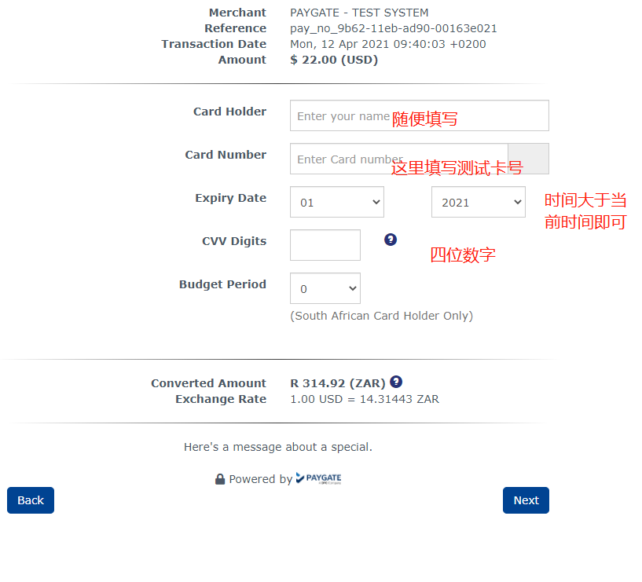

Fecmall扩展-Paygate（南非）支付方式，支持兰特货币收款
====================

> paygate是非洲的主流收款渠道。


### Paygate（南非）支付方式

官网：https://www.paygate.co.za/

官方开发文档：https://docs.paygate.co.za/#endpoints

**扩展支持**：fecmall开源系统，fecro跨境单商户，fecwbbc跨境多商户系统

### PayGate支付安装

用于信用卡收款，payGate是非洲的主要的收款方式，支持`兰特`货币收款

1.应用市场地址：http://addons.fecmall.com/98739358

2.如何应用市场安装应用，请参看文档：[Fecmall安装应用](https://www.fecmall.com/doc/fecshop-guide/addons/cn-2.0/guide-fecmall-addons-install.html)

安装插件后，请设置支付插件的优先级，`fecbraintree扩展优先级需要高出`其他插件（譬如fecro，fecwbbc等），
如何设置扩展插件优先级，请参看：[Fecmall-应用扩展优先级设置](https://www.fecmall.com/doc/fecshop-guide/addons/cn-2.0/guide-fecmall-addons-score.html)


3.如果你使用的`fecwbbc跨境多商户`，必须更改：（非fecwbbc忽略下面内容，不需要操作）

打开文件 `./addons/fecmall/fecpaygate/config.php` , 大约43行,将代码

```
'class' => 'fecpaygate\services\payment\Paygate',
```

改为：

```
'class' => 'fecpaygate\services\payment\PaygateFecwbbc',
```
 


### PayGate配置

1.1PayGate配置：`网站配置` --> `支付参数配置` -->  `PayGate配置`


测试收款账号:（Paygate没有沙盒环境，只有线上环境，但是给与了一个测试收款的卡号，如下）

```
PayGate ID	10011072130
密码	secret
货币	ZAR，EUR，USD
```

将其填写到后台`PayGate配置`（如上图），保存即可


1.2Appfront和apphtml5的支付，都要在后台`配置`中进行开启


1.2.1Appfront配置`支付开启`



1.2.2Apphtml5配置`支付开启`




2.测试


2.1测试支付卡号，可以这里查看：https://docs.paygate.co.za/#testing

```
卡牌	卡号	风险指标
签证	4000000000000002	已验证（AX）*
万事达	5200000000000015	已验证（AX）
美国运通	378282246310005	未认证（NX）
```

2.2进行下单，支付，跳转到paygate页面，填写测试支付信息



进行下单即可。


