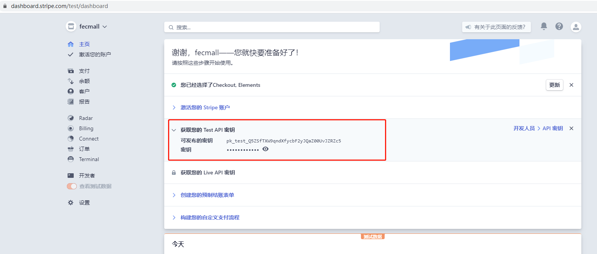
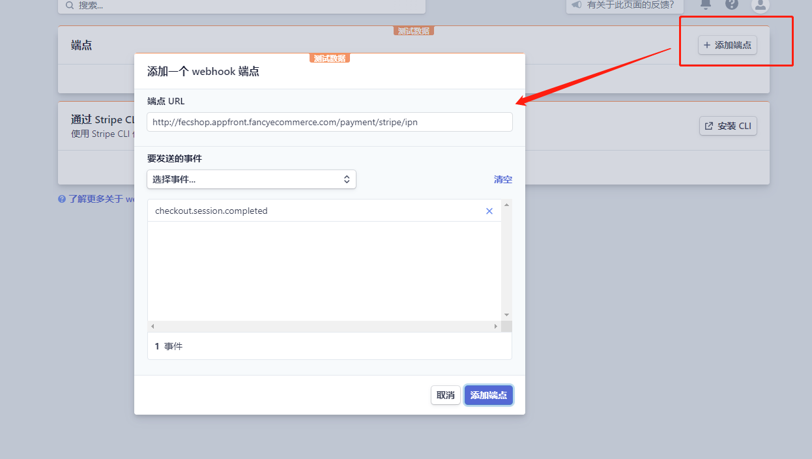
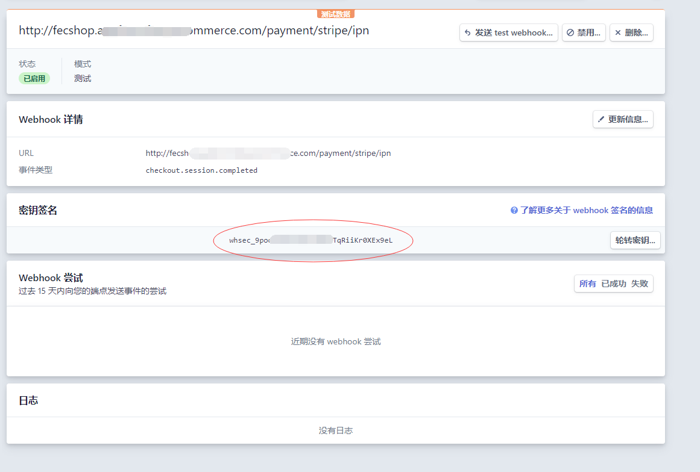
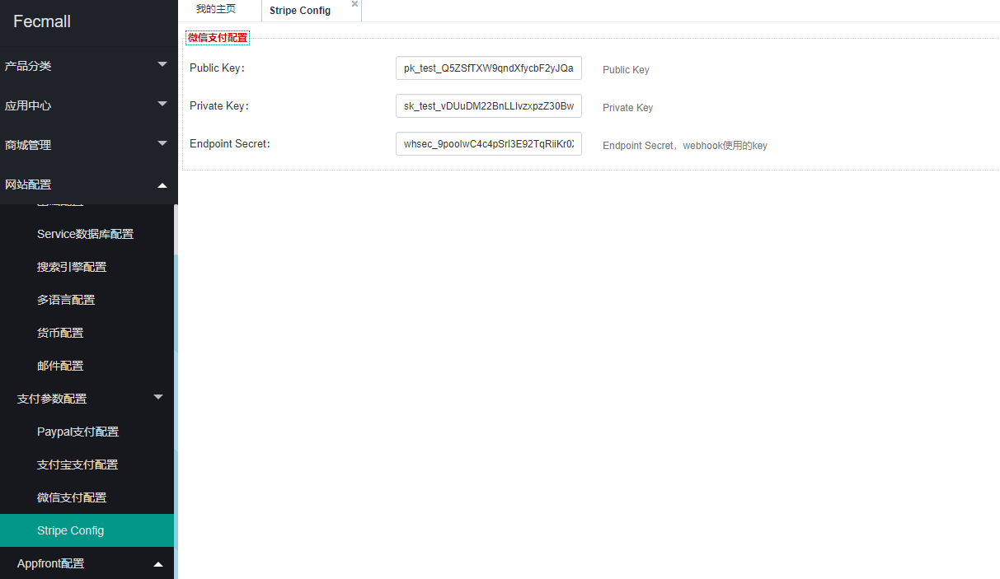
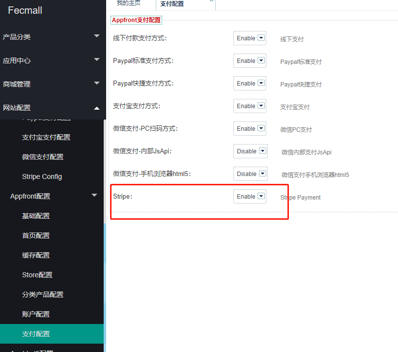
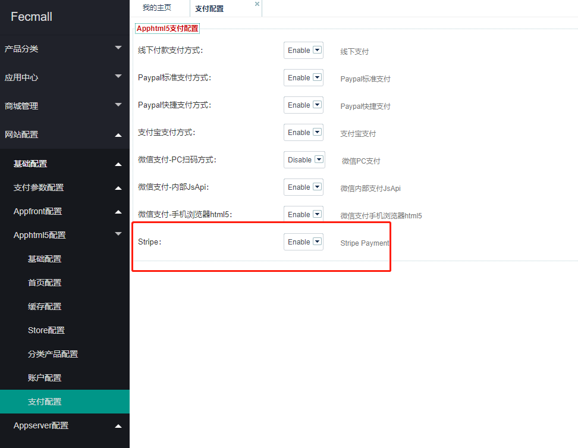
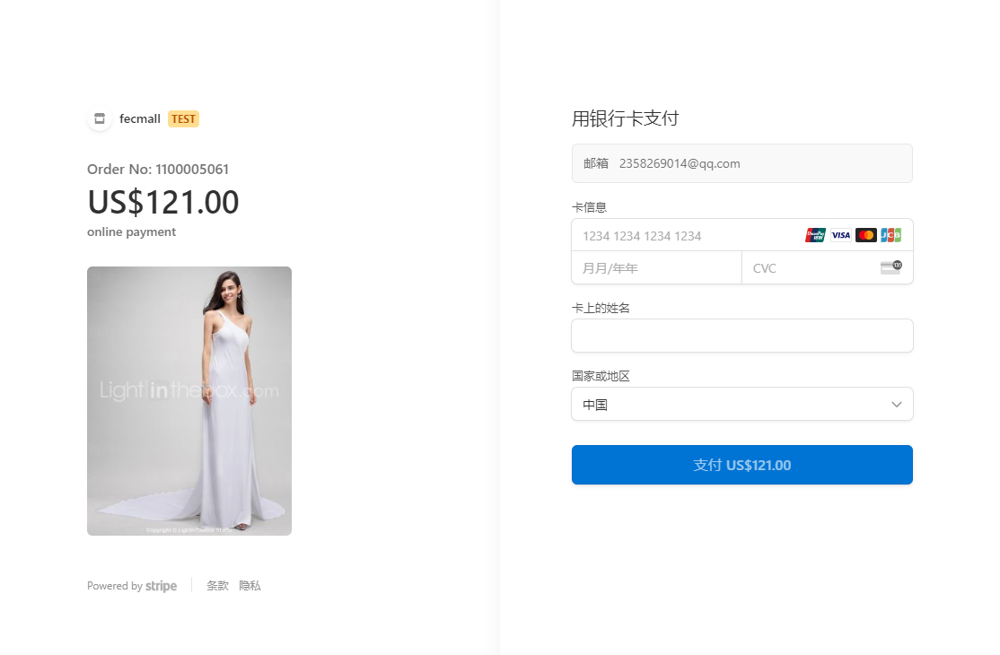
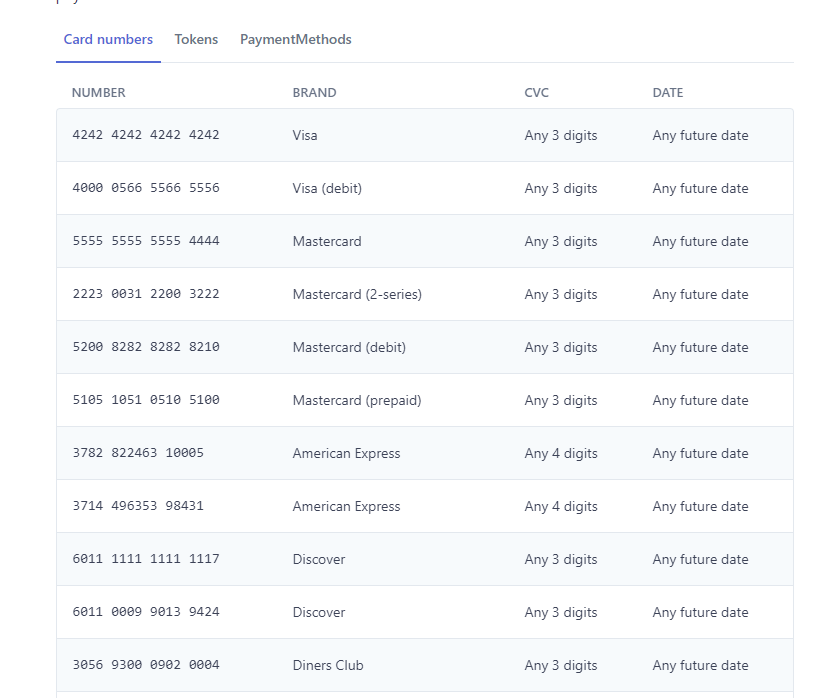

Fecmall-Stripe支付方式
=============

> Stripe支付方式，当今非常流行的支付方式，Fecmall和stripe支付方式进行了对接


### Fecmall-Stripe扩展安装

**扩展支持**：fecmall开源系统，fecro跨境单商户，fecwbbc跨境多商户系统

1.应用市场地址：http://addons.fecmall.com/57236781

2.如何应用市场安装应用，请参看文档：[Fecmall安装应用](https://www.fecmall.com/doc/fecshop-guide/addons/cn-2.0/guide-fecmall-addons-install.html)

安装插件后，请设置支付插件的优先级，`fecbraintree扩展优先级需要高出`其他插件（譬如fecro，fecwbbc等），
如何设置扩展插件优先级，请参看：[Fecmall-应用扩展优先级设置](https://www.fecmall.com/doc/fecshop-guide/addons/cn-2.0/guide-fecmall-addons-score.html)


3.如果你使用的`fecwbbc跨境多商户`，必须更改：（非fecwbbc忽略下面内容，不需要操作）

打开文件 `./addons/fecmall/fecstripe/config.php` , 大约40行,将代码

```
'class'    => 'fecstripe\services\payment\Stripe',
```

改为：

```
'class'    => 'fecstripe\services\payment\StripeFecwbbc',
```


### Fecmall-Stripe扩展配置


1.注册stripe账户：https://dashboard.stripe.com/ ，注册成功后登陆即可

> stripe是没有沙盒和证书环境之分（譬如不同的登陆地址和账户），而是通过`public key` 和 `private key`的前缀来区分的，
因此，只需要将test key，替换为 正式环境的key就可以了

得到测试环境的：`public key` 和 `private key`




正式环境需要身份验证后，才可以获取


2.添加webhooks，获取`Endpoint Secret`

添加webhooks网址：https://dashboard.stripe.com/test/webhooks






`Endpoint Secret`就是上图的`密码签名`


3.后台配置

进入后台配置界面



将上面获取的`public key` ， `private key`
，`Endpoint Secret`填写进去
，保存即可


4.appfront apphtml5开启stripe支付

4.1appfront开启支付




4.2apphtml5开启支付




### Fecmall-Stripe商城下单测试


1.产品加入购物车后，进行下单，支付方式选择stripe，点击下单后，
就会跳转到支付页面





测试卡stripe test card：https://stripe.com/docs/testing#cards




`卡号`填写上面`测试卡`的卡号，日期`大于`当前的日期即可，其他的随便填,然后点击支付即可，
支付成功后，将会跳转回商城，完成支付。


