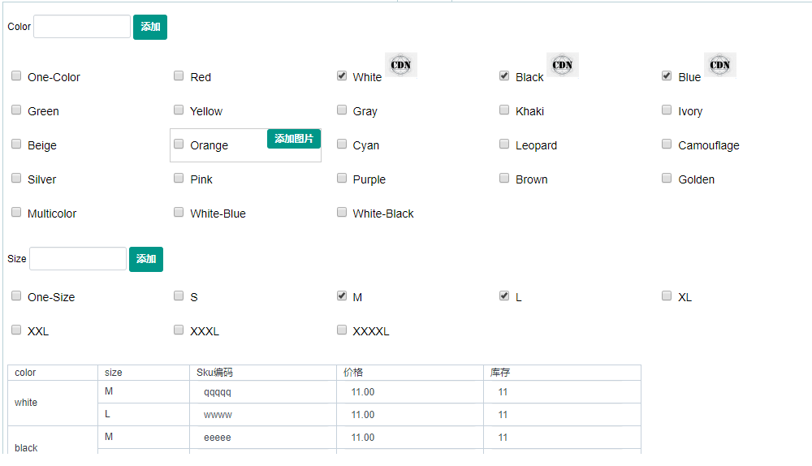
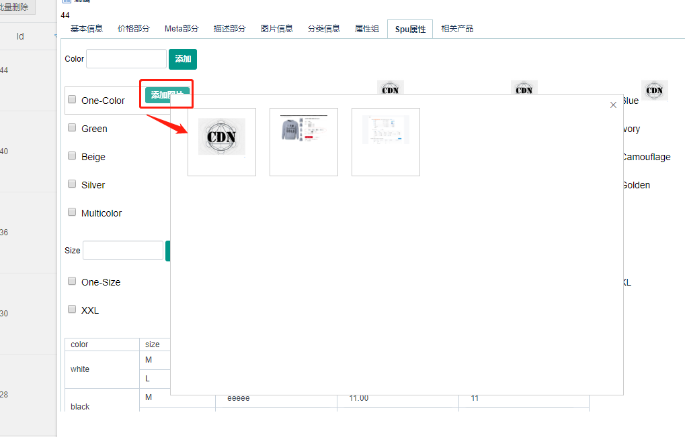
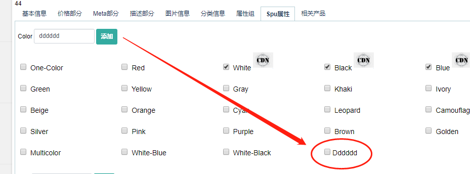
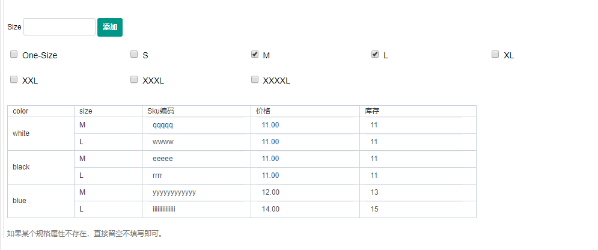
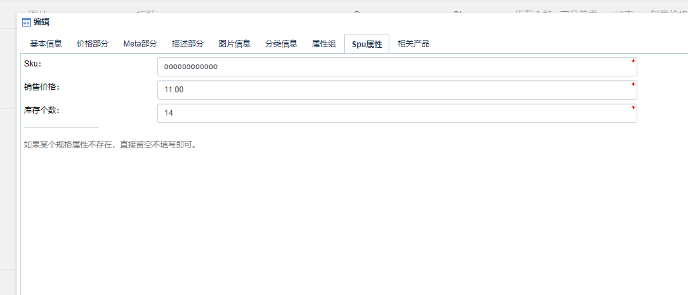

Fecmall扩展-淘宝模式产品扩展
===============

> 国内用户很多习惯于淘宝上传产品方式，fecmall目前的产品上架，
对于没有erp的用户，的确很不方便，特此，开发了一个产品管理工具，
让用户可以方便的上传多规格产品。


### Fecmall 应用市场

应用市场地址：http://addons.fecmall.com/37697256

### 概念

1.什么是规格产品

商品`加入购物车`的时候，需要选择产品的`规格属性`（spu属性），譬如`颜色`,`尺码`等，选择后，再加入购物车，
对于`颜色尺码`这些属性被成为`规格属性`（spu属性），这些产品被成为`规格产品`

规格产品的`spu`相同，但 `sku`，`库存`，`name`，`描述`，`图片`，`价格`等等等其他的属性都可以不同


### Fecmall 目前产品管理方式

作为一个通用商城，需要尽量多的满足各种用户，因此，fecmall的规格产品
的默认后台产品管理，有一下特点：

1.规格产品，除了`spu`相同之外，其他的`任何普通属性`都可以不同，譬如可以产品的name不同，图片不同，描述不同，等等

2.规格产品的`规格属性`不同

3.可以对某个`规格属性`产品进行编辑，其他的规格属性产品不影响。

4.所有的`规格产品`, 在产品管理后台列表都显示出来

这是一种可以基本解决所有用户的方式，但是，每个sku都需要单个填写，比较麻烦，因此fecmall开发了`批量添加`功能，
用户可以一次性将`规格产品`添加上去，编辑的时候单个编辑。

但是，对于某些用户，他们的规格产品，只有`sku`，`图片`，`格属性`，`价格`，`库存`不同，其他的产品属性都相同，
因此，希望对其他的产品属性`一次性处理`，也就是和`淘宝`那样来一次性处理产品的这些相同的产品属性。

因此，`淘宝模式产品管理工具`，很为迫切。


### fecmall淘宝模式产品扩展

fecmall淘宝模式产品特点：

1.对于规格产品里面的各个`规格属性`产品，只有`sku`，`图片`，`规格属性`，`价格`，`库存`不同，其他的都是相同的，`不能单独`编辑

2.对于对规格产品，在管理后台只显示`一行`产品数据，也就是`代表产品`的属性（选出来其中一个产品作为`代表产品`）

3.后台产品管理，点击编辑后，在`Spu属性`栏目中查看`规格属性`

后台产品管理菜单，还是原来的`产品信息管理`菜单，对原来的产品管理功能进行了重写。




3.1您可以在`图片信息`栏目部分添加`产品图片`，然后再`Spu属性栏目中，为显示图片的`spu属性`选择图片





3.2如果`spu属性`编辑的中，如果某个值，在列表中不存在，您可以点击`添加按钮`进行添加`值`





3.3勾选各个`spu属性`，勾选后，就会在底部出来`spu属性`组合的`列表`





如果某个`规格属性`不存在，直接`留空`不填写即可。

添加其他信息，进行`保存`即可。


3.4如果产品不是`规格产品`，那么规格属性显示如下：




3.5产品列表部分的`库存`，显示的是`代表产品`的库存（也就是拿出来其中的一个规格产品显示出来），而不是`规格产品`下面的所有产品之和。

另外对于`产品搜索`，请不要使用`sku搜索`，请使用`spu搜索产品`，搜索出来的产品，点击编辑，在`spu属性`下面查看该sku对应的
`价格`，`库存`

3.5如果添加产品，设置了`特价`，和`批发价`，那么所有的`规格产品`都生效。

3.6保存之后，您会看到，在后台产品管理列表只有`一行属性`，您可以点击，继续对产品进行`编辑`

或者去前端商城查看该产品的数据。

3.7前端商城，对于多规格属性的切换，由url跳转，改成了ajax加载多规格产品的价格和图片等，增强用户体验。


### 初始化历史产品数据


如果您的表里面有历史数据，那么，因为该插件增加了一个字段，作为后台列表代表产品，因此，您需要对历史数据进行初始化


```
cd addons/fecmall/fectbgoods/shell
sh initTbProduct.sh

```

执行完脚本即可


### 补充

> fecmall的默认模板不需要如下处理，只有fectb和fecyo安装该插件需要如下处理

1.fectb处理：

因为html5入口，js切换图片问题不好解决，暂时前端商城产品显示部分，规格属性切换，还是url跳转

更改：您需要到配置文件 @addons/fecmall/fectbgoods/config.php中，将

```
'view'	=> '@fectbgoods/app/appfront/theme/base/front/catalog/product/index/options.php',
```

和 


```
'view'	=> '@fectbgoods/app/apphtml5/theme/base/front/catalog/product/index/options.php',
```

注释掉


2.fecyo中文系统安装该插件需要的处理：

需要到配置文件 @addons/fecmall/fectbgoods/config.php中


```
将
'view'	=> '@fectbgoods/app/appfront/theme/base/front/catalog/product/index/options.php',
改成
'view'	=> '@fectbgoods/app/appfront/theme/base/front/catalog/product/index/options_yo.php',

```


```
将
'view'	=> '@fectbgoods/app/apphtml5/theme/base/front/catalog/product/index/options.php',
改成
'view'	=> '@fectbgoods/app/apphtml5/theme/base/front/catalog/product/index/options_yo.php',

```


### 总结

1.淘宝模式产品管理扩展，并没有改变数据库的表（只添加了一个后台操作的标识字段），因此
，表结构和原来是没有太多分别的，因此后面的加入购物车，订单，产品库存扣除都没有影响的，
可以理解成一个产品上架辅助工具。

2.通过该扩展，您可以方便的上传产品信息。


