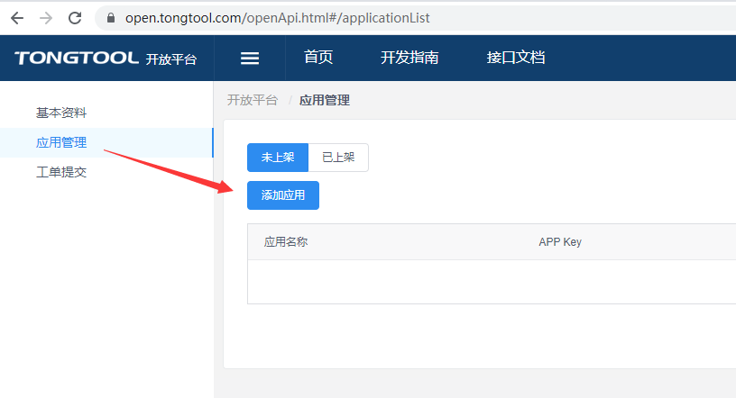
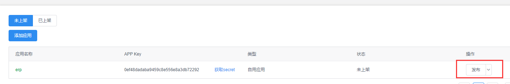

Fecmall 通途ERP获取AppKey和AppSecret
======================

> 如何获取通途ERP获取AppKey和AppSecret

### Fecmall 通途ERP获取AppKey和AppSecret

1.通途官网：http://www.tongtool.com/  注册账户，登陆后如图：

点击`进入开放平台`按钮, 进入开放平台

2.创建erp权限应用

点击  `应用管理` ，刷新后，点击`添加应用`按钮

填写添加应用的内容，注意将您的IP填写到白名单，否则访问api会被拒绝。

权限部分选择erp栏目的全部，保存即可

3.创建listing权限因公：

上面我们吧erp部分的应用就创建好了，下面创建Listing部分的应用，流程和上面类似：

保存后就可以在未发布栏目看到

4.发布应用

在未发布栏目，点击`发布`按钮即可

5.获取erp和Listing的  `appKey`  和 `appSecret`

到这里就完成了，如果还不明白可以去咨询通途客服

