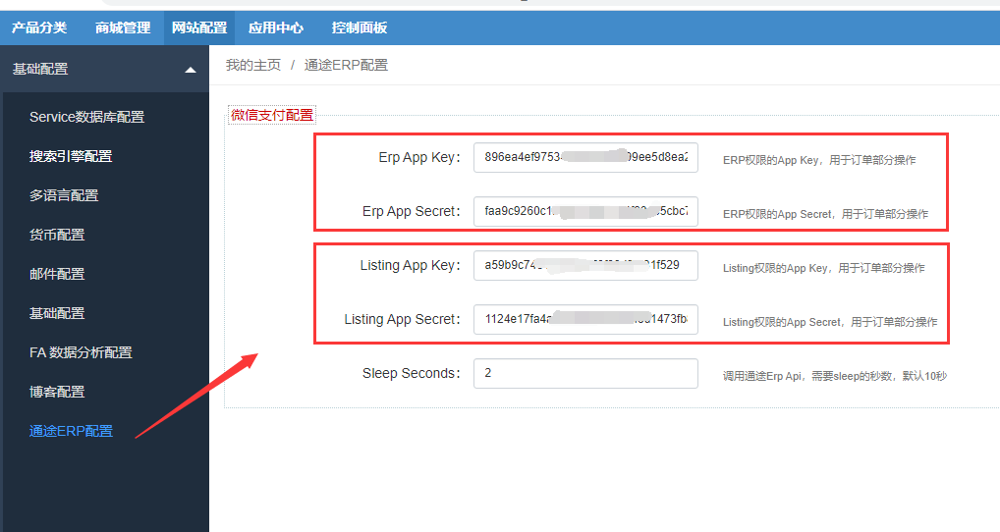

Fecmall 通途ERP插件安装和配置
===============

> `通途ERP`是一个十年老牌的`SAAS ERP`，主要面向`跨境出口`电商，可以进行`产品管理`，`仓储管理`，`订单管理`，`订单发货`管理等等，
fecmall通过api和其进行对接，可以将通途ERP的`产品同步`到Fecmall，将Fecmall`订单同步`给通途ERP，
另外进行产品库存同步更新，订单物流追踪号同步更新等等。

### 

### Fecmall 通途ERP插件 - 安装

您需要先安装fecmall开源系统，然后再进行插件的安装

1.fecmall应用市场地址：http://addons.fecmall.com/89187689

2.如何应用市场`安装`应用，请参看文档：[Fecmall安装应用](https://www.fecmall.com/doc/fecshop-guide/addons/cn-2.0/guide-fecmall-addons-install.html)

3.安装完成后，您需要设置插件的优先级,设置成最高，如何设置插件优先级，
请参看：[Fecmall-应用扩展优先级设置](https://www.fecmall.com/doc/fecshop-guide/addons/cn-2.0/guide-fecmall-addons-score.html)

4.注册`通途ERP账号`，通途官网：http://www.tongtool.com/

您需要获取Erp应用： `AppKey Key` 和 `App Secret`, 如何获取，请参看：[Fecmall 通途ERP获取AppKey和AppSecret](fecmall-addons-tongtool-erp-app-key-secret.md)

5.fecmall后台配置

进入后台，将第4步骤获取的`AppKey Key` 和 `App Secret`填写进去

注意：erp和listing的要对应好，否则操作将没有权限

