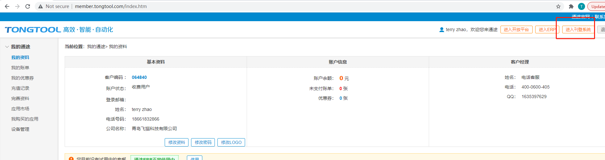
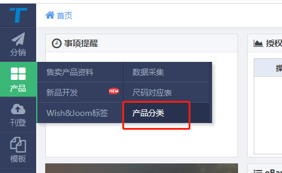
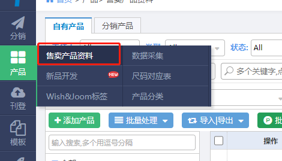
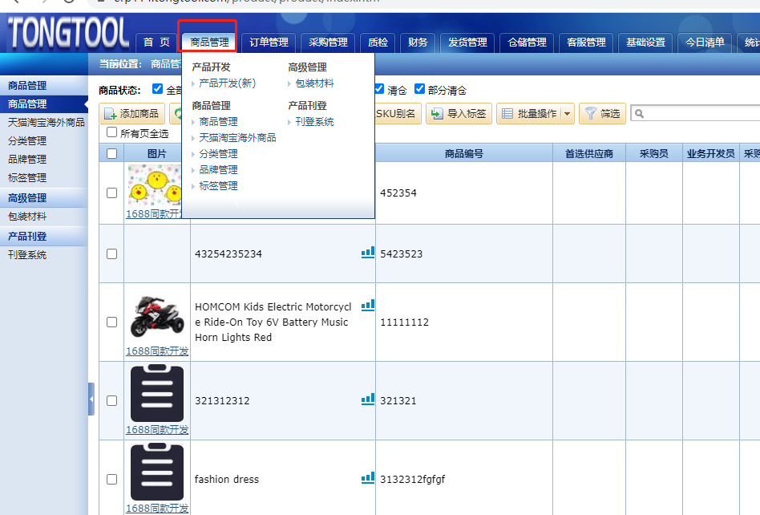
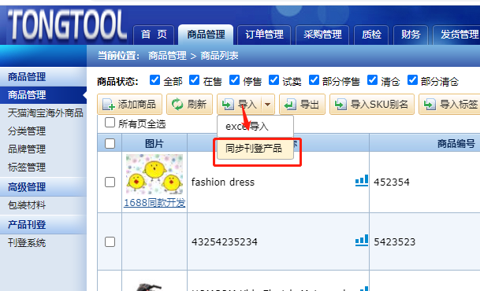
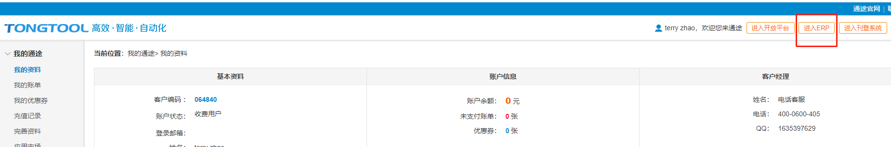
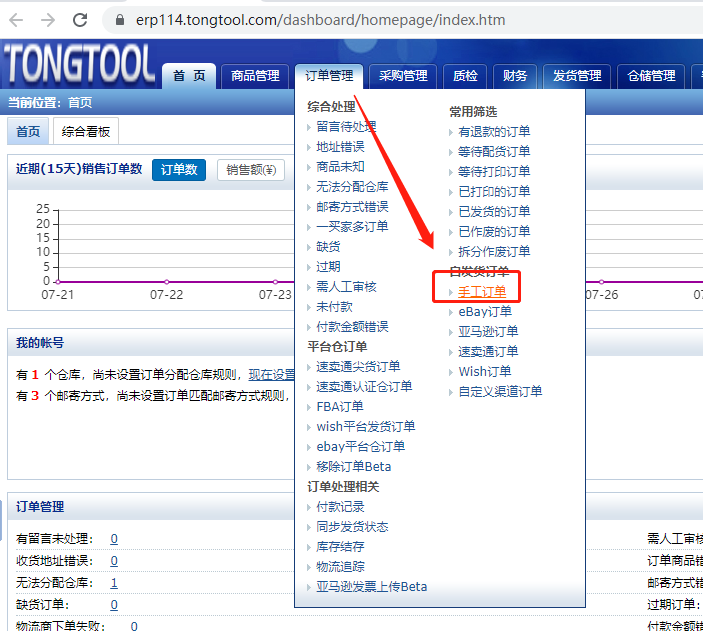
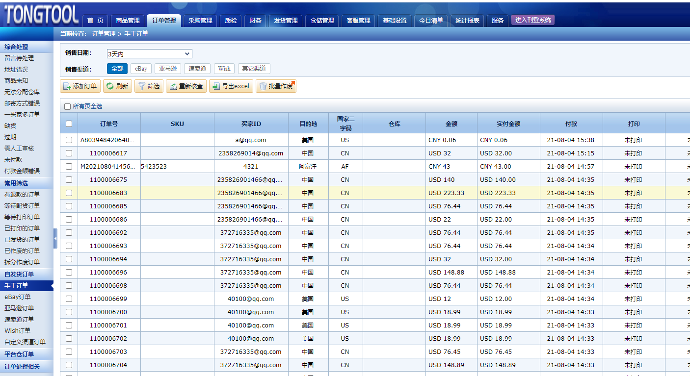
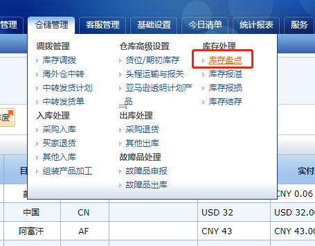
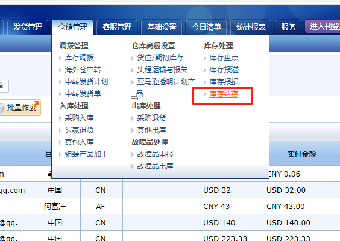

Fecmall 通途ERP操作说明
================

> 您可以在通途erp中添加产品，处理订单中，这里对其进行一定的说明，更多的操作请咨询通途客服。

### 通途ERP操作说明

**1.刊登工具添加产品**

fecmall更新的`产品数据`，是`刊登工具`里面的，因此在更新产品数据前，我们要保证刊登工具里面，我们添加了产品

1.1进入`刊登系统`：

1.2添加`产品分类`

1.3添加`产品`

添加完成产品，即可，至于添加产品的细节问题，请咨询通途客服

**2.将刊登工具的商品，同步到Fecmall**

产品添加完成后，就可以将其同步到`fecmall`独立站，详细参看：  [Fecmall 通途ERP扩展插件使用逻辑](fecmall-addons-tongtool-erp-use.md)
中的`syncProduct.sh`部分

**3.ERP系统产品管理，导入刊登系统中的产品**

进入erp产品管理部分

`导入` ---> `同步刊登产品`

填写条件导入即可。

为什么erp中的商品需要导入？为什么不直接用刊登商品的数据？因为erp的`商品`的作用是用来`订单发货`用的，和`仓储`有关系的，
而刊登工具的商品数据是
用来刊登到`电商平台`的，数据有一定的差异。

**4.查看手工订单**

通过[Fecmall 通途ERP扩展插件使用逻辑](fecmall-addons-tongtool-erp-use.md)
中的`syncOrderAndTracking.sh`脚本可以将fecmall的已支付订单推送到通途erp，我们可以在这里查看同步的订单列表

点击进入erp系统：

点击erp菜单`手工订单`, 进入`手工订单`管理页面

`手工订单`管理页面如下：

**5.添加库存，以及查看库存**

您可以通过`库存盘点`添加产品库存

通过`库存结存`查看商品的库存情况

添加完库存，您可以通过[Fecmall 通途ERP扩展插件使用逻辑](fecmall-addons-tongtool-erp-use.md)
中的`syncStockQty.sh`脚本，将erp的库存更新到商城中

**6.订单发货处理流程**

订单发货后，会得到`物流追踪号`，`物流公司`，`物流公司code`等，
您可以通过[Fecmall 通途ERP扩展插件使用逻辑](fecmall-addons-tongtool-erp-use.md)
中的`syncOrderAndTracking.sh`脚本，将erp的订单物流追踪信息，传递给`fecmall`

