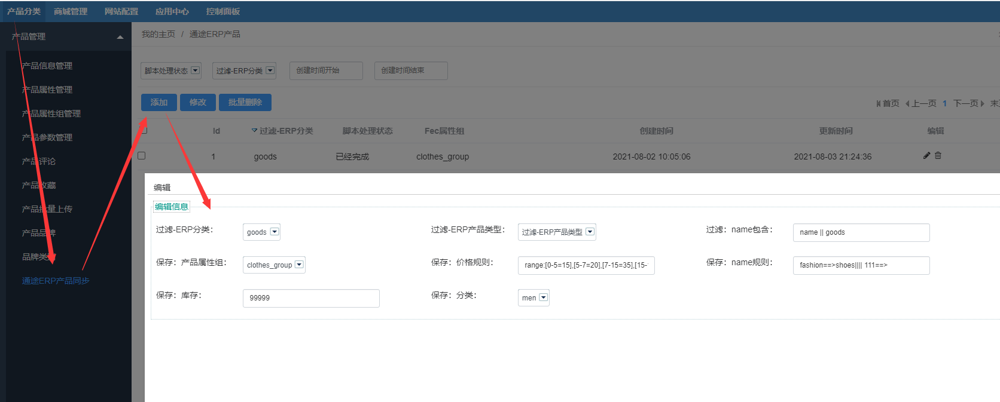
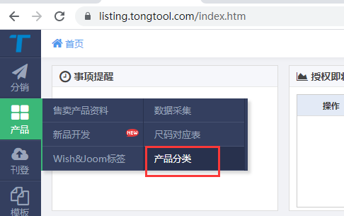

Fecmall 通途ERP扩展使用逻辑
===============

> 当我们配置完成后，就可以使用了

### 同步数据前的工作

您需要到通途刊登工具，进行`添加产品`数据，以及erp中`添加产品`等等，详细的操作参看：[Fecmall 通途ERP操作说明](fecmall-addons-tongtool-erp-op.md)

### 通途ERP扩展使用逻辑 - 脚本

一共有4个脚本，脚本文件的路径为：  ./addons/fecmall/fectongtool/shell/ , 可以发现有3个shell文件

1.`syncProduct.sh`

产品同步脚本，同步产品数据，产品图片文件（保存到fecmall本地）等等，需要注意的是
如果该sku在fecmall中，如果已经`存在`则`不会同步`。

您可以在后台添加产品更新任务，在添加之前，请保证通途刊登工具中有产品数据。

您可以在这里提交产品更新任务，cron就会定期自动执行该任务
，下面说明一下添加任务的各个字段的用法

1.1过滤-ERP分类：通途erp中的分类，您可以在通途erp中进行添加

当您在erp中添加，这里就会显示（为了减少api访问次数，这里加了缓存，如果您添加了分类，您可以后台刷新一下缓存）

您可以选择某个`erp分类`，来过滤erp中同步的商品，如果您同步所有则不需要选择

1.2过滤-ERP产品类型

`单属性`：没有规格属性的产品（没有变种属性，譬如颜色尺码等）

`多属性`：有规格属性的产品（有变种属性，譬如颜色尺码等）

不选择代表所有。

1.3过滤：name包含

产品的`name`包含`xx`的时候进行过滤，注意，这里只对fecmall的`默认语言`对应的产品name进行过滤

您有两种语法格式：

全或：`dress || shoes || goods  `, 分割符号`||`，代表产品name中至少包含其中的一个词，否则不同步数据，

全且: `dress && shoes && goods`, 分割符号`&&`， 代表产品name中必须包含里面的所有词，否则不同步数据，

上面都是对erp刊登产品部分的过滤

1.4保存：产品属性组

产品保存的时候，对应的`属性组`，譬如:服装属性组需要添加`color`, `size` 这样的规格属性，
对于fecmall，现在支持`规格属性选填`，譬如某些服装没有尺码（只有一个尺码），那么size值空，那么该产品仍可以被
保存，产品只有一个color规格属性。

关于fecmall的`属性`和`属性组`，可以参看：[fecmall的属性和属性组](https://www.fecmall.com/doc/fecshop-guide/instructions/cn-2.0/guide-fecmall_product_attr_and_group.html)

1.5保存：价格规则

由于`通途刊登`工具没有fecmall的栏目，因此只能通过成本价，通过公式生成产品售价，有2种格式：

规则格式1：区间格式：`range:[0-5=15],[5-7=20],[7-15=35],[15-100=235]`

代表：当产品的成本价为`0`和`5`之间（0=< X <5）,则售价为`15`。
当产品的成本价为`5`和`7`之间（`5=< X <7`）,则售价为`20`。以此类推

规则格式2：`formula:(cost_price * 2) + 15`

这个比较好理解，公式格式

注意：对于前缀`range:`和 `formula:` 不可去掉，否则无效。

1.6保存：name规则

名字处理，所有语言都进行处理

格式：`dress==>shoes||||111 ==>`

含义：`||||`为分隔符，将`name`中出现的`dress`替换成`shoes`，将`name`中出现的`111`替换成`空`，

1.7保存：库存

初始化库存，对于同步过来的商品，设置一个库存的初始值，填写整数即可

1.8保存：分类

Fecmall的分类，保存的产品自动添加到这个分类下面

2.`syncStockQty.sh`

同步通途erp的库存到fecmall产品库存

3.`syncOrderAndTracking.sh`

3.1`同步订单`，将fecmall的已支付订单同步到通途erp的手工订单里面

3.2同步`订单物流追踪号`，通途erp订单发货后，将`物流追踪号`，`物流公司名称`，`物流公司简码`传递给fecmall，保存到fecmall的订单数据中

### 脚本CRON设置

您可以设置cron，让各个脚本`自动定期`执行

如何设置，可以参看文档：[Fecmall CRON](https://www.fecmall.com/doc/fecshop-guide/instructions/cn-2.0/guide-fecmall_cron_script.html)

