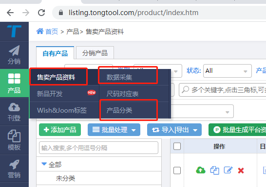
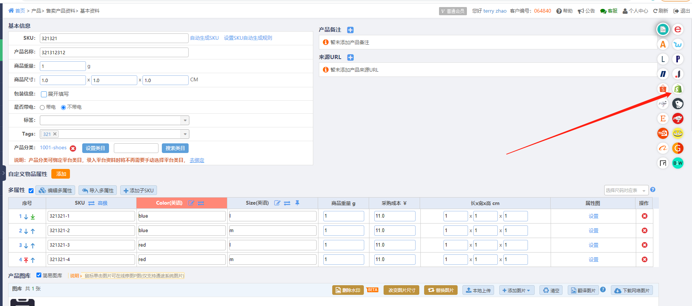
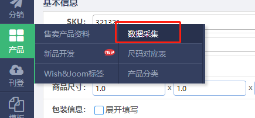
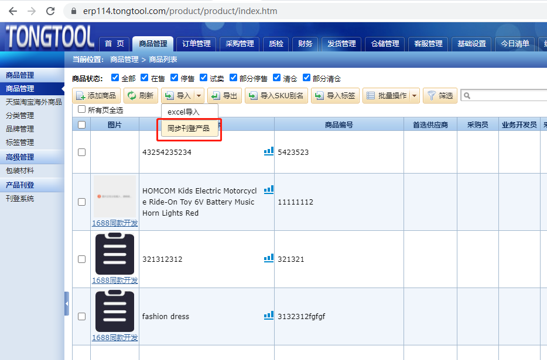

Fecmall对接 通途erp，逻辑流程需求整理
===================

> `通途erp`是一款老牌的`saas erp`

### 一：关于Api的对接

`通途erp`的api：https://open.tongtool.com/apiDoc.html#/?docId=d9e04946d6f74a2d894f6c2a05841852

`通途erp`和`通途刊登`系统是分开的

fecmall对接如下数据：

1.`通途刊登`系统的售卖产品资料，fecmall通过提供的api，拖取api的产品数据，写入到fecmall中。

相关api：

1.1查询售卖产品Id列表：
https://open.tongtool.com/apiDoc.html#/?docId=e98a5597822e406e9786f2db9209b2b3

1.2根据产品Id或sku查询售卖产品详情
https://open.tongtool.com/apiDoc.html#/?docId=6c5fda690c854f09bc00d8c0542bfb67

1.3获取产品类目：
https://open.tongtool.com/apiDoc.html#/?docId=11a5118bb70642f198a7acca0c0b56a2

2.产品库存同步

2.1查询库存：https://open.tongtool.com/apiDoc.html#/?docId=9aaf6b145a014060b3b3f669b0487096

2.2库存变动api：https://open.tongtool.com/apiDoc.html#/?docId=bd0971f61f2449eaa9752c7be779afa0

3.fecmall订单推送到通途erp

添加手工订单： https://open.tongtool.com/apiDoc.html#/?docId=908e49d8bf62487aa870335ef6951567

4.fecmall调用通途erp api，获取订单的物流单号

根据订单查询物流单号： https://open.tongtool.com/apiDoc.html#/?docId=3b3cceec8fe04e6db44da17ec4b38f08

### 二：关于操作逻辑

1.刊登商品添加商品

进入通途刊登系统，产品管理菜单

1.1`售卖产品资料`在这里可以添加商品

填写完成基本资料，您可以点击shopify图标，填写售卖价格信息，以及规格信息等，进行保存

1.2可以点击数据采集，从aliexpress等采集商品

1.3产品分类添加

通过上面的步骤，就将`售卖产品资料`添加完成,添加完成后，就可以`查询售卖产品api`进行查询，搭配如fecmall了

2.erp中商品管理

需要注意的是，通途erp的商品管理，和产品刊登部分是分开的，因此您需要在erp部分添加商品

当然，你可以通过导入工具，将刊登产品同步到erp商品管理中

3.设置商品的库存

设置完商品的库存，就可以通过库存api，将商品的可用库存同步到fecmall的商品管理了

因此，将通途erp的产品数据同步到fecmall，需要先同步分类，然后同步产品，最后同步库存数据

4.fecmall订单推送

fecmall通过api进行订单推送，推送完成后，即可在通途erp中进行处理

5.通途erp订单物流追踪号查询

fecmall通过api查询，将结果保存到erp中

