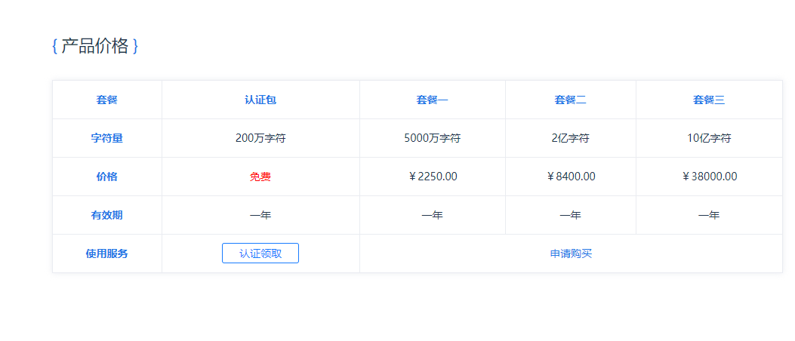
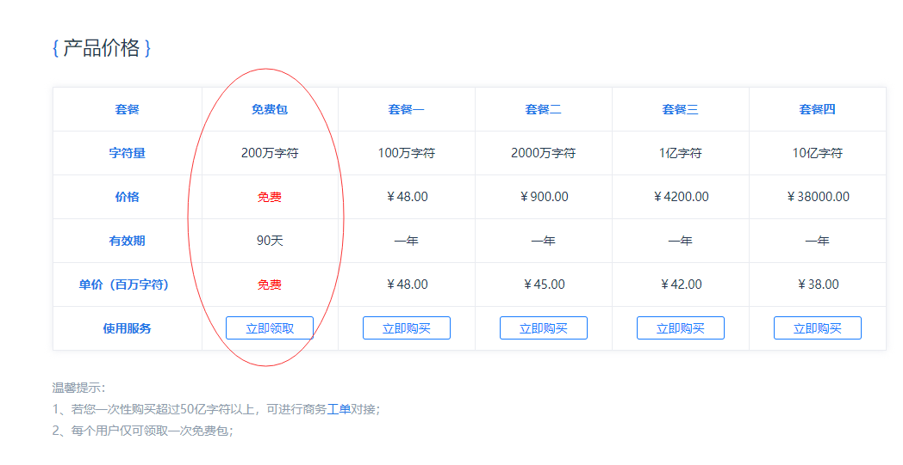
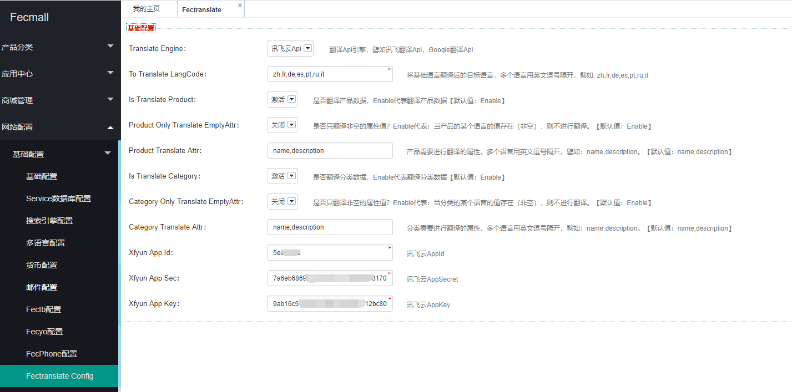
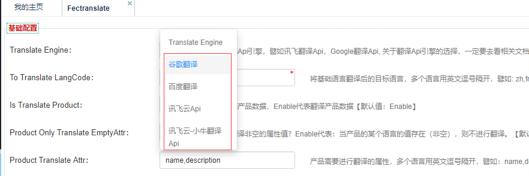

Fecmall扩展-分类产品多语言自动翻译扩展
================


> 通过api引擎，进行多语言自动翻译，对于网站建设初期，您可以只进行基础语言的编辑，其他的多语言通过多语言翻译api进行自动化数据翻译，
节省人力。


### 扩展介绍


对于项目初期，编辑人力有限，对于多语言商城而言，多个语种的翻译非常麻烦，可以使用本扩展，
使用翻译Api引擎，进行自动化翻译成多种语言。


1.支持翻译Fecmall产品数据，分类数据

2.目前实现了的`讯飞翻译`，`google翻译`，`百度翻译`，如果您需要使用其他的翻译引擎，可以根据需要二次开发，架构上可以非常方便的添加其他的任意翻译api引擎。

3.翻译的执行是通过后台的脚本，脚本通过shell进行循环控制，因此不会存在超时的问题。

4.google翻译需要国外信用卡才能申请key，因此还是有一定的门槛。

### 扩展安装

应用市场地址：http://addons.fecmall.com/23681738

应用市场安装扩展文档：[Fecmall 应用市场安装应用扩展](http://www.fecmall.com/doc/fecshop-guide/addons/cn-2.0/guide-fecmall-addons-install.html)


### 科大讯飞配置


> 讯飞的翻译，如果**翻译内容中有html标签，会把标签搞乱！！！因此不适合翻译产品描述，但是这是开发完成后才发现的**，就先这样吧，如果他们翻译api升级
在说把，建议不要使用讯飞翻译

1.科大讯飞注册账户，申请`AppId`，`AppSec`, `AppKey`


1.1科大讯飞-机器翻译

> 基于讯飞自主研发的机器翻译引擎，提供更优质的翻译接口。其中`中英`互译能力媲美大学英语六级水平，目前已逐步支持`英日韩法西俄`等多语种与中文的高品质互译。


**注1**：该翻译器，只能进行`中文`和`其他的语言`的互译，但是其他语言之间不能互译，譬如将`英文`翻译成`法文`,将会报错，其他语言的翻译需要使用`科大讯飞-机器翻译 niutrans`

**注2**：如果您想进行中文和其他语言的互译（基础语言是中文），那么建议使用该翻译引擎，科大讯飞的中外互译效果更好一些， 目前仅支持`英日韩法西俄`

访问网址：https://www.xfyun.cn/services/xftrans ，点击`免费试用`，然后在下图位置处，立即领取·免费包·



进行下单即可，中间存在注册账户，注册账户即可

1.2服务管理

访问：https://www.xfyun.cn/services/xftrans  ， 点击服务管理

在右侧获取可以看到申请`AppId`，`AppSec`, `AppKey`


2.科大讯飞-机器翻译 niutrans：

> 机器翻译2.0全新上线，基于小牛翻译自主研发的多语种机器翻译引擎，已经支持包括英、日、韩、法、西、俄等100多种语言

**注**：该翻译器，看介绍，不是科大讯飞的，是小牛翻译器，科大讯飞进行了集成。

2.1访问该网址：https://www.xfyun.cn/services/niutrans ，点击`免费试用`，然后在下图位置处，立即领取免费包



进行下单即可。


`科大讯飞-机器翻译` 和 `科大讯飞-机器翻译 niutrans`的`AppId`，`AppSec`, `AppKey`都是完全一致的。


### Google Translate配置

申请key的地址：https://cloud.google.com/translate/docs/basic/setup-basic

Google Translate Api的申请，需要绑定国外的信用卡（地址中没有中国选项），因此，使用需要一定的门槛。


### Baidu 翻译


百度翻译Api：https://api.fanyi.baidu.com/

通用翻译API接入文档： https://api.fanyi.baidu.com/product/113


审核个开发者认证要2天时间，也真是吐了。


### 后台配置


1.进行fecmall后台，填写配置即可




2.对于各个选项的参数，后台的参数后面都有说明，这里不做说明


### console执行翻译脚本


1.使用`科大讯飞-机器翻译`  **2020-03-17测试，不能翻译Html，不建议使用**

> 上面已经标注，这里进行重复说明，只能进行`中文`和`其他的语言`的互译，但是其他语言之间不能互译，譬如将`英文`翻译成`法文`,将会报错
，目前，基于讯飞自主研发的机器翻译引擎，提供更优质的翻译接口。其中`中英`互译能力媲美大学英语六级水平，目前已逐步支持`英日韩法西俄`等多语种与中文的高品质互译。


因此，在使用该翻译api引擎，只有下面两种情况支持

1.1基础语言是`cn`，进行翻译的目标语言，目标语言必须是`英日韩法西俄`。

1.2基础语言是`英日韩法西俄`中的一种 ，目标语言是`cn`。


此翻译的优势是，翻译优质，尤其是`中英`,劣势是支持的语言有限。


2.使用科大讯飞-机器翻译 niutrans  **2020-03-17测试，不能翻译Html，不建议使用**

> 机器翻译2.0全新上线，基于小牛翻译自主研发的多语种机器翻译引擎，已经支持包括英、日、韩、法、西、俄等100多种语言
，该翻译器，看介绍，不是科大讯飞的，是小牛翻译器，科大讯飞进行了集成。


优势：基础语言和目标语言没有限制，支持100多种语言。


基础上满足您的需要，可以将任意语言进行翻译，多语言支持度堪比`google translate`，但是翻译结果没有对比，
您可以将英文翻译成其他的任意语言，或者将中文翻译成其他的任意语言。

3.使用google翻译Api引擎

google翻译api应该是最好用的，但是，申请有点麻烦, 需要绑定国外信用卡才行。

Api使用的是`https://translate.googleapis.com/language/translate/v2`, 而不是  `https://www.googleapis.com/language/translate/v2`
，因此国内不翻墙也可以进行翻译.


4.百度翻译Api

5.执行脚本

> 在执行脚本前，您需要在后台配置部分，选择相应的翻译Api引擎，以及其他的选项，然后再执行脚本



对于各个选项的参数，后台的参数后面都有说明，这里不做说明

**在执行翻译脚本之前，一定要先备份数据，以免造成损失！！！**

**在执行翻译脚本之前，一定要先备份数据，以免造成损失！！！**

**在执行翻译脚本之前，一定要先备份数据，以免造成损失！！！**

3.1脚本执行命令行

```
cd ./addons/fecmall/fectranslate/shell
sh translate.sh
```

产品的翻译是通过shell进行的循环控制，因此不会存在超时的问题。


3.2如果您的产品比较多，可以通过nohup 执行，这样即使关掉shell窗口，执行也不会终止。

```
nohup sh translate.sh
```

另起一个shell窗口查看执行的log

```
tail -f nohup.out

```


###  二开扩展，让其支持更多的翻译引擎


1.@fectranslate/services/Translate.php

```
public function getEngineList()
    {
        return [
            'Google'  =>  '谷歌翻译',
            'Baidu'  =>  '百度翻译',
            'Xfyun'  =>  '讯飞云Api',
            'Xfyunniutrans'  =>  '讯飞云-小牛翻译Api',
        ];
        
    }
```

在该函数的返回数组中添加其他的翻译器，譬如添加  'Youdao'  =>  '有道翻译',


2.在文件夹`@fectranslate/services/`下，新建相应的services ，以`有道翻译为例子`，添加文件


@fectranslate/services/Youdao.php


```
<?php
namespace fectranslate\services\translate;

use fecshop\services\Service;
use Yii;

class Baidu extends Service
{

    /** 
     * @param $string | string, 需要翻译的文字
     * @param $fromLangCode | string, 需要进行翻译的文字语言 
     * @param $toLangCode | string, 翻译后的语言 
     */
    public function translateString($text, $fromLangCode, $toLangCode)
    {
        // 这里实现有道翻译的api逻辑即可
    }
    
}


```


