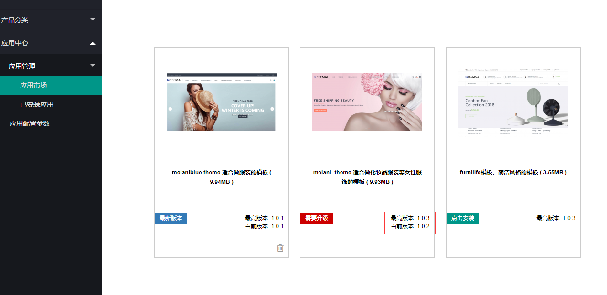
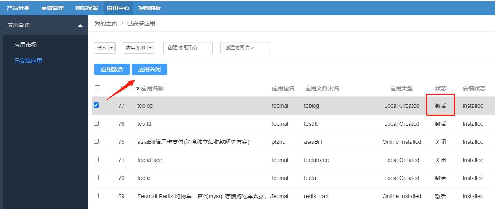
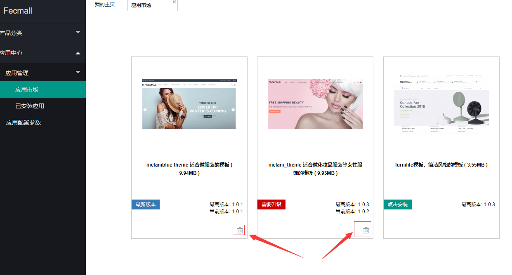

Fecmall-升级卸载应用
============

> Fecmall 已安装应用，当应用升级后，您可以在fecmall进行应用的升级。

### Fecmall 应用升级

升级注意：

1.Fecmall升级前，你一定要`备份数据库`和`fecmall文件`, 出现问题，可以进行还原

当开发者的应用的版本有了变动，那么用户在
后台应用市场可以看到，有一个`需要升级`的显示，
您可以点击这个按钮，进行升级

操作完成后，如果显示`最新版本`, 

### Fecmall应用关闭

对于某些已经安装的应用，如果暂时使用不到，您可以在fecmall的后台进行关闭

应用关闭后，fecmall初始化的时候，插件的配置将不会被加载，插件也会因此失效。

### Fecmall 应用卸载

注意：

1.对于您不使用的应用扩展，建议您直接将应用关闭即可，尽量不要卸载，因为应用卸载只是卸载插件文件，而插件安装
的sql，为了安全并没有进行删除，需要您手动卸载sql（对于fecmall的插件机制，是支持卸载sql的，但是为了安全，并没有实现
里面的函数内容，需要您手动删除）

2.当应用不需要的时候，或者插件冲突的时候，您需要进行卸载，那么卸载应用前，一定要备份数据库和fecmall文件，出现问题可以还原

一：卸载fecmall应用文件

二：卸载fecmall的sql部分

由于fecmall的插件的卸载机制，为了安全, 并没有进行数据库的`卸载`（只做了文件的卸载），
因此，对于您不使用的插件扩展，直接在fecmall后台关闭即可，如果您一定要卸载，
那么sql部分您需要手动卸载sql

1.`手动卸载安装部分的sql`，从`./addons`进入到相应的插件目录，打开`administer/Install.php`，查看执行的`sql`，然后手动删除sql。

2.`手动卸载升级部分的sql`，从`./addons`进入到相应的插件目录，打开`administer/Upgrade.php`，查看执行的`sql`，然后手动删除sql。

三：插件A卸载后，又重新安装插件A

1.如果您在安装插件A之前，已经进行了备份，那么可以使用`备份还原`，
然后`重新安装`应用插件，推荐该方式，在安装扩展之前一定要先备份sql，发生问题通过sql还原。

2.通过上面的步骤一和步骤二，卸载插件A的文件和sql部分，然后重装。

3.如果是`新安装`的fecmall，您又没有备份，那么可以`重新安装fecmall`，备份一下sql，然后再进行安装应用。

4.如果您卸载了插件A，然后发现卸载的sql太多了，太麻烦，想全部重装，然后将原来的产品和分类导入到新安装的fecnall里面，您可以参考一下：http://www.fecmall.com/topic/4823

