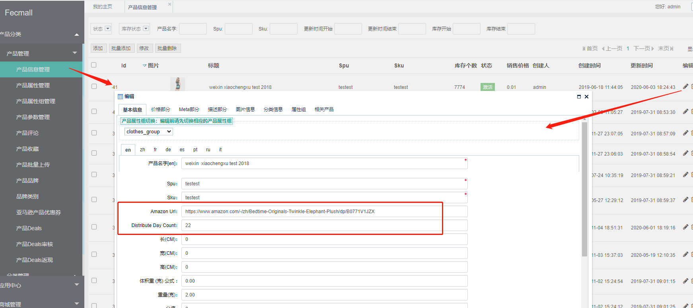
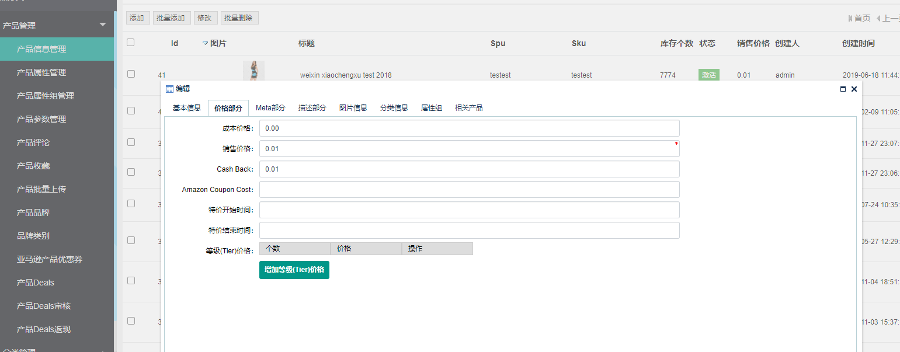
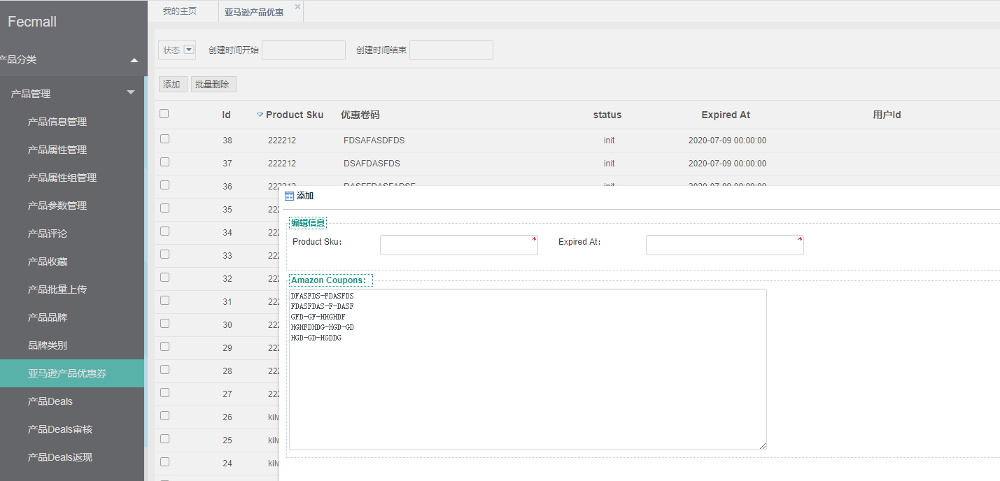
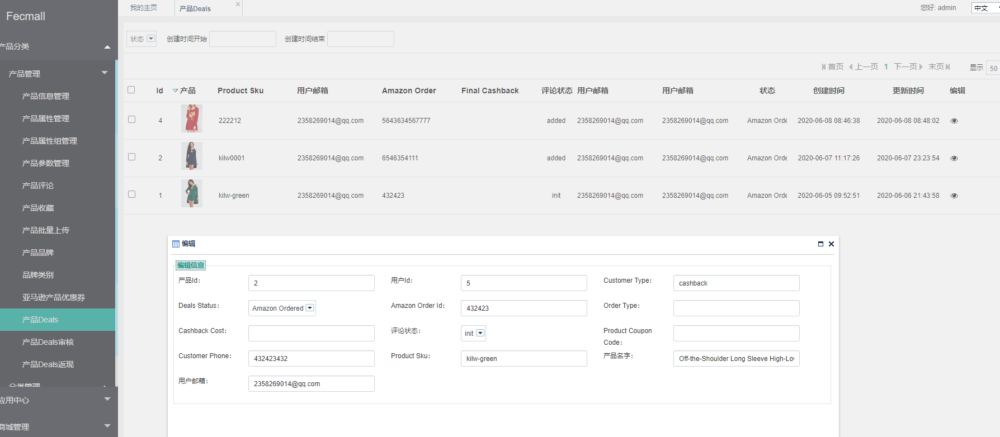
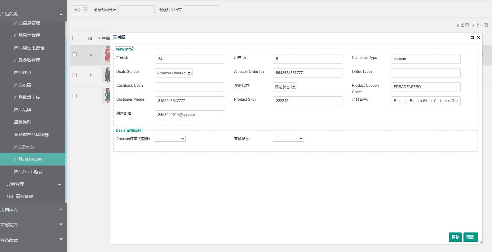
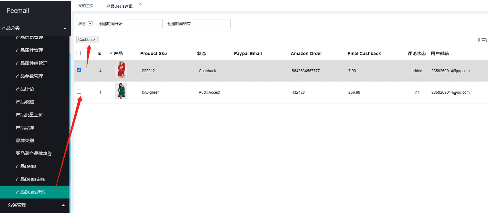
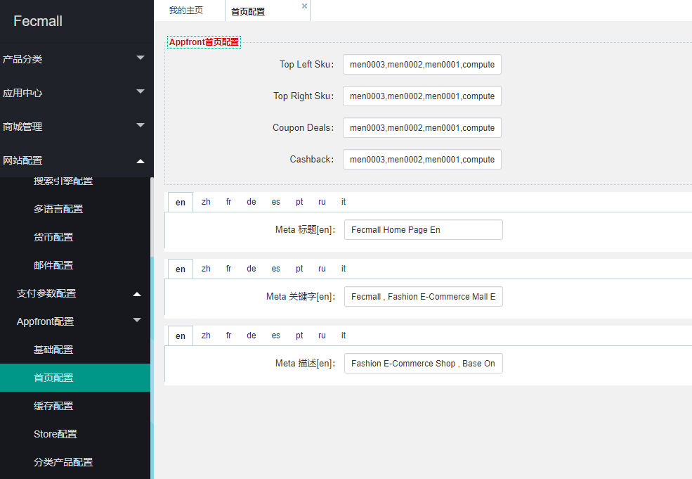
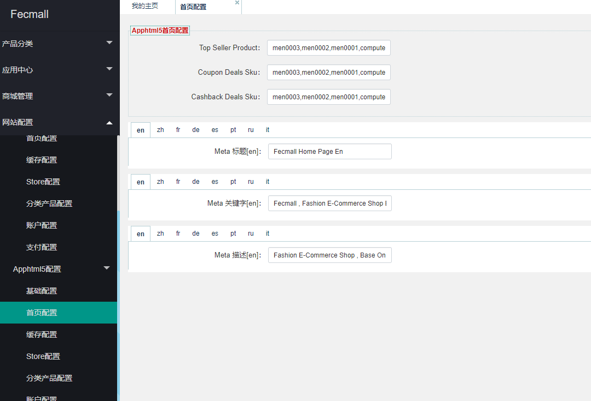

Cashback - Amazon导购返现独立站
=========================

> 参考：cashbackbase.com ， 通过导购站 将用户引流到amazon，用户购买产品后，进行返现给用户的独立站，
通过此种方式，提高产品订单量，进而刺激amazon的排名

### 安装

1.账户和该扩展绑定后，可以直接在后台应用中心在线安装

在安装前，一定要备份数据库文件，详细参看：http://www.fecmall.com/doc/fecshop-guide/addons/cn-2.0/guide-fecmall-addons-install.html

安装完成后刷新一下`cache`，在`后台菜单` `控制面板`里面可以找到`缓存管理`

2.配置模板路径

后台菜单：

2.1`网站配置` --> `appfront配置` --> `Store配置`，点击编辑（当前激活的store），在弹框中找到`第三方模板路径`，填写值：`@fecamazon/app/appfront/theme`

2.1`网站配置` --> `apphtml5配置` --> `Store配置`，点击编辑（当前激活的store），在弹框中找到`第三方模板路径`，填写值：`@fecamazon/app/apphtml5/theme`

### 使用

1.产品上传

`Amazon Url`：就是该产品对应的跳转到amazon的url

`Distribute Day Count`：该产品，用户每天领取deals的最大数，超过这个数将不能领取（针对商城cashback下面的产品），
如果某个产品不想发放delas了，可以设置该值为0

`销售价格`：产品的原价

`Cash back`：产品的返现金额（当产品作为cashback产品的时候）

`Amazon Coupon Cost`：产品优惠券金额，当产品填写了该值，代表产品可以作为优惠券产品

注：

1.1在前端商城可以看到两个菜单` cashback`   和  `coupo`n两种方式

`cashback`：用户在amazon购买后，将amazon订单号填写到商城中，进行返现的金额（金额就是`Cash back`的值）

`coupon`：用户在amazon购买时，使用该优惠券，然后将amazon订单号填写到商城中，进行返现，返现的金额 = `Cash back` - `Amazon Coupon Cost`

1.2如果产品填写了`Amazon Coupon Cost`，那么该产品会出现在两个菜单 `cashback`   和 ` coupon`中，表示用户既可以以优惠券的方式返现，也可以
以`cashback`的方式返现。

1.3对于产品的其他字段，是商城的基本字段，这里不做详细表述

2.为优惠券类型的产品添加优惠券

当产品的`Amazon Coupon Cost`设置了金额后，譬如10元，那么，您需要到amazon生成一堆10元的优惠券，然后将其复制到独立站里面，
提交保存，如图：

`Product Sku`: 产品sku

`Expired At`：优惠券的过期时间，这个得和amazon的优惠券一致，以免发生独立站领取了优惠券，但是amazon不可用的情况

`Amazon Coupons`: 亚马逊的优惠券列表，如上图，多个优惠券用`回车符号`隔开

保存提交即可。

当优惠券领取完成，或者过期，用户将无法领取优惠券。

3.产品deals

后台查看deals列表

4.deals审核

当用户在amazon下单后，然后再账户中心填写了amazon的订单号，那么就会出现在此列表中

管理员去amazon查看订单信息，订单是否存在，是否使用了优惠券，然后在`Deals 审核信息`处勾选审核选项进行保存

5.deals返现 

deals审核通过后，将会出现在返现列表，线下paypal打款后，这里进行操作标记成已返现即可

### 商城部分

1.pc入口的首页的产品，在后台配置，配置sku列表即可（英文逗号隔开）

2.h5入口首页的产品，在后台配置，配置sku列表即可（英文逗号隔开）

