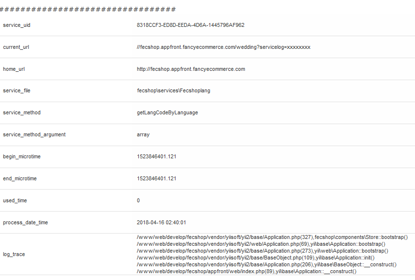
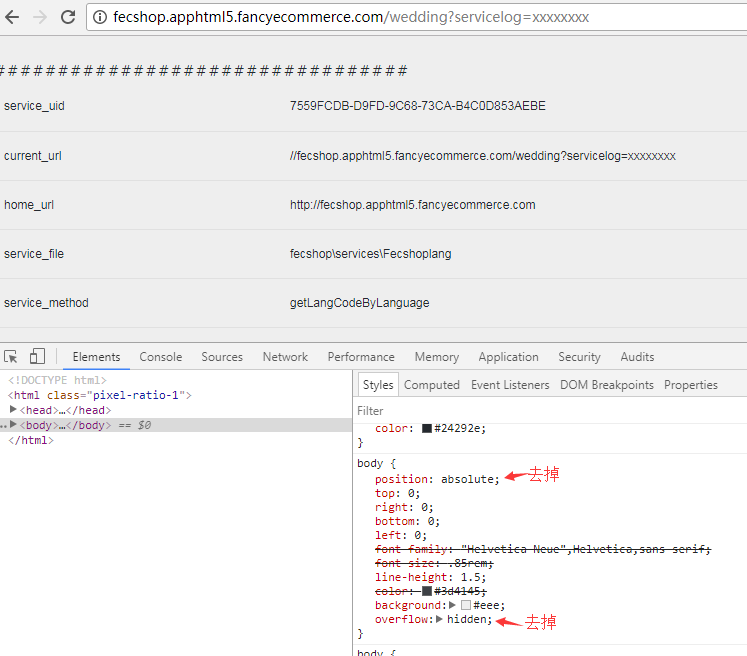

Fecshop Service Log
==================


> Fecshop service log, 是指专门记录service执行过程的log日志
, 做这个功能是为了更好的打印各个service的执行的日志，方便
二开程序员调试和追踪问题。


### 原理

在service中，可以看到一些`protected`的方法，函数名以`action`开头

譬如 @fecshop/services/Url.php文件中，`protected function actionGetCurrentUrlNoParam()`
,该service是可以通过方法  `Yii::$service->url->getCurrentUrlNoParam()` 访问。

原理为：当访问 `getCurrentUrlNoParam` 时，由于找不到该函数，就会执行
`@fecshop\services\Service->__call()`魔术方法，然后由魔术方法，
将 `getCurrentUrlNoParam` 改成  `actionGetCurrentUrlNoParam`，然后去查找函数，就会找到
，这样做的好处是，可以在`__call()`函数中记录每一个service的方法调用开始时间
和结束时间，这样就可以更好的调试出来哪一个service方法耗费的时间长，
这个是为了更好地统计各个services的状况，譬如：排查耗费时间最长的services，
使用最频繁的services等，
当然会耗费一定的时间，
在线上可以关掉log记录时间的功能，也可以间断性的手动开启，进行线上调试。

下面查看一下具体的实现原理，打开：`@fecshop\services\Service.php`

```
/**
     * 通过call函数，去调用actionXxxx方法。
     */
    public function __call($originMethod, $arguments)
    {
        if (isset($this->_callFuncLog[$originMethod])) {
            $method = $this->_callFuncLog[$originMethod];
        } else {
            $method = 'action'.ucfirst($originMethod);
            $this->_callFuncLog[$originMethod] = $method;
        }
        if (method_exists($this, $method)) {
            $this->beginCall($originMethod, $arguments);
            $return = call_user_func_array([$this, $method], $arguments);
            $this->endCall($originMethod, $arguments);

            return $return;
        } else {
            throw new InvalidCallException('fecshop service method is not exit.  '.get_class($this)."::$method");
        }
    }
```

通过这个方法，你就会明白实现的原理，也就是通过 `__call` 魔术方法

Service Log ，**只能追踪** `action开头`的service方法！！！,仔细查看上面的代码，
您就应该明白原理。

对于Fecshop，有一些方法是`action开头`的，有一些方法`不是action开头`的,
做这个功能，更好的是为了二开调试，譬如那个程序员做的service耗时检测等，
因此，fecshop的有很大一部分的services并没有使用`action开头`。

### Service Log 使用

默认情况下，Service Log 是**关闭**的。

@fecshop/config/components/ServiceLog.php 可以看到

```
return [
    'serviceLog' => [
        'class' => 'fecshop\components\ServiceLog',
        'log_config' => [
            // service log config
            'services' => [
                // if enable is false , all services will be close
                // 总开关，开启或关闭Service Log，如果关闭了总开关，那么下面的开关开启都无效
                'enable' => false,
                // print log info to db.
                // 将Service Log写入db的开关，开启后将会写入到 mongodb数据库的表 `fecshop_service_log ` , 前提：需要总开关开启
                'dbprint'        => false,
                // print log info to front html
                // 直接在页面显示Service Log 的开关。前提：需要总开关开启
                'htmlprint'    => false,
                // print log
                // 直接在页面显示Service Log 的开关。前提：需要总开关开启
                // 
                'htmlprintbyparam'  => [
                    // like :http://fecshop.appfront.fancyecommerce.com?servicelog=xxxxxxxx
                    // 当这里开启后，如果访问http://fecshop.appfront.fancyecommerce.com 是看不到service log信息的，
                    // 只有访问 http://fecshop.appfront.fancyecommerce.com?servicelog=xxxxxxxx ， 才能看到
                    'enable'        => false,
                    'paramKey'        => 'servicelog',
                    'paramVal'            => 'xxxxxxxx',
                ],
            ],
        ],
    ],
];
```

1.修改配置：

对于上面的配置文件里面的参数，您是不能直接在vendor下面修改配置的，
您可以通过重写的方式开启和关闭

您可以在 @app/config/fecshop_local.php （@app 是泛称，指的是@appfront，@apphtml5）

```
// 在return数组中添加配置覆盖：
return [
    'modules'  => $modules,
    'services' => $services,
    'components' => [
        'serviceLog' => [
            'log_config' => [
                'services' => [
                    'enable' => false,
                    'dbprint'        => false,
                    'htmlprint'    => false,
                    'htmlprintbyparam'  => [
                        'enable'        => false,
                        'paramKey'        => 'servicelog',
                        'paramVal'            => 'xxxxxxxx',
                    ],
                ],
            ],
        ],
    ],
];
```
2.参数说明： services里面的参数

`enable`: 总开关

service log 有三种显示方式：

`dbprint`: 【1】这是将service log 写入到mongodb中的方式，开启后将会写入到
mongodb数据库的表`fecshop_service_log `，建议线上不要开启，因为写入
的数据行还是很频繁的。一个页面访问，要插入几百条数据。


`htmlprint`: 【2】直接在访问的页面中打印出来，这种方式只能针对appfront 和apphtml5
入口，其他的入口不能使用，只能使用`dbprint`的方式


`htmlprintbyparam`: 【3】和 `htmlprint`类似，都是在访问的页面中直接查看，
只能针对appfront 和apphtml5，不同的是，`htmlprintbyparam`必须指定参数后才能打印，
譬如，根据上面的默认配置，访问这个页面，在后面加上 servicelog=xxxxxxxx的尾巴，
http://fecshop.appfront.fancyecommerce.com?servicelog=xxxxxxxx
，才会在页面中显示Service Log,
这个页面的好处是，可以在线上开启，加上参数访问才可以查看service log，直接在页面中打印输出
而不影响线上终端用户（终端用户没有加参数，因此不会输出log）


对于 `htmlprint` 和 `htmlprintbyparam` 显示的效果如下：




对于apphtml5，由于html的原因，导致没有下拉条，
可以的`查看元素`后，动态修改一下css样式



然后就出来下拉条了, 查看全部的service log（这个只是一个样式的动态修改，在浏览器的调试工具，譬如firefox的firebug工具）


！！切记，除特殊情况，线上一定不要打开，这个还是非常耗资源的。


