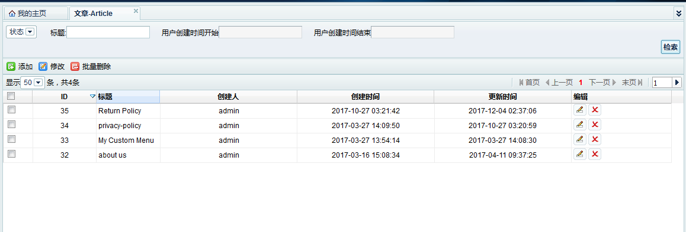

Fecshop Admin Block Index
==========================

> 该部分是对appadmin  block index 部分的说明，也就是后台table 列表部分，
> 如果快速的做一个带有搜索，分页，排序的list列表

### TableFieldArr 列表部分




这个部分是用来画出来table部分，对应到方法：`getTableFieldArr()` , 
打开 `@fecshop\app\appadmin\modules\Cms\block\article\Index.php`,
你会发现这个函数，我们通过配置这个函数里面的数组，可以快速的做一个列表
，譬如：

```
    public function getTableFieldArr()
    {
        $table_th_bar = [
            [
                'orderField'    => $this->_primaryKey,
                'label'            => 'ID',
                'width'            => '50',
                'align'        => 'center',

            ],
            [
                'orderField'    => 'title',
                'label'            => '标题',
                'width'            => '50',
                'align'        => 'left',
                'lang'            => true,
            ],
        ...
        ]
        
    }
```

原理是 `fecshop\app\appadmin\modules\AppadminbaseBlock.php` 中的
`public function getTableTbodyHtml($data)` 方法，将上面函数返回的配置数组进行处理成html，
您可以细看一下这个函数的内容了解原理，下面是关于 `getTableFieldArr()` 函数中数组配置的规则：


`orderField`: 【必填】对应数据库表的字段，譬如上面的 `title`，对应数据库表的`titile`的字段

`label`: 【必填】在列表中，列的名字

`width`: 【必填】在列表中，列的宽度

`align`: 【必填】在列表中，在列中，内容的显示位置， `left`:左对齐，`right`：右对齐，`center`：中间对齐

`lang`:  【选填】是否是多语言属性，因为多语言属性的值的json格式（多维数组），列中的属性如果是多语言属性，
设置该值为`true`，显示的默认语言对应的值

`convert`: 【选填】数据的转换，目前有这么几种转换

```
// 三选一，将mongo的时间格式进行转换，`date："Y-m-d"` ，`datetime："Y-m-d H:i:s"`, `int：时间戳`
mongodate => date | datetime | int , 

// 三选一，将mysql的时间格式进行转换，`date："Y-m-d"` ，`datetime："Y-m-d H:i:s"`, `int：时间戳`
date => date | datetime | int

// 三选一，将时间戳格式进行转换，`date："Y-m-d"` ，`datetime："Y-m-d H:i:s"`, `int：时间戳`
int =>  date | datetime | int

// 字符串标示的是图片的url地址，将其以图片的方式显示
string => img   
```

`img_width`：【选填】，当 `'convert' => [ 'string' => 'img']`，这里可以填写图片的宽度

`img_height`：【选填】，当 `'convert' => [ 'string' => 'img']`，这里可以填写图片的高度

`display`：【选填】，当列为状态值，譬如 数据库存储的 `1`,`2`值分别对应`激活`和`关闭`状态,
因此需要转换，`display`对应的是一个数组，譬如：

```
'display'        => [
    1 => '激活',
    2 => '关闭',
]
```


上面完成了fecshop appadmin列表部分的一些常规的转换，如果不能满足您，你可以重写
`public function getTableTbodyHtml($data)` 函数，来满足自己的需求。


### Search 搜索部分

指的是列表页面的搜索部分，也上面的部分都是在同一个block index文件。譬如；

```
/**
     * get search bar Arr config.
     */
    public function getSearchArr()
    {
        $data = [
            [    // selecit的Int 类型
                'type'=>'select',
                'title'=>'状态',
                'name'=>'status',
                'columns_type' =>'int',  // int使用标准匹配， string使用模糊查询
                'value'=> [                    // select 类型的值
                    1=>'激活',
                    2=>'关闭',
                ],
            ],
            [    // 字符串类型
                'type'=>'inputtext',
                'title'=>'标题',
                'name'=>'title',
                'columns_type' =>'string',
            ],
        ...
        ];
    }

```


得到的是搜索部分的配置，下面说一下规则


`title`： 标题

`name`：对应数据库的字段

`columns_type`：搜索匹配方式， `int：匹配方式`，  `string：模糊匹配`

`type`: 显示方式  `select` ， `chosen_select`，  `inputtext`，  `inputdate`，
`inputdatefilter`， `inputfilter` ，下面细说一下各种类型的详细：

1.`type = 'select' | 'chosen_select'` （二选一） ，select为普通的下拉条，
chosen_select为可以搜索的下拉条。

`value`: 【必填】，当前类型，value必须填写，内容属一个数组，
是select下拉部分的内容，譬如：

```
'value'=> [ // select 类型的值
    1=>'激活',
    2=>'关闭',
],
```

如果不填写，那么select下拉条将没有内容。

2.`type = 'inputtext'` 普通的input输入框，用于数据库单值搜索类型的字段

3.`type = 'inputdate'`  时间的输入框，点击后下面出来一个时间勾选条，
对应的确定时间值的搜索

4.`type = 'inputdatefilter'` 时间范围的查询方式，显示的是两个输入框，
开始时间和结束时间，为范围查询，开始时间的00:00:00 到结束时间的00:00:00

5.`type = 'inputfilter'` 数字范围的查询方式，显示的是两个输入框，
数字字段的开始和结束范围。


原理；

打开文件：`fecshop\app\appadmin\modules\AppadminbaseBlock.php;`

方法：`getSearchBarHtml($data)`

上面的方法又调用了这个方法: `getDbSearchBarHtml($data)`

在这两个函数里面可以看到具体的实现，如果不满足您的需求，您可以重写
这两个函数。


