Github  如何制作Composer包
========================

> 本文讲述，如果将github地址的文件发布成一个composer包，
> 通过本文的讲解，您可以将您的php的库包文件做成composer库包发布出去，
> 使用者就可以通过composer安装您的库包了

一.在github申请账户，申请完成就可以创建项目了

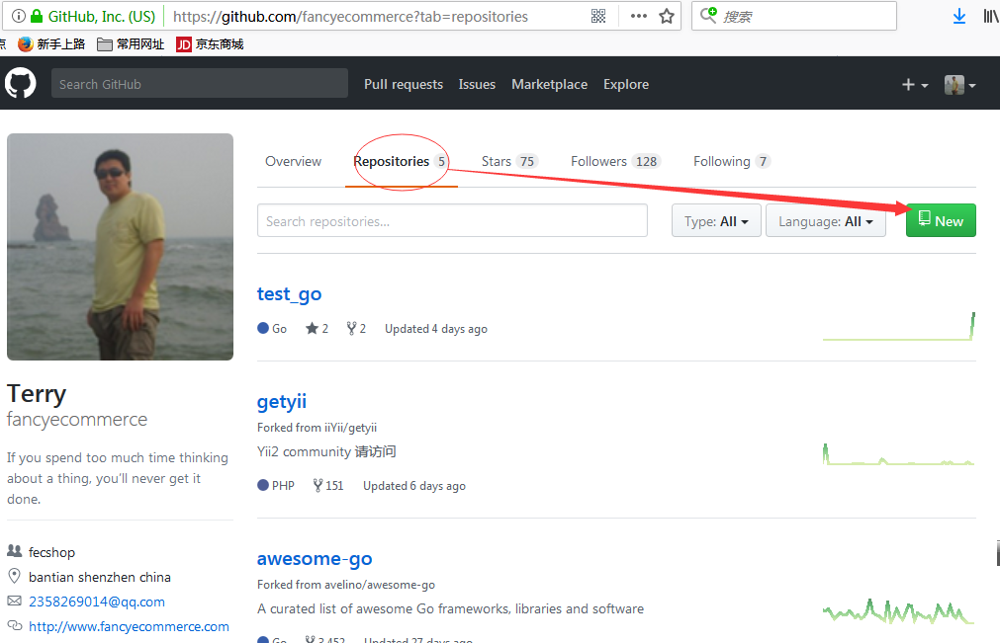

点击new后，就会进入下面图片的页面，填写您的信息，创建项目

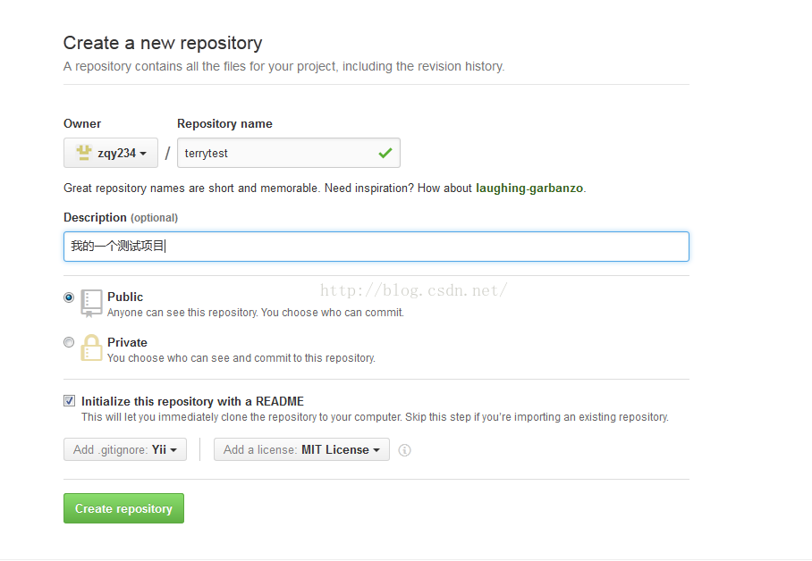

二.创建项目成功后，我们进入到这个项目

按照如图，

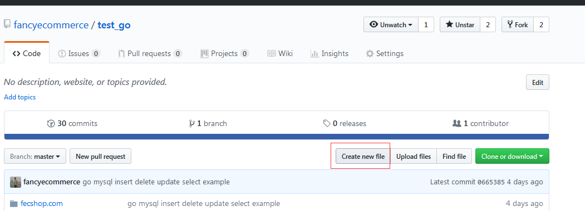

点击`Create New File`创建一个`composer.json`文件

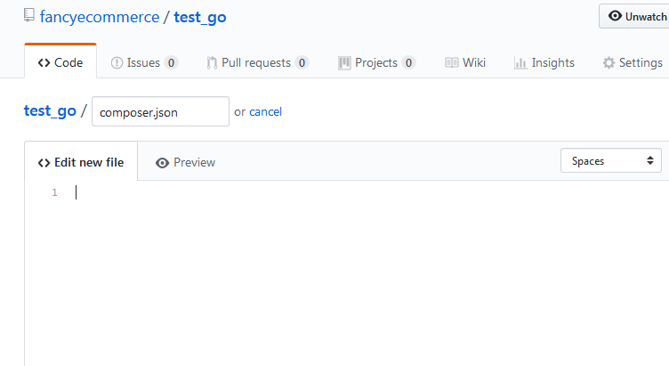

内容部分填写如下:

```
    {  
      "name": "zqy234/terrytest",  
      "description": "Yii2 zqy234 terrytest",  
      "keywords": [  
        "yii2",  
        "terrytest"  
      ],  
      "homepage": "https://github.com/zqy234/terrytest",  
      "type": "yii2-extension",  
      "license": "MIT",  
      "support": {  
        "source": "https://github.com/zqy234/terrytest"  
      },  
      "authors": [  
        {  
          "name": "terry water",  
          "email": "2358269014@qq.com"  
        }  
      ],  
      "minimum-stability": "stable",  
      "require": {  
        "php": ">=5.4.0",  
        "yiisoft/yii2": ">=2.0.6"  
         
      },  
      "autoload": {  
        "psr-4": {  
          "terry\\": ""  
        }  
      },  
      "config": {  
        "process-timeout": 1800  
      }  
    }
```

注意：您不能直接复制进去，因为这是我的地址，
我的扩展的地址为：https://github.com/zqy234/terrytest
，您要做一些更改，下面对里面的各个参数进行解释

`name`: 这个是包的命名，他有这么几个作用：

1.在`packagist.org`中命名的库包名称，
譬如fecshop的库包名称为：`fancyecommerce/fecshop`，网址为
https://packagist.org/packages/fancyecommerce/fecshop

2.**【这部分是后面操作的】**命名后，当在`packagist.org`添加包的时候，需要填写github地址，譬如https://github.com/zqy234/terrytest
，`packagist.org`会自动从这个项目中的composer.json中读取`name`对应
的值作为库包的名字

3.**【这部分是后面操作的】**当我们`packagist.org`添加包完成后，然后通过composer安装我们提交的包，
安装命令行填写的名字，就是`name`参数的值，
譬如：fecshop核心包为：`"fancyecommerce/fecshop": ">=1.2.2.8",`

4.**【这部分是后面操作的】**库包通过composer安装后，将会新建相应的文件夹，
譬如：上面命名的是`zqy234/terrytest`，安装后，将会在`vendor`文件夹下
新建文件夹`zqy234/terrytest`，库包文件将会存放到
`vendor\zqy234/terrytest`路径下。

5.`name`的值可以要和github的`项目名称`不一致，譬如：
https://github.com/zqy234/terrytest ，我可以填写`zqy234/terrytest`,
也可以填写`zqy888/terry666`, 
只要这个库包在packagist.org中不存在就可以，
不过我们一般为了方便管理，让名字一样。
另外，在命名前，您可以
去 https://packagist.org/ 查一下（譬如查询 `zqy234/terrytest`），是否被占用了，如果占用了
，需要更改成其他的名字

说这么多，您应该name的作用了吧？
为了方便管理，一般github的项目名`zqy234/terrytest` 和 `name`的值一致
，上面填写的就是`zqy234/terrytest`

`description`: 描述信息，随便填

`keywords`: 关键字，为了方便搜索，那您可以填写 "yii2","fecshop","your keyword",

`homepage`: 包的首页，填写github地址url

`type`: 不用改动，用上面的`yii2-extension`即可

`license`: 开源协议

`support.source`: 填写github地址url，譬如上面填写的是：https://github.com/zqy234/terrytest，
您改成您自己的项目地址即可，这个必须填写正确

`authors`: 作者信息

`minimum-stability`: 不用改动


`require`: 本库包依赖的库包，如果您的库包依赖其他的库包，譬如依赖Yii2库包，可以填写进去，
填写后，在安装本库包的同时，会将依赖的库包都安装进去，安装后，你会发现安装了很多东西，
这是因为依赖的库包又存在依赖其他的库包。

`autoload.psr-4`: 这个部分非常重要，一定要了解含义，下面详细阐述

1.在Yii2中，我们都是通过use引入，也就是基于namespaces

2.这里填写的就是本库包引入的开头名。

3.譬如上面填写的是`"terry\\": "" `，那么这个项目下的 models/Test.php 文件头部为：

```
<?php

namespace terry\models;

class Test
{
    // ....
}


```

4.如果其他php文件引入上面的Test.php，那么可以通过`use terry\models\Test`
的方式引入

5.此处可以填写多个路径名，譬如：https://github.com/fecshop/yii2_fecshop_redis_cart/blob/master/composer.json
这个扩展

```
"autoload": {  
        "psr-4": {  
          "fecshop\\rediscart\\": ""  
        }  
}, 
```

使用的是两个路径名，对于这个库包的文件：
https://github.com/fecshop/yii2_fecshop_redis_cart/blob/master/services/Cart.php
，你可以看到，在namespaces里面把这两个路径名都加上了。

```
<?php
namespace fecshop\rediscart\services;
use Yii;

class Cart extends \fecshop\services\Cart
{
    
}
```


6.`psr-4`的信息，在composer安装后，更将信息更新到文件`/vendor/composer/autoload_psr4.php` 中，具体信息，可以到这个文件中查看详细。


此处是非常重要的一个配置，上面说的一定要看明白。
填写后，你的项目中的namespace都需要以这个开头。


`config`: 不需改动


按照您的需要将上面的信息配置好，然后填写进去保存即可。


三.搞完上面的，我们需要在包管理里面添加。

打开：https://packagist.org/packages/submit
,如果没有账户，请先注册

把github的地址url填写，提交，这里提交需要点两次，
因为中间有一个需要确认的步骤，提交成功后的界面：

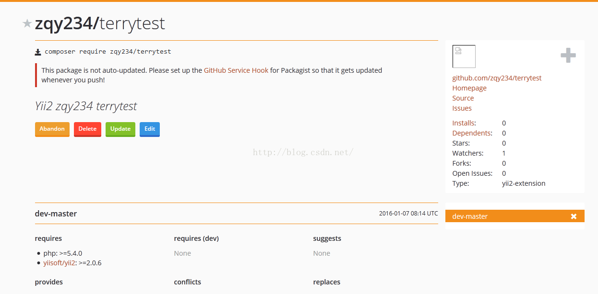

到这里就提交成功了，您可以使用composer下载了：


> **注意**：如果您上面刚在packagist.org添加包，那么需要等半个小时左右，
> 才能通过下面的语句下载，新添加的包存在延迟，另外，如果您
> 用的是中国composer镜像，那么可能需要等的时间更长一些。


```
[root@iZ942k2d5ezZ cc]# composer require  zqy234/terrytest:dev-master  
./composer.json has been updated  
Loading composer repositories with package information  
Updating dependencies (including require-dev)  
  - Installing zqy234/terrytest (dev-master c80914f)  
    Cloning c80914fc7dedc2f464f16fb0af5d3a843326bddb  
  
Writing lock file  
Generating autoload files
```

`zqy234/terrytest` : 将这个改成您上面,在`composer.json` 中 `name` 参数的值
然后再执行composer安装

四.使用正式版本号（稳定版本号）

我们的项目可能根据不同的情况，发布多个版本，因此我们在github
上面会发布多个版本。

首先去github中：


然后：

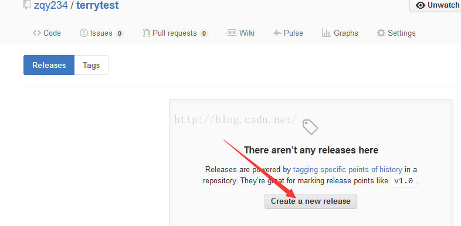

然后：

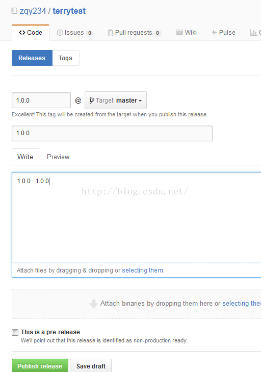

然后再packagist中更新：

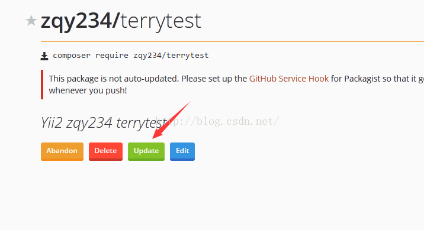

然后：

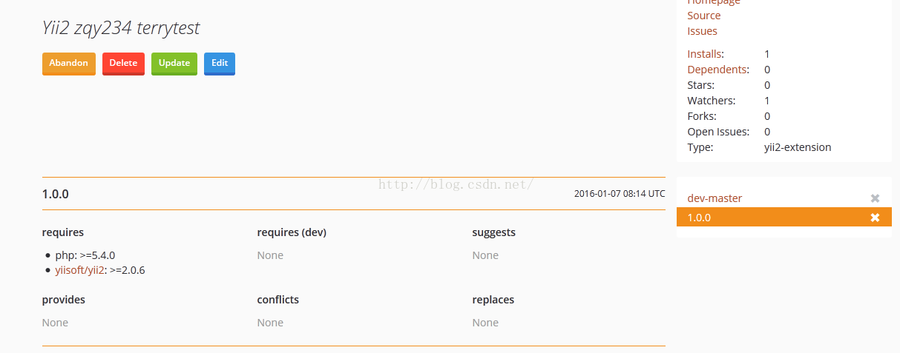


> **注意**：如果您上面刚在packagist.org添加包，那么需要等半个小时左右，
> 才能通过下面的语句下载，新添加的包存在延迟，另外，如果您
> 用的是中国composer镜像，那么可能需要等的时间更长一些。

然后就可以更新了：（注意更改 `zqy234/terrytest`）


```
    [root@iZ942k2d5ezZ cc]# composer require --prefer-dist zqy234/terrytest  
    Using version ^1.0 for zqy234/terrytest  
    ./composer.json has been created  
    Loading composer repositories with package information  
    Updating dependencies (including require-dev)  
      - Installing yiisoft/yii2-composer (2.0.3)                 
        Loading from cache  
      
      - Installing bower-asset/jquery (2.1.4)  
        Loading from cache  
      
      - Installing bower-asset/yii2-pjax (v2.0.5)  
        Loading from cache  
      
      - Installing bower-asset/punycode (v1.3.2)  
        Loading from cache  
      
      - Installing bower-asset/jquery.inputmask (3.1.63)  
        Loading from cache  
      
      - Installing cebe/markdown (1.1.0)  
        Loading from cache  
      
      - Installing ezyang/htmlpurifier (v4.6.0)  
        Loading from cache  
      
      - Installing yiisoft/yii2 (2.0.6)  
        Loading from cache  
      
      - Installing zqy234/terrytest (1.0.0)  
        Downloading: 100%           
      
    Writing lock file  
    Generating autoload files  
    [root@iZ942k2d5ezZ cc]#
```

这样就安装成功了。

五.版本号自动更新（github和packagist之间）

如果我在github上发布了新版本，然后我还需要去 https://packagist.org/
手动更新，比较麻烦，可以设置自动版本更新到 packagist.org

> 详细说明地址：https://packagist.org/about

访问：https://packagist.org/profile/ ， 获取api token

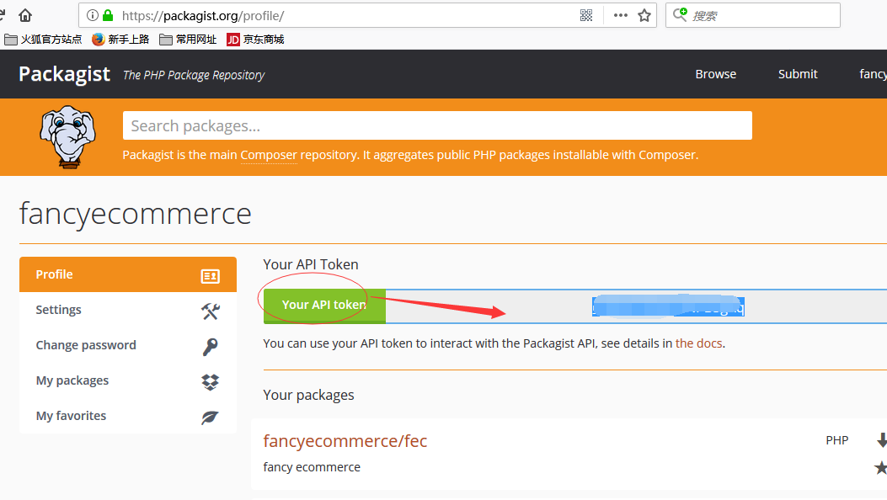

然后去github ，进行add webhook操作

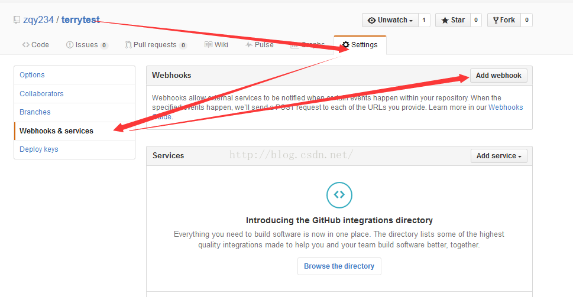

`payload URL`: 填写https://packagist.org/api/bitbucket?username=USERNAME&apiToken=API_TOKEN
,该url中的 `USERNAME` 替换成您的https://packagist.org
的账户，
`API_TOKEN`替换成在上面获取的api token.

`Content type`: 选择`application/json`

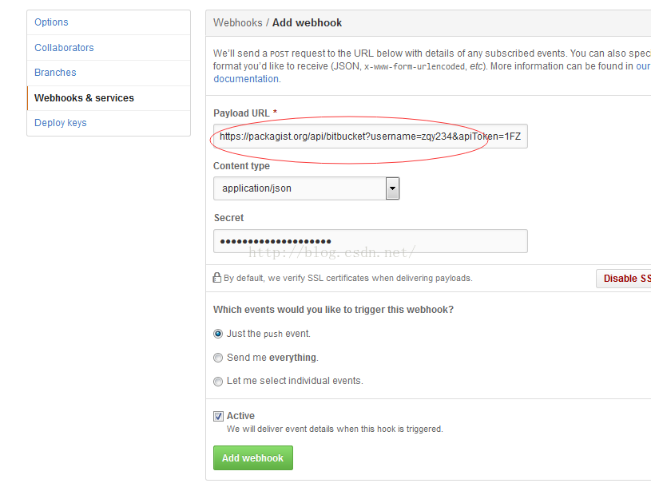

在保存前，可以先测试一下是否正确，通过下面的命令行，执行前，你需要更改里面的参数，`https://packagist.org/api/update-package?username=USERNAME&apiToken=API_TOKEN`

```
curl -XPOST -H'content-type:application/json' 'https://packagist.org/api/update-package?username=USERNAME&apiToken=API_TOKEN' -d'{"repository":{"url":"PACKAGIST_PACKAGE_URL"}}'
```

如果返回success，说明正确，
将上面的信息保存即可


测试自否自动：

在github那边增加一个稳定版本号

然后再 https://packagist.org/packages/zqy234/terrytest#1.0.1

发现：1.0.1出来了。


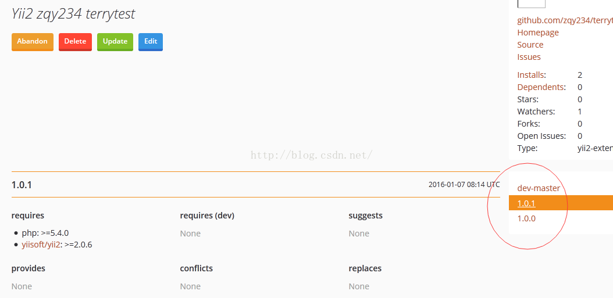

六.基本的详细大致使用就这些，这样，可以快乐的，让别人下载自己的库包了

**注意**：如果您上面刚在packagist.org添加包，那么需要等半个小时左右，
才能通过下面的语句下载，新添加的包存在延迟，另外，如果您
用的是中国composer镜像，那么可能需要等的时间更长一些。

```
composer require --prefer-dist zqy234/terrytest
```


您可以做Yii2的扩展库包，也可以做Fecshop的库包


