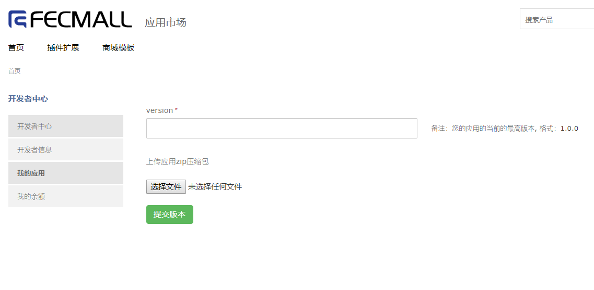

Fecmall-开发者中心
=============

> 如果您想成为开发者,你需要先注册成为用户，然后才能申请成为开发者

### Fecmall 开发者申请

1.注册用户： http://addons.fecmall.com/customer/account/login
，并登陆用户

2.点击右上角开发者中心

页面刷新后，填写申请资料，等待管理员审核

`Package（开发者包名）`: 这个需要英文，您的应用安装后都放到这个包里面，
这个值是必须唯一的，如果您填写的这个被其他人占用，请使用其他的名字

`支付宝账户（用于收款）`： 该项是你的支付宝账户，如果您的付费插件赚取了费用，
进行提现，应用平台将汇款到该账户

`自我介绍（不少过1000字）`：您的自我介绍，是通过开发者审核的有力凭证，
请认真填写，提高通过率

### Fecmall 开发者添加应用

当您有了开发者资质，那么就可以将自己开发的应用插件发布到应用平台

> 注意，上传的必须是`zip`压缩包，目前不支持其他的压缩包

填写应用信息并提交：

`应用名称`： 用于在应用商城中显示的名字，可以使用中文描述您的应用扩展，譬如：melaniblue theme 适合做服装的模板

`应用文件夹名`: Fecmall后台在线安装该应用，以此作为解压文件夹的名字，譬如：furnilife_theme，
在当前开发者中，该项需要唯一，否则无法添加

`Namespace`: 命名空间namespace，一个扩展使用一个namespace，保证唯一性。譬如：fectmelaniblue

`分类`: 应用显示的分类

`应用类型`: 免费应用 or 付费应用

`价格（RMB）`: 如果是付费应用，这里填写价格

`应用描述`： 插件的说明，描述信息，您可以把插件安装的说明写到这里

### Fecmall 开发者发布应用版本

通过上面的步骤，添加了应用，下面需要为这个应用，上传`版本zip压缩包`

一个插件应用，对应多个`版本`，每个`版本`添加后，都需要管理员`审核`后才能发布

点击版本：

点击添加`应用版本`

填写版本号，以及上传`zip`压缩包

提交后，等待管理员审核，在未通过审核的期间，您可以编辑该`应用版本`的内容

对于审核通过的`应用版本`，不可以编辑修改

审核后，该`应用版本`会发布

版本发布后，您可以看到应用状态的变化，然后，您可以在分类产品中查看到该应用。

对于开发者发布的应用，会直接添加到`账户中心-->我的应用`中，因此开发者发布的付费应用，
开发者自身是不需要购买就可以下载的。

