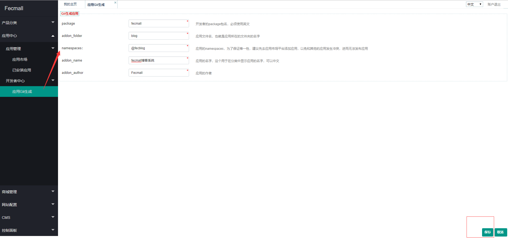
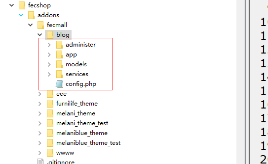

Fecmall-应用初始化工具
============

> 开发者开发应用，可以通过初始化工具，快速创建应用

### Fecmall后台初始化应用工具

在后台可以看到：

1.进行配置，如上图

2.创建成功后，有如下该百年

2.1创建应用初始化文件

根据上面填写的内容，具体的文件夹为
`@addons/fecmall/blog`

2.2extentions表会自动增加配置

3.进行二次开发

初始化的文件，是一些简单的初始化配置，
您可以在配置中添加您的应用配置和功能，进行二次开发。

