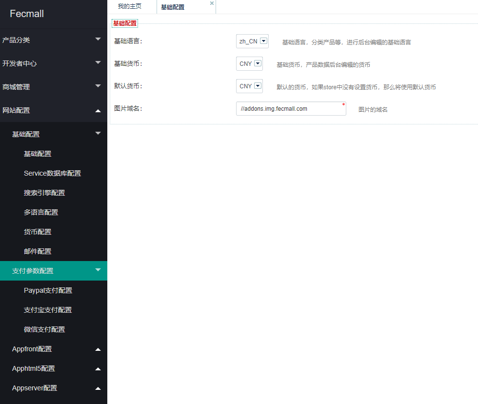

Fecmall 后台配置
================

> Fecmall-2版本，将很多文件配置项，改为后台配置，下面说一下后台配置的内容和原理


### 后台配置

1.配置项存储表：`store_base_config`

里面的值是序列化存储的，也就是一个key对应的是一个数组array，然后序列化存储
到该表中

2.后台编辑操作



很多参数都可以后台配置，
进行编辑操作是`storeBaseConfig services`,进行参数的保存和查询。

3.fecmall初始化加载配置项


通过store components进行的，也就是文件 @fecshop/components/Store.php
的get方法获取配置项，

例子代码：https://github.com/fecshop/yii2_fecshop/blob/master/services/Order.php#L111

```
Yii::$app->store->get('order', 'increment_id');
Yii::$app->store->get('order', 'requiredAddressAttr');
```

第一个参数`order`就是表`store_base_config`中的`key`字段，因为该表的`value`是
序列化数组，因此第二个参数value字段存储的数组对应的值

通过这个方式，Fecmall-1.x版本的一些在文件里面的配置项，就可以放到后台进行配置了
，您开发的一些功能，如果需要后台配置，可以参考该方式进行


