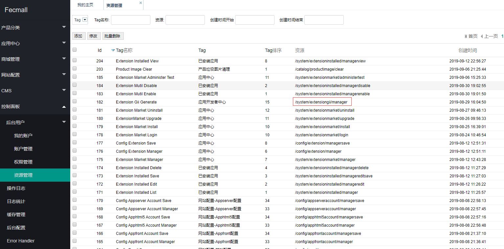
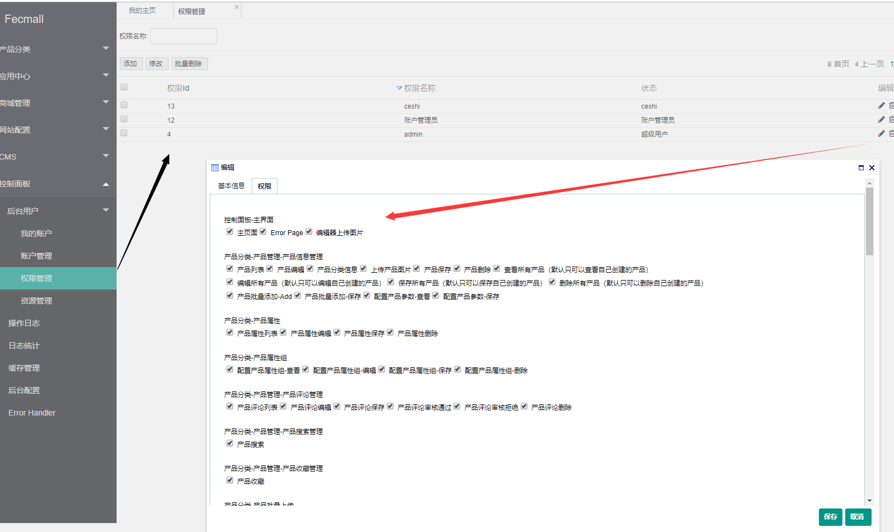

Fecshop Admin 菜单和权限
=========================

> 打开appadmin后台，可以在左侧看到相应的菜单


### Appadmin 菜单

fecmall后台的菜单是在配置文件中配置 `@fecshop/config/services/Admin.php`
,您可以通过配置自行添加后台菜单。

譬如：

```
'services' => [
    // 后台菜单配置
    'admin'  => [
        'childService' => [
            'urlKey' => [
                'urlKeyTags' => [
                    // url Key分组
                    'product_image_clear'  => 'Product-Image-Clear',
                ],
            ],
            'menu' => [
                'menuConfig' => [
                    // menu菜单配置
                    'catalog' => [
                        'child' => [
                            'product_manager' => [
                                'child' => [
                                    // 三级类
                                    'product_image_clear' => [
                                        'label' => 'Product Image Clear',
                                        'url_key' => '/catalog/productimage/clear',
                                    ],
                                ],
                            ],
                        ],
                    ],
                ],
            ],
        ],
    ],
],
```

您可以在 `admin service`中添加配置即可


### admin资源和权限


1.fecmall的`资源`是相应的`urlKey`，`module/controller/action`,您可以在后台查看默认的
fecmall资源




fecmall系统默认的`资源`是不允许编辑的，您可以本地开发后台功能添加相应的`资源`

2.用户的权限，是以`权限组`的方式进行的，您可以编辑`权限组`，为`权限组`添加
资源



3.后台用户添加`权限组`，即拥有`权限组`对应的`资源`访问权限

4.编辑资源和权限后，需要`刷新缓存`，否则无法生效


