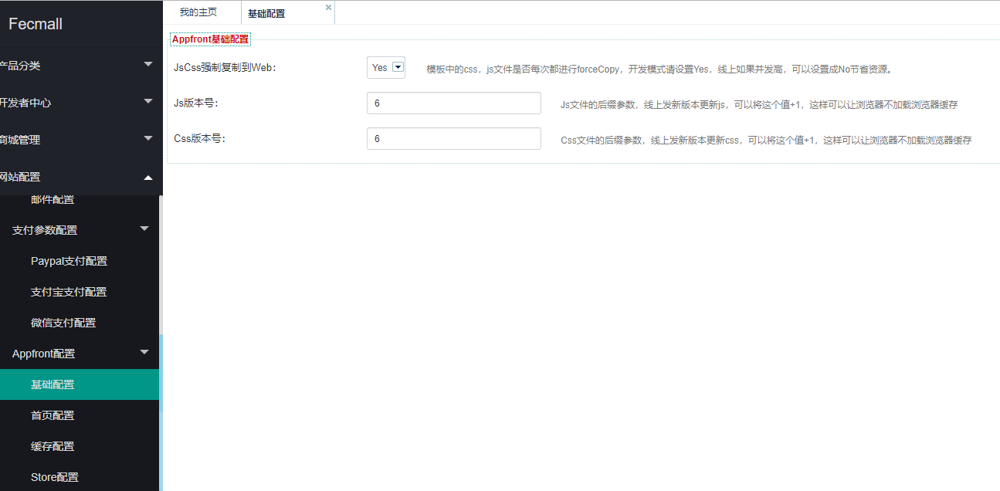

Fecmall theme js and css
============================


### Fecmall如何添加js和css - 在layouts中添加css和js文件。


在layout.php文件的顶部可以看到代码，譬如：
譬如：`@fecshop/app/appfront/theme/base/front/layouts/home.php`

```

<?php
$jsOptions =[ # js的配置部分
	[
		# js options ，来定义位置，条件等
		'options' => [
			'position' =>  'POS_END',
			'condition'=> 'lt IE 9',
		],
		# 在当前options下的js文件
		'js'	=>[
			'js/jquery-3.0.0.min.js',
			'js/js.js',
		],
	],
	# 另外一个js配置
	[
		# 定义另外一个options下的js文件
		'options' => [
			'condition'=> 'lt IE 9',
		],
		'js'	=>[
			'js/ie9js.js'
		],
	],
];

$cssOptions = [
	# css配置
	[
		'css'	=>[
			'css/style.css',
			'css/ie.css',
		],
	],
	
	# 另外一个css配置
	[
		# 这个css配置，有一定的条件
		'options' => [
			'condition'=> 'lt IE 9',
		],
		# css文件
		'css'	=>[
			'css/ltie9.css',
		],
	],
];
	
\Yii::$service->page->asset->jsOptions 	= $jsOptions;
\Yii::$service->page->asset->cssOptions = $cssOptions;				
\Yii::$service->page->asset->register($this);
?>
	
```

每一个layout文件，都可以自定义当前的js和css文件
,js和css的文件是放到模板路径下的assets文件夹下面.

对于css中使用的image，一定要和css在一个模板路径里面，否则会找不到文件。


### Fecshop如何添加js和css - 在配置文件中添加

在配置文件
`@fecshop/config/services/Page.php` 中可以看到如下代码：

```
'asset' => [
	'class' =>  'fecshop\services\page\Asset',
	# 在js后面加一个v参数，修改js后，更改v参数，否则，浏览器会使用缓存。
	# /assets/dbdba3fa/js/js.js?v=2
	//'jsVersion'		=> 1,
	# /assets/dbdba3fa/css/owl.carousel.css?v=2
	//'cssVersion'	=> 1,
	/* js and css config example:
	'jsOptions'	=> [
		# js config 1
		[
			'options' => [
				'position' =>  'POS_END',
			//	'condition'=> 'lt IE 9',
			],
			'js'	=>[
				'js/jquery-3.0.0.min.js',
				'js/js.js',
			],
		],
		# js config 2
		[
			'options' => [
				'condition'=> 'lt IE 9',
			],
			'js'	=>[
				'js/ie9js.js'
			],
		],
	],
	# css config
	'cssOptions'	=> [
		# css config 1.
		[
			'css'	=>[
				'css/style.css',
				'css/ie.css',
			],
		],
		
		# css config 2.
		[
			'options' => [
				'condition'=> 'lt IE 9',
			],
			'css'	=>[
				'css/ltie9.css',
			],
		],
	],
	*/
],
```

您可以按照Yii2的语法方式，在里面添加js和css文件。可以添加css和js
加载的条件.

但是`vendor/`下的文件您是不能修改的，因此，您需要到
`@app/config/fecshop_local_services/Page.php`中添加配置（文件不存在，可以创建之~）

### js和css 设置域名

为了更好的加载，一般，js和css使用和网站不同的子域名，
这样做是为了加载，原因可以参看文章：
[网站的图片，css，js 为什么要和网站的域名不一样](http://www.fancyecommerce.com/2017/04/17/%e7%bd%91%e7%ab%99%e7%9a%84%e5%9b%be%e7%89%87%ef%bc%8ccss%ef%bc%8cjs-%e4%b8%ba%e4%bb%80%e4%b9%88%e8%a6%81%e5%92%8c%e7%bd%91%e7%ab%99%e7%9a%84%e5%9f%9f%e5%90%8d%e4%b8%8d%e4%b8%80%e6%a0%b7/)

您可以在 `@appfront/config/fecshop_local_services/Page.php`
中配置：

```
'asset' => [
	'class' =>  'fecshop\services\page\Asset',
	# 在js后面加一个v参数，修改js后，更改v参数，否则，浏览器会使用缓存。
	# /assets/dbdba3fa/js/js.js?v=2
	//'jsVersion'		=> 1,
	//'cssVersion'	=> 1,
	# js和css的域名，如果不设置，则使用网站的域名。
	/**
     * @var string the root directory string the published asset files.
     * 设置: js和css的发布路径，默认在web路径下的assets文件夹下，您可以放到其他的文件路径，然后用独立的jscss域名做指向
     * 譬如设置为：'@appimage/assets'，也可以将 @appimage 换成绝对路径
     */
    'basePath' => '@webroot/assets',
    /**
     * @var string the base URL through which the published asset files can be accessed.
     * 设置: js和css的URL路径
     * 可以将 @web 换成域名 ， 譬如  `http:://www/fecshop.com/assets`
     * 这样就可以将js和css文件使用独立的域名了【把域名对应的地址对应到$basePath】。
     */
    'baseUrl' => '@web/assets',
],
```

参看配置中的注释就会明白，如何使用独立域名，也就是设置
`basePath` 和 `baseUrl`

### js和css 浏览器缓存和版本

为了加速，我们需要使用浏览器缓存，但是我们如果升级，怎么告诉浏览器，
我们的js和css更改了呢？我们需要用到版本参数的方式，也就是在后面
加一个v参数，当js和css更改后，我们把
v参数的值+1即可。譬如：

```
/assets/dbdba3fa/js/js.js?v=2
```

您可以在后台进行配置




### 重写css或者js：

js 和 css 的重写和view ，layout类似，也是通过
模板路径的优先级，来完成重写。
如果要重写css或者js，只需要在高优先级的模板路径下创建js或者css文件即可。

譬如：我想要重写 js文件：`@fecshop/app/appfront/theme/base/front/assets/js/js.js`

如果本地模板路径为：`@appfront/theme/terry/theme01`，
那么，新建文件 `@appfront/theme/terry/theme01/assets/js/js.js` 即可，
在加载js的文件，就会加载 `@appfront/theme/terry/theme01/assets/js/js.js`，
这样就完成了js文件的重写。

重写css和js的原理参看：
[yii2 多模板路径优先级加载view方式下- js和css 的解决](http://www.fancyecommerce.com/2016/07/06/yii2-%e5%a4%9a%e6%a8%a1%e6%9d%bf%e8%b7%af%e5%be%84%e4%bc%98%e5%85%88%e7%ba%a7%e5%8a%a0%e8%bd%bdview%e6%96%b9%e5%bc%8f%e4%b8%8b-js%e5%92%8ccss-%e7%9a%84%e8%a7%a3%e5%86%b3/)


### CDN

如果您使用的是cdn，那么您把web下面的assets里面的文件
上传到csn，然后设置jscss域名，把这个域名指向CDN即可。


