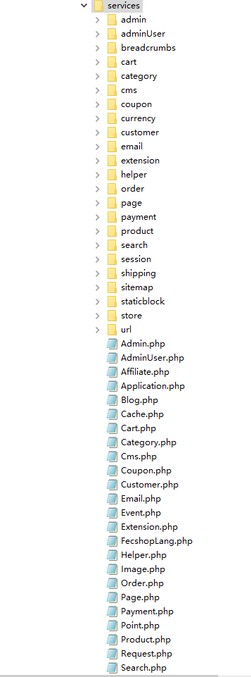
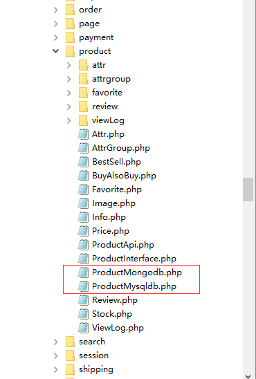

Fecmall 关于服务
=================

> fecmall服务是一个公用性的底层，为各个应用系统提供底层服务

1.Fecmall 服务Service介绍
------------------------------

`fecmall Service`是一个`中间层`，对于`MVC`结构，由`Controller`调用`Model`, 进行数据处理，这种架构方式会存在如下问题：

1.1很多的中间层逻辑写到`controller`中，造成`controller`非常庞大

1.2`controller`层，是`调度层`，在里面写的中间逻辑，其他的`controller`文件`无法重复利用`

1.3有一些逻辑，是需要很多`model`完成，譬如`生成订单`操作，需要`订单生成`，`扣除库存`，`优惠券扣除`，`物车清空`等多个model协作实现，
这些逻辑写到某个`model`里显然不合适，如果写到`controller`里面，代码`重复利用`不高

1.4对于多设备电商，各个`入口`对数据的操作，`参数配置`需要一致， 这样写到controller里面的一些代码，无法重复利用，需要多处实现，
维护起来非常费劲（需求变动，需要多处维护）

1.5后期重构，如果将`cart model`由`mysql`换成`redis`，那么非常的费劲，需要各个`入口`的逻辑都要修改。

1.6公司技术架构做成`服务总线`，某些数据需要`api`调取，需要将`model`重构为`api`，维护起来非常麻烦

Fecmall Service就是为了解决这些问题！


1.1Fecmall Service文件结构



上面的文件夹中含有多个`子services`


1.2Fecmall Service实现

Fecmall Service是通过`配置注入`，`容器生成`等技术实现的`单例模式对象`，可以通过配置注入参数到`实例化对象`中
`懒加载`模式，调用的时候才会`实例化`，这样不会有额外的开销。
(参考Yii2组件（component）实现)

`controller`层或者`block`层，调用`service`层函数，然后由`service`调用`model`层数据，或者其他的`service`的方法，进行逻辑数据处理，
将结果返回`调用方`。

对于多入口电商系统，各个入口有独自的`controller`，但service层`公用`，这样如果改动了`service`层的实现，或者通过插件扩展`重构service`层，
即可把所有的入口都修改，方便维护

可以实现多个services，譬如`mysql cart services`， `redis cart services`，然后通过配置重写，即可完成底层的重构, 
譬如fecmall对产品部分，有`mysql`和`mongodb`两种services实现，您可以在后台配置，选择使用那种数据库存储产品数据,如图：




对于存储底层，除了mysql，mongodb，redis等本地数据库外，不局限于数据库，您可以将远程的`api`封装到`service`里面（将远程的`api`看成`数据库`）
，这样，对于业务晋升快的公司，很有帮助。


2.原则约定
----------

各个“应用系统”，譬如`appfront`，`appadmin`，`apphtml5`，是一个独立的文件结构
，他们都有独立的模块，里面有`controller`（控制层） `block`（数据中间逻辑处理层） `theme`（模板view层）
，但是没有`model`层，在原则上约定，各个“应用系统”不能直接访问`model`，
只能访问`Fecmall Service`（服务），来进行数据的`获取`和`处理`工作，然后由`service`层
访问`model`层进行数据的获取处理等工作。


服务层的`功能粒度`：

首先，对于`model`层的函数粒度，对应的是数据的操作，譬如更改某一行数据，添加一行数据等，这个地球人都知道。

对于`service`层的函数粒度，一般是我们语言描述需求的`最小粒度`，譬如：把一个产品加入购物车，
删除购物车的某个产品，调出某个分类下的产品，登录用户，计算产品的最终价格，等等，对于上面的这些最小的
语言描述粒度，会在服务层实现，然后直接访问该服务中的方法即可。

3.实现原理
---------

3.1 实例化过程：

当我们执行 `Yii::$service->cart`，就会访问fecmall cart service 服务
，对应文件 `@fecshop/services/Cart.php`
当执行`Yii::$service->cart->coupon` 就会访问 cart的子服务coupon
，对应文件 `@fecshop/services/cart/Coupon.php`

下面是实现原理：

在index.php入口文件中可以看到如下代码：

```
new fecshop\services\Application($config['services']);
unset($config['services']);
```

查看 fecshop\services\Application.php的代码如下：

```
<?php
/**
 * FecShop file.
 *
 * @link http://www.fecshop.com/
 * @copyright Copyright (c) 2016 FecShop Software LLC
 * @license http://www.fecshop.com/license/
 */
namespace fecshop\services;
use Yii;
use yii\base\Component;
use yii\base\InvalidConfigException;
/**
 * @author Terry Zhao <2358269014@qq.com>
 * @since 1.0
 */
class Application
{
	public $childService;
	public $_childService;
	
	
	public function __construct($config = [])
    {
        Yii::$service 		= $this;
        $this->childService = $config;
    }
	/**
	 * 得到services 里面配置的子服务childService的实例
	 */
	public function getChildService($childServiceName){
		if(!$this->_childService[$childServiceName]){
			$childService = $this->childService;
			if(isset($childService[$childServiceName])){
				$service = $childService[$childServiceName];
				$this->_childService[$childServiceName] = Yii::createObject($service);
			}else{
				throw new InvalidConfigException('Child Service ['.$childServiceName.'] is not find in '.get_called_class().', you must config it! ');
			}
		}
		return $this->_childService[$childServiceName];
	}
	
	/**
	 * 
	 */
	public function __get($attr){
		return $this->getChildService($attr);
		
	}
	
}
```


service配置，譬如：@fecshop\config\services\Cart.php

```
<?php
/**
 * FecShop file.
 * @link http://www.fecshop.com/
 * @copyright Copyright (c) 2016 FecShop Software LLC
 * @license http://www.fecshop.com/license/
 */
return [
	'cart' => [
		'class' => 'fecshop\services\Cart',
		
		# 子服务
		'childService' => [
			'quote' => [
				'class' => 'fecshop\services\cart\Quote',
			],
			'quoteItem' => [
				'class' => 'fecshop\services\cart\QuoteItem',
			],
			
			'info' => [
				'class' => 'fecshop\services\cart\Info',
				/**
				 * 单个sku加入购物车的最大个数。
				 */
				'maxCountAddToCart' => 100,
				# 上架状态产品加入购物车时，
				# 如果addToCartCheckSkuQty设置为true，则需要检查产品qty是否>购买qty，
				# 如果设置为false，则不需要，也就是说产品库存qty小于购买qty，也是可以加入购物车的。
				'addToCartCheckSkuQty' => true,
			],
			'coupon' => [
				'class' => 'fecshop\services\cart\Coupon',
			],
		],
	],
];
```

Yii::$service->cart 就是cart服务

Yii::$service 对应的是 fecshop\services\Application
当执行Yii::$service->cart时，找不到cart变量就会执行 __get()魔术方法，进而执行
getChildService(),将上面cart配置的class对应的文件`fecshop\services\Cart`，
进行实例化，也就是说 Yii::$service->cart 对应的是 fecshop\services\Cart 实例化的对象，
如果下次使用 Yii::$service->cart ，不会再实例化对象，FecShop Service是单例模式。

Fecmall子服务：Yii::$service->cart->coupon，通过上面的配置，会实例化
`fecshop\services\cart\Coupon`，子服务的原理和服务类似，都是单例模式。

3.2 关于service类

上面讲解了
Yii::$service->cart，如何找到 fecshop\services\Cart的步骤，下面详细讲述
service类。

所有的服务类，譬如上面说的cart服务，都必须继承
`@fecshop\services\Service`。
里面的方法都必须以action开头（如果不以action开头，而是实际的方法，那么
将方法声明为public ，也是可以访问的，但是这种方式不会经过上面提到的魔术方法，
因此，是无法记录该方法
的开始和结束时间），和controller中类似，
譬如执行  `Yii::$service->cart->addProductToCart($item)`，对应的是
fecshop\services\Cart中的 `protected function actionAddProductToCart($item)`方法。

原理为：当访问 addProductToCart时，由于找不到该函数，就会执行
`@fecshop\services\Service->__call()`魔术方法，然后由魔术方法，
将 `addProductToCart` 改成  `actionAddProductToCart`，然后去查找函数，就会找到
，这样做的好处是，可以在`__call()`函数中记录每一个service的方法调用开始时间
和结束时间，这样就可以更好的调试出来哪一个service方法耗费的时间长，
这个是为了更好地统计各个services的状况，譬如：排查耗费时间最长的services，
使用最频繁的services等，
当然会耗费一定的时间，
在线上可以关掉log记录时间的功能，也可以间断性的手动开启，进行线上调试。
详细参看：[Fecshop Service Log](fecshop-service-log.md)

当然，您可以把服务中的类函数定义成`public` ，函数名不以`action`开头，
这种方式定义的函数，开启services log，不会被记录，因为直接找到函数名，不会
访问魔术方法`__call()`。


4.关闭Service
---------

对于您自己开发的`service`，您如果想去掉很轻松，把`service`对应的配置去掉,
就无法访问这个`Service`了。

对于fecmall开发的`Service`，您可以通过配置的方式关掉某个services
，在配置中加入 `'enableService' => false`  就可以了


譬如：搜索有mongodb和xunsearch搜索，mongodb对应外文搜索，
而xunsearch对应的是中文搜索，如果我是做跨境电商的，我不需要中文搜索，
那么，我就不需要安装xunsearch，后台产品编辑save的时候，也不需要把产品
同步到xunSearch中，因此，我们可以通过加入（或修改） `'enableService' => false`
就可以了

打开文件： @common/config/fecshop_local_services/Search.php

可以看到xunSearch的配置：

```
'xunSearch'  => [
    'fuzzy'         => true,  // 是否开启模糊查询
    'enableService' => true,
    'synonyms'      => true, //是否开启同义词翻译
    'searchLang'    => [
        'zh' => 'chinese',
    ],
],
```

设置 `'enableService' => false` , 将关掉xunSearch Services
，然后，我们关掉xunSearch（kill进程），然后后台保存产品，会发现保存成功，


对于Service关闭的原理，可以参看文件 `@fecshop/services/Service.php` 文件


