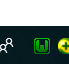
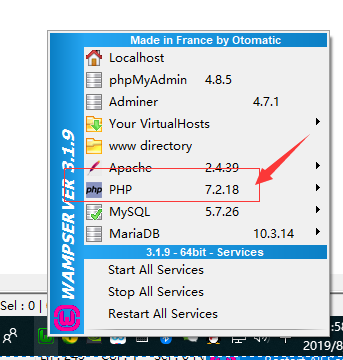
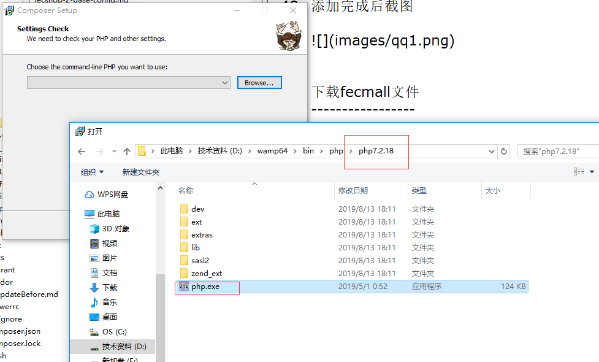
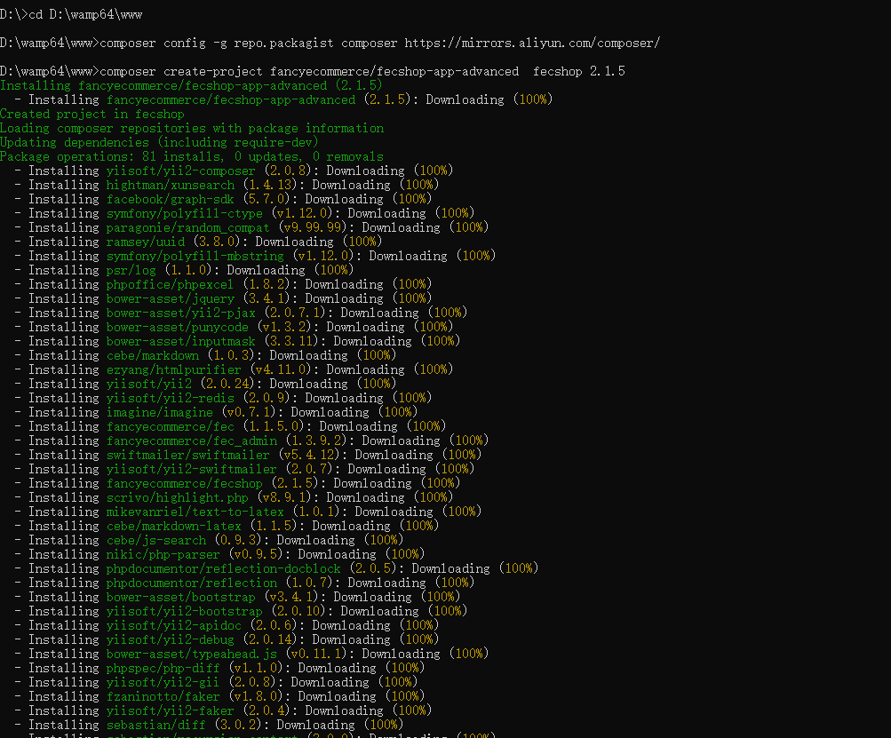
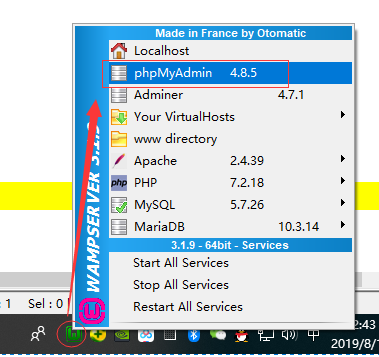
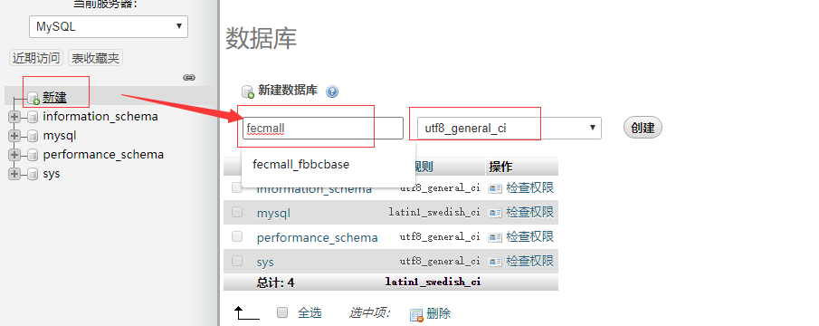
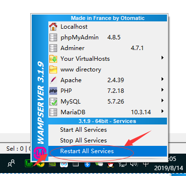

Fecmall-2.x WAMP环境安装 - 手把手系列
================

> Windows下面，使用WAMP环境本地安装fecshop教程，相信有经验的程序员看一下linux
下安装fecmall，就可以在wamp下面，安装，下面的安装教程是给小白用的，
比较详细，配图比较多。


**有一些截图太大，如果看起来不够清晰，可以放大浏览器查看截图**

**手把手再WAMP上面配置fecmall，满足小白用户的win环境安装**

下载WAMP
--------------

### 1.下载

1.1官网下载
wamp官网：http://www.wampserver.com/en/#download-wrapper

下载地址：https://sourceforge.net/projects/wampserver/files/

1.2Fecmall Q群下载


Q群文件中可以看到：wampserver3.1.9_x64.exe
，这个是win64位使用的安装程序，安装即可

### 2.安装

我的安装路径是：`D:\wamp64`

安装完成后，启动`wamp`，启动成功后，`右下角`图标为`绿色`，不是绿色可以`重启`（restart all services）试试



打开浏览器访问：http://127.0.0.1/ ， 出来wamp就代表安装，并启动wamp成功了


配置域名指向
----------

### 1.打开win host文件

C:\Windows\System32\drivers\etc\hosts

将下面的添加到hosts文件中


```
127.0.0.1 appfront.fecshoptest.com
127.0.0.1 appadmin.fecshoptest.com
127.0.0.1 img.fecshoptest.com
127.0.0.1 apphtml5.fecshoptest.com
127.0.0.1 appserver.fecshoptest.com
127.0.0.1 appapi.fecshoptest.com
```

添加完成后截图


下载fecmall文件
-----------------

### 一.推荐使用composer安装

1.下载composer： https://getcomposer.org/download/


鼠标左键点击右下角的wamp图标，可以看到当前启动的php的版本`7.2.18`



安装composer，需要选择相应的`php`(**注意，这个一定要和wamp默认启动的php版本一致，否则将会出现
web的php和命令行的php，不是同一个的问题，这个一定要注意**)



剩下的都是一路next即可。

安装完成后， window + r ，cmd进入命令行模式


2.进入web目录

我的目录是： D:\wamp64\www


更改阿里云composer镜像源

```
composer config -g repo.packagist composer https://mirrors.aliyun.com/composer/
```

执行下载：

> 请将2.1.6 改成最近的fecmall版本，这里查看最新的版本号： https://github.com/fecshop/yii2_fecshop/releases

```
composer create-project fancyecommerce/fecshop-app-advanced  fecshop 2.1.6
```
然后就可以看到文件下载：


下载的log日志如下：




下载完成后，可以看到：D:\wamp64\www\fecshop
，打开这个文件夹，可以看到如下


这就代表下载成功了

2.直接下载完整压缩包

2.1百度网盘 下载地址，https://pan.baidu.com/s/1hs1iC2C ， 下载fecshop-2.x.x.zip （请下载最高的版本）

2.2QQ群文件下载，官方Q群文件里面有相应的文件,Fecmall QQ群(新)：782387676，入群验证：fecmall

Fecmall初始化
---------------

### 1.执行fecmall  init

进入fecshop的目录，执行`init.bat`


### 2.初始化mysql数据库

鼠标左键点击wamp的右下角图标，如图所示，点击mysql console


点击后，弹框内容`root`即可，点击ok，然后出来mysql控制台，直接点回车


```
use mysql

update mysql.user set authentication_string=password('123456') where user='root' ;

flush privileges;

```

执行log如图：


这样初始化完成了  mysql账户密码为：`root  123456`

打开phpmyadmin




浏览器打开后，用创建好的mysql用户名密码登陆，创建数据库 `fecmall`




点击创建，成功可以看到fecmall数据库


### 3.配置apache
 
 上面再win hosts中我们添加了指向本地的域名
 

```
127.0.0.1 appfront.fecshoptest.com
127.0.0.1 appadmin.fecshoptest.com
127.0.0.1 img.fecshoptest.com
127.0.0.1 apphtml5.fecshoptest.com
127.0.0.1 appserver.fecshoptest.com
127.0.0.1 appapi.fecshoptest.com
```

下面我们在apache中做配置，打开apache配置文件


在这个配置文件后面追加如下的内容

> 新版本2.1.6以后的fecmall版本，@app/web/`.htaccess`默认已经添加，用于处理`url中去掉index.php`的问题, 您不需要自己手动添加了


```

<VirtualHost *:80>
  ServerName appadmin.fecshoptest.com
  ServerAlias fecshoptest
  DocumentRoot "${INSTALL_DIR}/www/fecshop/appadmin/web"
  <Directory "${INSTALL_DIR}/www/fecshop/appadmin/web">
    Options +Includes +FollowSymLinks +MultiViews
    AllowOverride All
    Require local
  </Directory>
</VirtualHost>


<VirtualHost *:80>
  ServerName appfront.fecshoptest.com
  ServerAlias fecshoptest
  DocumentRoot "${INSTALL_DIR}/www/fecshop/appfront/web"
  <Directory "${INSTALL_DIR}/www/fecshop/appfront/web">
    Options +Includes +FollowSymLinks +MultiViews
    AllowOverride All
    Require local
  </Directory>
</VirtualHost>


<VirtualHost *:80>
  ServerName apphtml5.fecshoptest.com
  ServerAlias fecshoptest
  DocumentRoot "${INSTALL_DIR}/www/fecshop/apphtml5/web"
  <Directory "${INSTALL_DIR}/www/fecshop/apphtml5/web">
    Options +Includes +FollowSymLinks +MultiViews
    AllowOverride All
    Require local
  </Directory>
</VirtualHost>

<VirtualHost *:80>
  ServerName img.fecshoptest.com
  ServerAlias fecshoptest
  DocumentRoot "${INSTALL_DIR}/www/fecshop/appimage/common"
  <Directory "${INSTALL_DIR}/www/fecshop/appimage/common">
    Options +Includes +FollowSymLinks +MultiViews
    AllowOverride All
    Require local
  </Directory>
</VirtualHost>

<VirtualHost *:80>
  ServerName appserver.fecshoptest.com
  ServerAlias fecshoptest
  DocumentRoot "${INSTALL_DIR}/www/fecshop/appserver/web"
  <Directory "${INSTALL_DIR}/www/fecshop/appserver/web">
    Options +Includes +FollowSymLinks +MultiViews
    AllowOverride All
    Require local
  </Directory>
</VirtualHost>


<VirtualHost *:80>
  ServerName appapi.fecshoptest.com
  ServerAlias fecshoptest
  DocumentRoot "${INSTALL_DIR}/www/fecshop/appapi/web"
  <Directory "${INSTALL_DIR}/www/fecshop/appapi/web">
    Options +Includes +FollowSymLinks +MultiViews
    AllowOverride All
    Require local
  </Directory>
</VirtualHost>
```

保存apche配置文件，然后重启apache




Fecmall界面安装
----------------

1.在上面的步骤中，配置了apache, 您配置好域名后，appfront对应域名配置为：`appfront.fecshoptest.com`   >  `$root/appfront/web/`

安装入口文件为：`$root/appfront/web/install.php`
, 打开安装地址： http://appfront.fecshoptest.com/install.php （替换成您自己的域名）


2.填写mysql的配置，点击提交


提交后，如图：


mysql的配置写入了配置文件：`@common/config/main-local.php`

点击按钮： `进行数据表初始化`，需要一段时间执行（请耐心等待），执行完成后的界面如下：


点击`测试产品数据安装`，完成后界面（如果不想安装测试数据，可以点击`跳过`按钮）


点击`下一步`按钮，进入完成安装界面


您可以进入mysql查看一下数据表是否已经创建，然后查看一下`product_flat`表里面是否有数据，进行数据库初始化以及
测试数据安装成功确认。


3.您还需要进行如下的步骤：

3.1需要设置`安全权限`（根目录执行，win不需要执行）：`chmod 644 common/config/main-local.php`

3.2删除安装文件 install.php（**为了安全，一定要删除掉**）(文件路径为：`appfront/web/install.php`),


Fecmall访问后台，进行后台配置
-----------------------

也就是上面配置的域名：`appadmin.fecshoptest.com`

初始账户密码：  `admin`  `admin123`

右上角切换成`中文语言`。

**首先配置图片域名** 

`网站配置`-->`基础配置`-->`基础配置`  找到`图片域名`，填写您的图片域名，譬如：`//img.fecshoptest.com`
(前面不要加`http:`,这种方式http和https都可以调用图片url,将该域名替换成您自己的域名)


3.1后台添加`appfront`(PC)配置，添加`store`


`网站配置`-->`Appfront配置`-->`Store配置`

可以看到`store`列表，点击`id为1`的数据（激活状态），进行编辑，将域名更改成 `appfront.fecshoptest.com`(替换成您自己的域名)，保存

然后就可以访问：appfront.fecshoptest.com ，查看pc端了


3.2配置Apphtml5

`网站配置`-->`Apphtml5配置`-->`Store配置`

可以看到store列表，点击`id为8`的数据（激活状态），进行编辑，将域名更改成 `apphtml5.fecshoptest.com`(替换成您自己的域名)，保存

然后就可以访问：apphtml5.fecshoptest.com ，查看H5端了


3.3配置Appserver


> 这里是对`Appserver`端的配置，对应的域名为：`appserver.fecshoptest.com`(替换成您自己的域名) ,是对微信小程序，vue等客户端提供api的入口

`网站配置`-->`Appappserver配置`-->`Store配置`

将 `Store Key` 更改成 `appserver.fecshoptest.com` (替换成您自己的域名)即可。


Appserver 就可以为vue和微信小程序提供api了。

其他的配置
----------------

> 配置完`appserver.fecshoptest.com`，您可以安装vue和微信小程序等客户端

`vue`: https://github.com/fecshop/vue_fecshop_appserver

`微信小程序`：https://github.com/fecshop/wx_micro_program


 
 